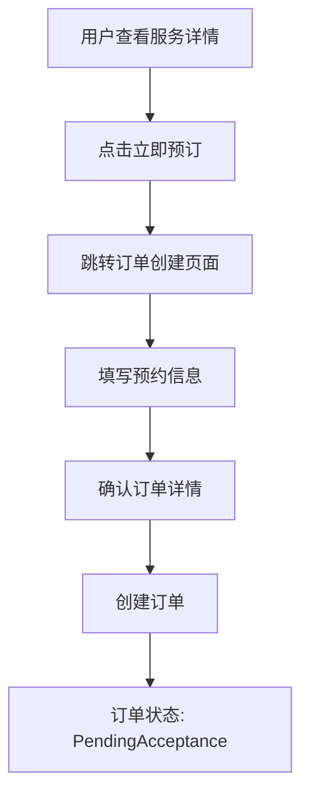
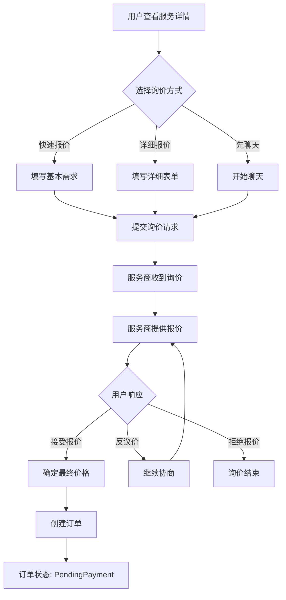
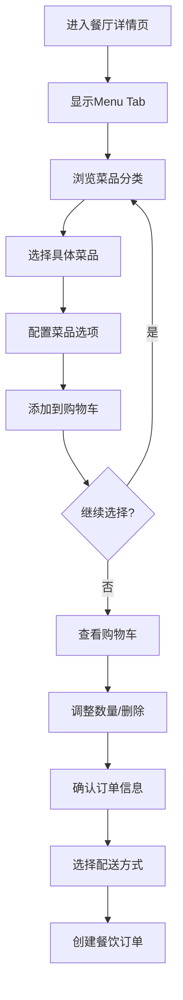
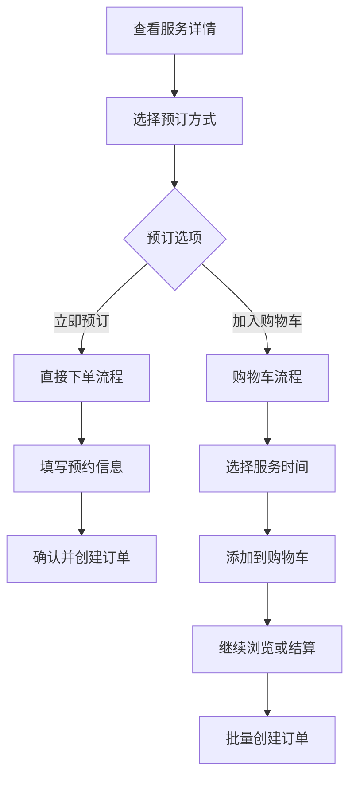

# Service Details 订单生成流程设计文档

## 📋 **文档概述**

### **文档目的**
详细设计Service Details页面中不同定价类型的订单生成流程，包括Fixed价格的直接下单和非Fixed价格的询价流程，以及购物车模式的差异化处理策略。

### **更新日期**
2025-01-08

### **版本信息**
v2.0 - 增加购物车模式和行业差异化处理

---

## 🎯 **业务需求分析**

### **核心问题**
- Fixed价格服务是否应该先加入购物车？
- 不同行业的服务如何优化订单生成流程？
- 如何平衡用户体验和业务转化率？

### **目标用户群体**
1. **效率导向用户**: 希望快速完成服务预订
2. **对比选择用户**: 需要多项服务组合和对比
3. **计划性用户**: 喜欢先收集再统一处理

---

## 🔄 **定价类型与处理流程**

### **1. Fixed价格服务流程**

#### **A. 当前实现（直接下单模式）**


#### **优势分析**
- ⚡ **效率高**: 减少操作步骤，快速下单
- 🎯 **目标明确**: 适合单一服务需求
- 📱 **移动友好**: 触屏操作简单直观
- ⏱️ **时效性强**: 适合紧急服务需求

#### **适用场景**
- 家政清洁服务
- 维修服务
- 咨询服务
- 紧急服务

### **2. 非Fixed价格服务流程（Ask for Quote）**

#### **询价流程设计**


#### **询价选项详细设计**

**快速报价**
- 📝 简要需求描述（必填）
- ⏰ 期望时间（可选）
- 💰 预算范围（可选）
- 🔄 24小时内回复

**详细报价**
- 📋 详细需求表单
- 📅 具体服务日期
- 🕐 具体服务时间
- 🔥 紧急程度选择
- 💬 特殊要求说明

**先聊天**
- 💬 即时通讯功能
- 📞 视频通话选项
- 📸 图片分享
- 📋 需求收集表单

---

## 🛒 **购物车模式设计**

### **行业差异化策略**

#### **1. 餐饮服务（强制购物车模式）**

**业务逻辑**
```sql
-- 餐饮服务特征
categoryLevel1Id = '1010000' -- 美食天地
```

**用户流程**


**技术实现**
```dart
class RestaurantOrderFlow {
  bool isRestaurantService(Service service) {
    return service.categoryLevel1Id == '1010000';
  }
  
  Widget buildRestaurantActions() {
    return Column(
      children: [
        // 显示Menu Tab
        MenuTabWidget(),
        // 购物车浮动按钮
        FloatingCartButton(),
        // 不显示"立即预订"按钮
      ],
    );
  }
}
```

**数据库设计**
```sql
-- 餐饮购物车表
CREATE TABLE public.restaurant_carts (
    id uuid PRIMARY KEY DEFAULT gen_random_uuid(),
    user_id uuid NOT NULL REFERENCES auth.users(id),
    restaurant_id uuid NOT NULL REFERENCES public.services(id),
    status text DEFAULT 'active',
    delivery_method text DEFAULT 'delivery', -- delivery/pickup/dine_in
    delivery_address_id uuid REFERENCES public.user_addresses(id),
    special_instructions text,
    estimated_delivery_time timestamptz,
    expires_at timestamptz DEFAULT (now() + interval '24 hours'),
    created_at timestamptz DEFAULT now(),
    updated_at timestamptz DEFAULT now()
);

-- 餐饮购物车项目表
CREATE TABLE public.restaurant_cart_items (
    id uuid PRIMARY KEY DEFAULT gen_random_uuid(),
    cart_id uuid NOT NULL REFERENCES public.restaurant_carts(id),
    menu_item_id uuid NOT NULL REFERENCES public.service_details(id),
    quantity integer NOT NULL DEFAULT 1,
    unit_price numeric NOT NULL,
    customizations jsonb DEFAULT '{}', -- 口味、配料等定制选项
    special_requests text, -- 特殊要求
    subtotal numeric GENERATED ALWAYS AS (quantity * unit_price) STORED,
    created_at timestamptz DEFAULT now(),
    updated_at timestamptz DEFAULT now()
);
```

#### **2. 预约型服务（双选项模式）**

**适用服务类型**
- 家政服务 (1020000)
- 教育培训 (1050000)
- 生活帮忙 (1060000)

**用户流程**


**UI设计**
```dart
Widget buildBookingOptions() {
  return Row(
    children: [
      Expanded(
        child: ElevatedButton.icon(
          icon: Icon(Icons.calendar_today),
          label: Text('立即预订'),
          onPressed: _directBooking,
          style: ElevatedButton.styleFrom(
            backgroundColor: Colors.blue,
          ),
        ),
      ),
      SizedBox(width: 16),
      Expanded(
        child: OutlinedButton.icon(
          icon: Icon(Icons.shopping_cart_outlined),
          label: Text('加入购物车'),
          onPressed: _addToCart,
          style: OutlinedButton.styleFrom(
            side: BorderSide(color: Colors.blue),
          ),
        ),
      ),
    ],
  );
}
```

#### **3. 即时服务（直接下单模式）**

**适用场景**
- 紧急维修
- 即时咨询
- 紧急配送

**特点**
- ⚡ 时效性要求高
- 🎯 单一服务目标
- 📱 操作简化
- 🔄 无需购物车缓存

### **购物车技术架构**

#### **统一购物车控制器**
```dart
class UnifiedCartController extends GetxController {
  final RxList<CartItem> cartItems = <CartItem>[].obs;
  final RxDouble totalAmount = 0.0.obs;
  final RxInt totalItems = 0.obs;
  final RxMap<String, ServiceType> serviceTypes = <String, ServiceType>{}.obs;
  
  // 添加服务到购物车
  Future<void> addServiceToCart({
    required String serviceId,
    required String serviceDetailId,
    int quantity = 1,
    DateTime? scheduledTime,
    Map<String, dynamic>? customizations,
    String? specialInstructions,
  }) async {
    try {
      final serviceType = await _getServiceType(serviceId);
      
      final cartItem = CartItem(
        id: _generateCartItemId(),
        serviceId: serviceId,
        serviceDetailId: serviceDetailId,
        serviceType: serviceType,
        quantity: quantity,
        scheduledTime: scheduledTime,
        customizations: customizations,
        specialInstructions: specialInstructions,
        addedAt: DateTime.now(),
      );
      
      // 检查是否已存在相同服务
      final existingIndex = cartItems.indexWhere(
        (item) => _isSameService(item, cartItem)
      );
      
      if (existingIndex >= 0) {
        _updateExistingItem(existingIndex, cartItem);
      } else {
        cartItems.add(cartItem);
      }
      
      await _persistCartToDatabase();
      _updateTotals();
      _showCartFeedback();
      
    } catch (e) {
      AppLogger.error('Failed to add service to cart: $e');
      _showErrorFeedback();
    }
  }
  
  // 批量创建订单
  Future<List<Order>> createOrdersFromCart() async {
    final groupedItems = _groupItemsByService();
    final orders = <Order>[];
    
    for (final serviceGroup in groupedItems) {
      final order = await _createOrderForService(serviceGroup);
      orders.add(order);
    }
    
    await _clearCart();
    return orders;
  }
  
  // 根据服务类型分组
  Map<String, List<CartItem>> _groupItemsByService() {
    final grouped = <String, List<CartItem>>{};
    
    for (final item in cartItems) {
      final key = item.serviceId;
      grouped.putIfAbsent(key, () => []).add(item);
    }
    
    return grouped;
  }
}
```

#### **购物车数据模型**
```dart
class CartItem {
  final String id;
  final String serviceId;
  final String serviceDetailId;
  final ServiceType serviceType;
  final int quantity;
  final double unitPrice;
  final DateTime? scheduledTime;
  final Map<String, dynamic>? customizations;
  final String? specialInstructions;
  final DateTime addedAt;
  
  // 计算小计
  double get subtotal => quantity * unitPrice;
  
  // 是否为餐饮服务
  bool get isRestaurantItem => serviceType == ServiceType.restaurant;
  
  // 是否需要预约时间
  bool get requiresScheduling => serviceType.requiresScheduling;
}

enum ServiceType {
  restaurant,      // 餐饮服务
  housekeeping,    // 家政服务
  education,       // 教育培训
  consultation,    // 咨询服务
  maintenance,     // 维修服务
  transportation,  // 交通出行
}
```

---

## 📱 **用户界面设计**

### **服务详情页操作区域**

#### **餐饮服务UI**
```dart
Widget buildRestaurantActions() {
  return Column(
    children: [
      // Menu Tab (强制显示)
      Container(
        height: 400,
        child: MenuTabContent(),
      ),
      
      // 购物车浮动按钮
      Positioned(
        bottom: 20,
        right: 20,
        child: FloatingActionButton.extended(
          onPressed: _showCart,
          icon: Icon(Icons.shopping_cart),
          label: Obx(() => Text('购物车 (${cartController.totalItems})')),
          backgroundColor: Colors.orange,
        ),
      ),
    ],
  );
}
```

#### **预约服务UI**
```dart
Widget buildAppointmentActions() {
  return Container(
    padding: EdgeInsets.all(16),
    child: Column(
      children: [
        // 服务价格显示
        _buildPriceDisplay(),
        
        SizedBox(height: 16),
        
        // 双选项按钮
        Row(
          children: [
            Expanded(
              flex: 3,
              child: ElevatedButton.icon(
                icon: Icon(Icons.event_available),
                label: Text('立即预订'),
                onPressed: _directBooking,
                style: ElevatedButton.styleFrom(
                  backgroundColor: Colors.blue,
                  padding: EdgeInsets.symmetric(vertical: 12),
                ),
              ),
            ),
            SizedBox(width: 12),
            Expanded(
              flex: 2,
              child: OutlinedButton.icon(
                icon: Icon(Icons.add_shopping_cart),
                label: Text('购物车'),
                onPressed: _addToCart,
                style: OutlinedButton.styleFrom(
                  side: BorderSide(color: Colors.blue),
                  padding: EdgeInsets.symmetric(vertical: 12),
                ),
              ),
            ),
          ],
        ),
        
        SizedBox(height: 8),
        
        // 提示文字
        Text(
          '立即预订可快速完成预约，购物车可对比多个服务',
          style: TextStyle(
            color: Colors.grey[600],
            fontSize: 12,
          ),
          textAlign: TextAlign.center,
        ),
      ],
    ),
  );
}
```

#### **即时服务UI**
```dart
Widget buildInstantActions() {
  return Container(
    padding: EdgeInsets.all(16),
    child: Column(
      children: [
        // 价格和紧急标识
        Row(
          children: [
            Expanded(child: _buildPriceDisplay()),
            Container(
              padding: EdgeInsets.symmetric(horizontal: 8, vertical: 4),
              decoration: BoxDecoration(
                color: Colors.red[100],
                borderRadius: BorderRadius.circular(12),
              ),
              child: Text(
                '即时服务',
                style: TextStyle(
                  color: Colors.red[700],
                  fontSize: 12,
                  fontWeight: FontWeight.w500,
                ),
              ),
            ),
          ],
        ),
        
        SizedBox(height: 16),
        
        // 单一预订按钮
        SizedBox(
          width: double.infinity,
          child: ElevatedButton.icon(
            icon: Icon(Icons.flash_on),
            label: Text('立即预订'),
            onPressed: _directBooking,
            style: ElevatedButton.styleFrom(
              backgroundColor: Colors.red,
              padding: EdgeInsets.symmetric(vertical: 14),
              textStyle: TextStyle(
                fontSize: 16,
                fontWeight: FontWeight.bold,
              ),
            ),
          ),
        ),
        
        SizedBox(height: 8),
        
        Text(
          '紧急服务，建议立即预订',
          style: TextStyle(
            color: Colors.grey[600],
            fontSize: 12,
          ),
          textAlign: TextAlign.center,
        ),
      ],
    ),
  );
}
```

### **购物车页面设计**

#### **购物车主界面**
```dart
class CartPage extends StatelessWidget {
  @override
  Widget build(BuildContext context) {
    return Scaffold(
      appBar: AppBar(
        title: Text('购物车'),
        actions: [
          TextButton(
            onPressed: _clearCart,
            child: Text('清空', style: TextStyle(color: Colors.red)),
          ),
        ],
      ),
      body: Obx(() {
        if (cartController.cartItems.isEmpty) {
          return _buildEmptyCart();
        }
        
        return Column(
          children: [
            // 服务分组列表
            Expanded(
              child: ListView.builder(
                itemCount: cartController.groupedServices.length,
                itemBuilder: (context, index) {
                  final serviceGroup = cartController.groupedServices[index];
                  return _buildServiceGroup(serviceGroup);
                },
              ),
            ),
            
            // 底部操作栏
            _buildBottomActionBar(),
          ],
        );
      }),
    );
  }
  
  Widget _buildServiceGroup(ServiceGroup group) {
    return Card(
      margin: EdgeInsets.symmetric(horizontal: 16, vertical: 8),
      child: Column(
        children: [
          // 服务商信息头部
          _buildServiceHeader(group),
          
          // 服务项目列表
          ...group.items.map((item) => _buildCartItem(item)),
          
          // 服务小计
          _buildServiceSubtotal(group),
        ],
      ),
    );
  }
}
```

---

## 🔧 **技术实现详解**

### **服务类型判断逻辑**

```dart
class ServiceBookingTypeResolver {
  static ServiceBookingType resolve(Service service) {
    final categoryId = service.categoryLevel1Id;
    final isEmergency = service.tags?.contains('emergency') ?? false;
    final isConsultation = service.tags?.contains('consultation') ?? false;
    
    // 餐饮服务强制购物车
    if (categoryId == '1010000') {
      return ServiceBookingType.cartOnly;
    }
    
    // 紧急服务直接下单
    if (isEmergency || isConsultation) {
      return ServiceBookingType.directOnly;
    }
    
    // 其他服务提供双选项
    return ServiceBookingType.both;
  }
}

enum ServiceBookingType {
  directOnly,   // 只支持直接下单
  cartOnly,     // 只支持购物车
  both,         // 两者都支持
}
```

### **订单创建差异化处理**

#### **餐饮订单创建**
```dart
class RestaurantOrderService {
  Future<Order> createFromCart(String cartId) async {
    final cart = await _getRestaurantCart(cartId);
    final cartItems = await _getCartItems(cartId);
    
    // 验证库存
    await _validateMenuItemsAvailability(cartItems);
    
    // 计算总价
    final pricing = _calculateRestaurantPricing(cartItems);
    
    // 创建主订单
    final order = await _createMainOrder(
      orderType: 'restaurant',
      serviceId: cart.restaurantId,
      totalAmount: pricing.total,
      deliveryMethod: cart.deliveryMethod,
      deliveryAddress: cart.deliveryAddress,
      estimatedDeliveryTime: cart.estimatedDeliveryTime,
    );
    
    // 创建订单项目
    for (final item in cartItems) {
      await _createOrderItem(
        orderId: order.id,
        menuItemId: item.menuItemId,
        quantity: item.quantity,
        unitPrice: item.unitPrice,
        customizations: item.customizations,
        specialRequests: item.specialRequests,
      );
    }
    
    // 清空购物车
    await _clearCart(cartId);
    
    return order;
  }
}
```

#### **预约服务订单创建**
```dart
class AppointmentOrderService {
  Future<Order> createDirect(AppointmentBookingData data) async {
    // 检查时间可用性
    await _checkTimeAvailability(
      data.serviceId,
      data.scheduledTime,
    );
    
    // 创建预约订单
    final order = await _createMainOrder(
      orderType: 'appointment',
      serviceId: data.serviceId,
      scheduledStartTime: data.scheduledTime,
      scheduledEndTime: data.estimatedEndTime,
      serviceAddress: data.serviceAddress,
      totalAmount: data.agreedPrice,
    );
    
    return order;
  }
  
  Future<List<Order>> createFromCart(String cartId) async {
    final cartItems = await _getCartItems(cartId);
    final groupedByService = _groupByService(cartItems);
    final orders = <Order>[];
    
    for (final serviceGroup in groupedByService) {
      // 为每个服务创建独立订单
      final order = await createDirect(
        AppointmentBookingData.fromCartItems(serviceGroup.items)
      );
      orders.add(order);
    }
    
    await _clearCart(cartId);
    return orders;
  }
}
```

### **价格计算逻辑**

#### **餐饮服务价格计算**
```dart
class RestaurantPricingCalculator {
  PricingResult calculate(List<CartItem> items) {
    double subtotal = 0;
    double itemsTotal = 0;
    
    // 菜品总价
    for (final item in items) {
      itemsTotal += item.subtotal;
    }
    
    // 配送费
    final deliveryFee = _calculateDeliveryFee(items);
    
    // 小费建议
    final suggestedTip = itemsTotal * 0.15;
    
    // 税费
    final taxAmount = (itemsTotal + deliveryFee) * 0.13; // 13% HST
    
    // 平台服务费
    final serviceFee = itemsTotal * 0.05; // 5%
    
    subtotal = itemsTotal + deliveryFee + serviceFee;
    final total = subtotal + taxAmount;
    
    return PricingResult(
      itemsTotal: itemsTotal,
      deliveryFee: deliveryFee,
      serviceFee: serviceFee,
      taxAmount: taxAmount,
      suggestedTip: suggestedTip,
      subtotal: subtotal,
      total: total,
    );
  }
}
```

#### **预约服务价格计算**
```dart
class AppointmentPricingCalculator {
  PricingResult calculate(Service service, AppointmentDetails details) {
    double basePrice = service.basePrice ?? 0;
    
    // 时间段调整
    final timeMultiplier = _getTimeMultiplier(details.scheduledTime);
    basePrice *= timeMultiplier;
    
    // 距离费用
    final distanceFee = _calculateDistanceFee(
      details.serviceAddress,
      service.providerLocation,
    );
    
    // 紧急服务加急费
    final urgencyFee = details.isUrgent ? basePrice * 0.2 : 0;
    
    // 平台服务费
    final serviceFee = (basePrice + distanceFee + urgencyFee) * 0.1;
    
    final subtotal = basePrice + distanceFee + urgencyFee + serviceFee;
    final taxAmount = subtotal * 0.13; // HST
    final total = subtotal + taxAmount;
    
    return PricingResult(
      basePrice: basePrice,
      distanceFee: distanceFee,
      urgencyFee: urgencyFee,
      serviceFee: serviceFee,
      taxAmount: taxAmount,
      subtotal: subtotal,
      total: total,
    );
  }
}
```

---

## 📊 **数据库架构扩展**

### **购物车相关表结构**

```sql
-- =====================================================
-- 统一购物车表
-- =====================================================
CREATE TABLE public.unified_carts (
    id uuid PRIMARY KEY DEFAULT gen_random_uuid(),
    user_id uuid NOT NULL REFERENCES auth.users(id) ON DELETE CASCADE,
    cart_type text NOT NULL, -- 'restaurant', 'appointment', 'mixed'
    status text DEFAULT 'active', -- 'active', 'converting', 'converted', 'expired'
    expires_at timestamptz DEFAULT (now() + interval '24 hours'),
    created_at timestamptz DEFAULT now(),
    updated_at timestamptz DEFAULT now(),
    
    -- 索引
    UNIQUE(user_id, cart_type, status)
);

-- 购物车项目表（统一）
CREATE TABLE public.cart_items (
    id uuid PRIMARY KEY DEFAULT gen_random_uuid(),
    cart_id uuid NOT NULL REFERENCES public.unified_carts(id) ON DELETE CASCADE,
    
    -- 服务信息
    service_id uuid NOT NULL REFERENCES public.services(id),
    service_detail_id uuid REFERENCES public.service_details(id),
    
    -- 基础信息
    item_type text NOT NULL, -- 'menu_item', 'appointment', 'package'
    quantity integer NOT NULL DEFAULT 1,
    unit_price numeric NOT NULL,
    
    -- 预约相关（仅预约类服务）
    scheduled_start_time timestamptz,
    scheduled_end_time timestamptz,
    service_address_snapshot jsonb,
    
    -- 定制选项（主要用于餐饮）
    customizations jsonb DEFAULT '{}',
    special_instructions text,
    
    -- 快照信息
    item_name_snapshot jsonb NOT NULL,
    item_description_snapshot text,
    item_image_snapshot text,
    
    -- 元数据
    added_at timestamptz DEFAULT now(),
    updated_at timestamptz DEFAULT now(),
    
    -- 计算字段
    subtotal numeric GENERATED ALWAYS AS (quantity * unit_price) STORED
);

-- 购物车操作日志
CREATE TABLE public.cart_operation_logs (
    id uuid PRIMARY KEY DEFAULT gen_random_uuid(),
    cart_id uuid NOT NULL REFERENCES public.unified_carts(id),
    operation_type text NOT NULL, -- 'add', 'remove', 'update', 'clear', 'convert'
    item_id uuid REFERENCES public.cart_items(id),
    operation_data jsonb,
    created_at timestamptz DEFAULT now()
);

-- 索引优化
CREATE INDEX idx_unified_carts_user_status ON public.unified_carts(user_id, status);
CREATE INDEX idx_cart_items_cart_id ON public.cart_items(cart_id);
CREATE INDEX idx_cart_items_service_id ON public.cart_items(service_id);
CREATE INDEX idx_cart_items_scheduled_time ON public.cart_items(scheduled_start_time);
```

### **订单表结构扩展**

```sql
-- =====================================================
-- 扩展orders表支持不同来源
-- =====================================================
ALTER TABLE public.orders 
ADD COLUMN order_source text DEFAULT 'direct', -- 'direct', 'cart', 'quote'
ADD COLUMN source_cart_id uuid REFERENCES public.unified_carts(id),
ADD COLUMN source_quote_id uuid REFERENCES public.negotiation_records(id),
ADD COLUMN batch_order_id uuid, -- 批量订单时的批次ID
ADD COLUMN delivery_method text, -- 'delivery', 'pickup', 'on_site'
ADD COLUMN estimated_completion_time timestamptz;

-- 订单项扩展
ALTER TABLE public.order_items
ADD COLUMN item_type text DEFAULT 'service', -- 'service', 'menu_item', 'package'
ADD COLUMN customizations_snapshot jsonb DEFAULT '{}',
ADD COLUMN scheduled_start_time timestamptz,
ADD COLUMN scheduled_end_time timestamptz;

-- 批量订单信息表
CREATE TABLE public.batch_orders (
    id uuid PRIMARY KEY DEFAULT gen_random_uuid(),
    user_id uuid NOT NULL REFERENCES auth.users(id),
    total_orders_count integer NOT NULL,
    total_amount numeric NOT NULL,
    currency text DEFAULT 'CAD',
    payment_status text DEFAULT 'pending',
    created_at timestamptz DEFAULT now(),
    updated_at timestamptz DEFAULT now()
);
```

---

## 🚀 **实施计划**

### **Phase 1: 基础架构 (2周)**

#### **Week 1: 数据库设计**
- [ ] 创建购物车相关表结构
- [ ] 扩展订单表支持多源头
- [ ] 编写数据迁移脚本
- [ ] 性能测试和索引优化

#### **Week 2: 核心服务类**
- [ ] 实现UnifiedCartController
- [ ] 实现ServiceBookingTypeResolver
- [ ] 实现不同类型的PricingCalculator
- [ ] 单元测试和集成测试

### **Phase 2: UI实现 (3周)**

#### **Week 3: 服务详情页适配**
- [ ] 实现行业差异化的操作区域
- [ ] 添加购物车浮动按钮
- [ ] 更新预订按钮组件
- [ ] 响应式设计适配

#### **Week 4-5: 购物车页面**
- [ ] 设计和实现购物车主界面
- [ ] 实现服务分组显示
- [ ] 添加批量操作功能
- [ ] 价格计算和显示

### **Phase 3: 订单流程 (2周)**

#### **Week 6: 订单创建优化**
- [ ] 实现从购物车创建订单
- [ ] 优化直接下单流程
- [ ] 添加订单来源追踪
- [ ] 处理并发和库存问题

#### **Week 7: 测试和优化**
- [ ] 端到端测试
- [ ] 性能优化
- [ ] 用户体验优化
- [ ] 错误处理完善

### **Phase 4: 上线和监控 (1周)**

#### **Week 8: 生产部署**
- [ ] 生产环境部署
- [ ] 监控告警配置
- [ ] 数据迁移验证
- [ ] 用户行为分析设置

---

## 📈 **成功指标**

### **用户体验指标**
- **转化率提升**: 购物车到订单转化率 > 75%
- **平均客单价**: 比直接下单提升 20%
- **用户留存**: 使用购物车的用户7日留存率 > 60%
- **操作效率**: 多服务订单创建时间减少 40%

### **业务指标**
- **餐饮订单**: 平均每单菜品数量 > 3个
- **预约服务**: 同时预约多个服务的比例 > 25%
- **客户满意度**: NPS评分提升 15分
- **服务商接单率**: 保持 > 80%

### **技术指标**
- **系统性能**: 购物车操作响应时间 < 200ms
- **数据一致性**: 购物车与订单数据一致性 > 99.9%
- **错误率**: 购物车相关错误率 < 0.1%
- **可用性**: 系统整体可用性 > 99.95%

---

## 🔄 **后续优化方向**

### **短期优化 (1-3个月)**
1. **智能推荐**: 基于购物车内容推荐相关服务
2. **价格优化**: 动态定价和组合优惠
3. **用户习惯**: 学习用户偏好，优化默认选项
4. **支付优化**: 支持分期付款和预付费

### **中期规划 (3-6个月)**
1. **跨服务包**: 不同类型服务的组合套餐
2. **社交分享**: 购物车分享和协作功能
3. **AI助手**: 智能客服协助选择和搭配
4. **会员体系**: VIP购物车特权和专属优惠

### **长期愿景 (6-12个月)**
1. **生态整合**: 与第三方服务平台集成
2. **国际化**: 支持多地区和多货币
3. **企业服务**: B2B批量采购和管理
4. **数据分析**: 深度用户行为分析和预测

---

*文档更新日期: 2025-01-08*  
*版本: v2.0*  
*状态: 设计完成，待实施*
