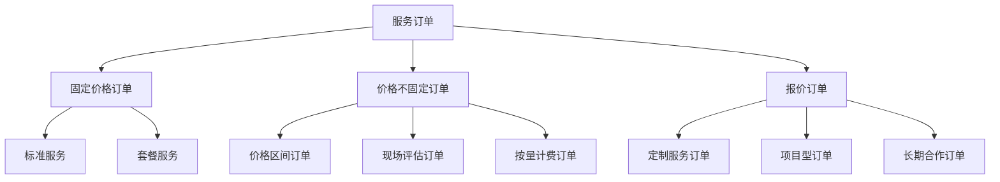
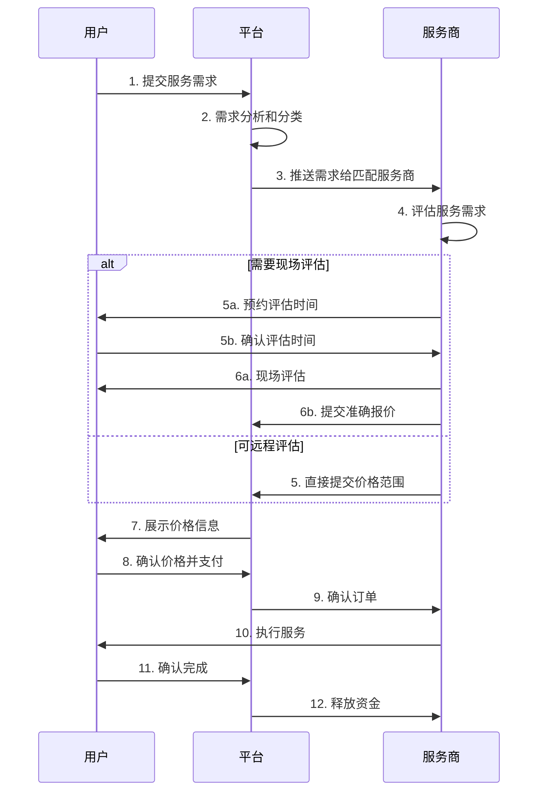
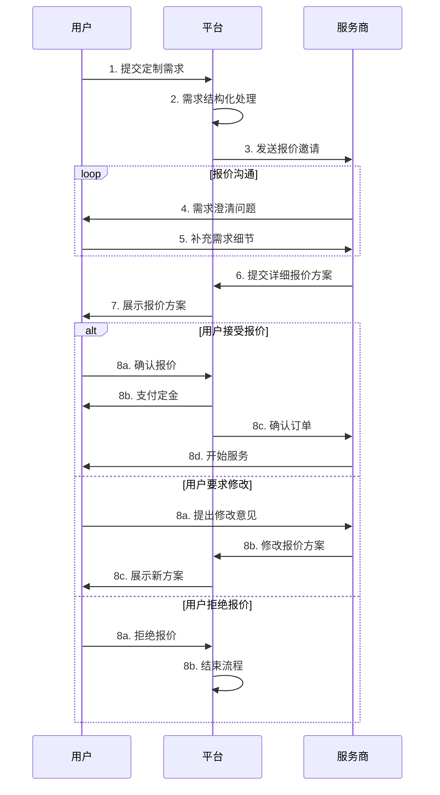
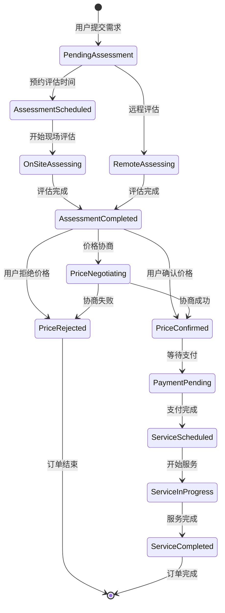
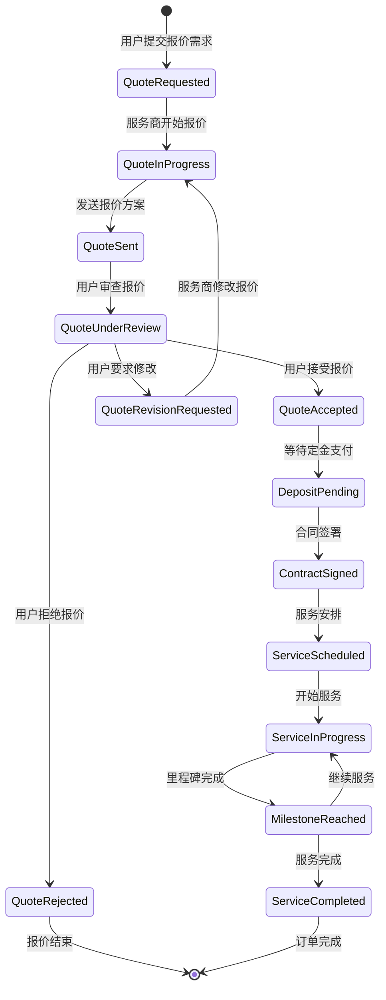

# 价格不固定订单与报价订单处理方案

## 📋 目录
- [1. 业务场景分析](#1-业务场景分析)
- [2. 订单类型分类](#2-订单类型分类)
- [3. 处理流程设计](#3-处理流程设计)
- [4. 数据模型设计](#4-数据模型设计)
- [5. 状态流转机制](#5-状态流转机制)
- [6. 用户体验设计](#6-用户体验设计)
- [7. 技术实现方案](#7-技术实现方案)

---

## 1. 业务场景分析

### 1.1 价格不固定订单（Price Not Fixed Orders）

#### 典型场景
1. **家政清洁服务**
   - 用户描述：3室2厅深度清洁
   - 价格因素：房屋大小、脏污程度、特殊要求
   - 处理方式：服务商上门评估后确定价格

2. **维修服务**
   - 用户描述：水管漏水修理
   - 价格因素：问题复杂度、材料成本、工作量
   - 处理方式：现场诊断后报价

3. **搬家服务**
   - 用户描述：2居室搬家，楼层信息
   - 价格因素：物品数量、距离、是否有电梯
   - 处理方式：预估价格区间，实际按工作量计费

#### 特点分析
```
✅ 用户需求明确，但价格需要评估
✅ 服务商需要更多信息才能准确定价
✅ 通常有价格区间参考
✅ 可能需要现场评估
✅ 支付通常在服务确认后
```

### 1.2 报价订单（Quote-based Orders）

#### 典型场景
1. **装修服务**
   - 用户需求：厨房翻新
   - 报价过程：需求分析 → 方案设计 → 材料清单 → 工期评估
   - 处理方式：多轮沟通确定方案和价格

2. **活动策划**
   - 用户需求：生日聚会策划
   - 报价过程：主题确定 → 场地选择 → 服务内容 → 预算分配
   - 处理方式：定制化方案报价

3. **专业咨询**
   - 用户需求：税务咨询服务
   - 报价过程：问题复杂度评估 → 服务范围确定 → 时间投入估算
   - 处理方式：按项目或时间报价

#### 特点分析
```
✅ 高度定制化需求
✅ 需要专业评估和方案设计
✅ 多轮沟通确认
✅ 价格差异较大
✅ 通常涉及较高金额
✅ 需要合同或协议
```

---

## 2. 订单类型分类

### 2.1 按定价方式分类



### 2.2 详细分类说明

#### 价格区间订单（Range Pricing）
```dart
class RangePricingOrder {
  final double minPrice;      // 最低价格
  final double maxPrice;      // 最高价格
  final String priceUnit;     // 计价单位：小时、平方米、项目
  final List<String> pricingFactors; // 影响价格的因素
  
  // 示例：家政清洁
  // minPrice: 80.0
  // maxPrice: 200.0
  // priceUnit: "次"
  // pricingFactors: ["房屋面积", "清洁程度", "特殊要求"]
}
```

#### 现场评估订单（On-site Assessment）
```dart
class OnSiteAssessmentOrder {
  final bool requiresAssessment;    // 是否需要现场评估
  final double assessmentFee;       // 评估费用
  final bool assessmentFeeRefundable; // 评估费是否可退还
  final Duration assessmentDuration; // 评估时长
  
  // 示例：维修服务
  // requiresAssessment: true
  // assessmentFee: 50.0
  // assessmentFeeRefundable: true（下单后退还）
  // assessmentDuration: 30分钟
}
```

#### 定制报价订单（Custom Quote）
```dart
class CustomQuoteOrder {
  final Duration quoteValidDuration;  // 报价有效期
  final int maxRevisions;            // 最大修改次数
  final bool requiresDeposit;        // 是否需要定金
  final double depositPercentage;    // 定金比例
  
  // 示例：装修服务
  // quoteValidDuration: 7天
  // maxRevisions: 3次
  // requiresDeposit: true
  // depositPercentage: 30%
}
```

---

## 3. 处理流程设计

### 3.1 价格不固定订单处理流程



### 3.2 报价订单处理流程



### 3.3 混合模式处理流程

某些服务可能需要组合处理：

```
阶段1：初步报价（价格区间）
阶段2：详细评估（具体需求）
阶段3：最终报价（准确价格）
阶段4：合同签署（服务确认）
阶段5：服务执行（分阶段支付）
```

---

## 4. 数据模型设计

### 4.1 灵活定价服务详情模型

```dart
/// 灵活定价服务详情
class FlexiblePricingServiceDetail {
  final String id;
  final String serviceId;
  final PricingType pricingType;
  
  // 价格信息
  final double? basePrice;           // 基础价格
  final double? minPrice;           // 最低价格
  final double? maxPrice;           // 最高价格
  final String priceUnit;           // 计价单位
  final String currency;
  
  // 定价因素
  final List<PricingFactor> pricingFactors;
  final Map<String, dynamic> pricingRules;
  
  // 评估设置
  final bool requiresAssessment;
  final double? assessmentFee;
  final bool assessmentFeeRefundable;
  final Duration? assessmentDuration;
  
  // 报价设置
  final bool allowsCustomQuote;
  final Duration? quoteValidDuration;
  final int maxQuoteRevisions;
  final bool requiresDeposit;
  final double? depositPercentage;
  
  // 服务配置
  final Duration estimatedServiceDuration;
  final List<String> includedServices;
  final List<String> optionalServices;
  final Map<String, dynamic> serviceTerms;
}

/// 定价类型枚举
enum PricingType {
  fixed,           // 固定价格
  range,           // 价格区间
  assessment,      // 现场评估
  customQuote,     // 定制报价
  hourly,          // 按小时计费
  projectBased,    // 按项目计费
}

/// 定价因素
class PricingFactor {
  final String id;
  final String name;
  final String description;
  final PricingFactorType type;
  final Map<String, dynamic> options;
  final double impactWeight;        // 影响权重 0-1
  
  const PricingFactor({
    required this.id,
    required this.name,
    required this.description,
    required this.type,
    required this.options,
    this.impactWeight = 0.1,
  });
}

enum PricingFactorType {
  selection,       // 单选：房屋类型
  multiSelect,     // 多选：清洁项目
  range,          // 范围：面积大小
  boolean,        // 布尔：是否加急
  text,           // 文本：特殊要求
  number,         // 数字：楼层数
}
```

### 4.2 需求评估模型

```dart
/// 需求评估
class ServiceAssessment {
  final String id;
  final String orderId;
  final String serviceId;
  final String providerId;
  final String userId;
  
  // 评估信息
  final AssessmentType assessmentType;
  final AssessmentStatus status;
  final DateTime? scheduledAt;
  final DateTime? completedAt;
  final Duration? actualDuration;
  
  // 用户需求
  final Map<String, dynamic> userRequirements;
  final List<String> userImages;
  final String? userNotes;
  
  // 服务商评估
  final Map<String, dynamic>? providerAssessment;
  final List<String>? providerImages;
  final String? providerNotes;
  final double? assessedPrice;
  final Map<String, dynamic>? pricingBreakdown;
  
  // 评估结果
  final AssessmentResult? result;
  final DateTime createdAt;
  final DateTime updatedAt;
}

enum AssessmentType {
  remote,          // 远程评估
  onSite,          // 现场评估
  hybrid,          // 混合评估
}

enum AssessmentStatus {
  pending,         // 待评估
  scheduled,       // 已预约
  inProgress,      // 评估中
  completed,       // 已完成
  cancelled,       // 已取消
}

class AssessmentResult {
  final double finalPrice;
  final String currency;
  final Map<String, dynamic> pricingDetails;
  final Duration estimatedDuration;
  final DateTime? earliestStartDate;
  final DateTime? latestStartDate;
  final List<String> includedServices;
  final List<String> additionalOptions;
  final String? specialNotes;
}
```

### 4.3 报价模型

```dart
/// 服务报价
class ServiceQuote {
  final String id;
  final String orderId;
  final String serviceId;
  final String providerId;
  final String userId;
  
  // 报价基本信息
  final String quoteNumber;
  final QuoteStatus status;
  final QuoteType quoteType;
  final int revisionNumber;
  
  // 价格信息
  final double totalPrice;
  final String currency;
  final Map<String, dynamic> pricingBreakdown;
  final double? depositAmount;
  final List<PaymentMilestone> paymentMilestones;
  
  // 服务信息
  final String serviceDescription;
  final Duration estimatedDuration;
  final DateTime? proposedStartDate;
  final DateTime? proposedEndDate;
  final List<String> includedServices;
  final List<QuoteOption> additionalOptions;
  
  // 条款信息
  final Map<String, dynamic> terms;
  final DateTime validUntil;
  final String? cancellationPolicy;
  final String? refundPolicy;
  
  // 沟通记录
  final List<QuoteMessage> messages;
  final List<String> attachments;
  
  final DateTime createdAt;
  final DateTime updatedAt;
  final String? lastUpdatedBy;
}

enum QuoteStatus {
  draft,           // 草稿
  sent,            // 已发送
  viewed,          // 已查看
  underReview,     // 审查中
  revised,         // 已修改
  accepted,        // 已接受
  rejected,        // 已拒绝
  expired,         // 已过期
  cancelled,       // 已取消
}

enum QuoteType {
  standard,        // 标准报价
  competitive,     // 竞争报价
  negotiated,      // 议价报价
  revised,         // 修改报价
}

/// 支付里程碑
class PaymentMilestone {
  final String id;
  final String name;
  final String description;
  final double amount;
  final double percentage;
  final DateTime? dueDate;
  final String? triggerCondition;
  final PaymentMilestoneStatus status;
}

/// 报价选项
class QuoteOption {
  final String id;
  final String name;
  final String description;
  final double price;
  final bool isRequired;
  final bool isSelected;
  final int? quantity;
}

/// 报价消息
class QuoteMessage {
  final String id;
  final String senderId;
  final String senderType;     // 'user', 'provider', 'system'
  final String message;
  final List<String>? attachments;
  final DateTime createdAt;
}
```

---

## 5. 状态流转机制

### 5.1 价格不固定订单状态流转



### 5.2 报价订单状态流转



---

## 6. 用户体验设计

### 6.1 价格不固定订单用户界面

#### 需求提交界面
```dart
class FlexiblePricingOrderForm extends StatefulWidget {
  @override
  Widget build(BuildContext context) {
    return Column(
      children: [
        // 服务基本信息
        ServiceInfoSection(),
        
        // 定价因素选择
        PricingFactorsSection(
          factors: service.pricingFactors,
          onFactorChanged: _updatePriceEstimate,
        ),
        
        // 价格估算显示
        PriceEstimateCard(
          minPrice: estimatedMinPrice,
          maxPrice: estimatedMaxPrice,
          factors: selectedFactors,
        ),
        
        // 评估选项
        if (service.requiresAssessment)
          AssessmentOptionsSection(
            assessmentFee: service.assessmentFee,
            isRefundable: service.assessmentFeeRefundable,
          ),
        
        // 提交按钮
        SubmitButton(
          onPressed: _submitFlexibleOrder,
          text: service.requiresAssessment ? '预约评估' : '提交需求',
        ),
      ],
    );
  }
}
```

#### 价格确认界面
```dart
class PriceConfirmationDialog extends StatelessWidget {
  final AssessmentResult assessmentResult;
  
  @override
  Widget build(BuildContext context) {
    return AlertDialog(
      title: Text('服务价格确认'),
      content: Column(
        children: [
          // 最终价格显示
          PriceSummaryCard(
            finalPrice: assessmentResult.finalPrice,
            breakdown: assessmentResult.pricingDetails,
          ),
          
          // 服务详情
          ServiceDetailsCard(
            duration: assessmentResult.estimatedDuration,
            includedServices: assessmentResult.includedServices,
            startDate: assessmentResult.earliestStartDate,
          ),
          
          // 特殊说明
          if (assessmentResult.specialNotes != null)
            NotesCard(notes: assessmentResult.specialNotes!),
        ],
      ),
      actions: [
        TextButton(
          onPressed: () => _rejectPrice(),
          child: Text('拒绝'),
        ),
        TextButton(
          onPressed: () => _negotiatePrice(),
          child: Text('协商'),
        ),
        ElevatedButton(
          onPressed: () => _confirmPrice(),
          child: Text('确认支付'),
        ),
      ],
    );
  }
}
```

### 6.2 报价订单用户界面

#### 报价需求表单
```dart
class CustomQuoteRequestForm extends StatefulWidget {
  @override
  Widget build(BuildContext context) {
    return Column(
      children: [
        // 项目基本信息
        ProjectBasicInfoSection(),
        
        // 详细需求描述
        RequirementDescriptionSection(
          maxLength: 1000,
          placeholder: '请详细描述您的需求...',
        ),
        
        // 预算范围
        BudgetRangeSection(
          minBudget: minBudget,
          maxBudget: maxBudget,
          onBudgetChanged: _updateBudgetRange,
        ),
        
        // 时间要求
        TimeRequirementSection(
          preferredStartDate: preferredStartDate,
          deadline: deadline,
        ),
        
        // 附件上传
        AttachmentSection(
          allowedTypes: ['image', 'pdf', 'doc'],
          maxFiles: 10,
          maxFileSize: 10 * 1024 * 1024, // 10MB
        ),
        
        // 提交按钮
        SubmitButton(
          onPressed: _submitQuoteRequest,
          text: '提交报价需求',
        ),
      ],
    );
  }
}
```

#### 报价方案展示
```dart
class QuoteProposalView extends StatelessWidget {
  final ServiceQuote quote;
  
  @override
  Widget build(BuildContext context) {
    return SingleChildScrollView(
      child: Column(
        children: [
          // 报价标题
          QuoteHeaderCard(
            quoteNumber: quote.quoteNumber,
            status: quote.status,
            validUntil: quote.validUntil,
          ),
          
          // 价格汇总
          PriceSummaryCard(
            totalPrice: quote.totalPrice,
            breakdown: quote.pricingBreakdown,
            depositAmount: quote.depositAmount,
          ),
          
          // 支付里程碑
          PaymentMilestonesCard(
            milestones: quote.paymentMilestones,
          ),
          
          // 服务详情
          ServiceDetailsCard(
            description: quote.serviceDescription,
            duration: quote.estimatedDuration,
            startDate: quote.proposedStartDate,
            endDate: quote.proposedEndDate,
            includedServices: quote.includedServices,
          ),
          
          // 可选服务
          OptionalServicesCard(
            options: quote.additionalOptions,
            onOptionToggled: _toggleOption,
          ),
          
          // 条款条件
          TermsAndConditionsCard(
            terms: quote.terms,
            cancellationPolicy: quote.cancellationPolicy,
            refundPolicy: quote.refundPolicy,
          ),
          
          // 沟通历史
          CommunicationHistoryCard(
            messages: quote.messages,
          ),
          
          // 操作按钮
          QuoteActionButtons(
            onAccept: _acceptQuote,
            onReject: _rejectQuote,
            onRequestRevision: _requestRevision,
            onMessage: _sendMessage,
          ),
        ],
      ),
    );
  }
}
```

---

## 7. 技术实现方案

### 7.1 价格计算引擎

```dart
/// 灵活定价计算器
class FlexiblePricingCalculator {
  
  /// 计算价格区间
  Future<PriceRange> calculatePriceRange({
    required FlexiblePricingServiceDetail serviceDetail,
    required Map<String, dynamic> userInputs,
  }) async {
    double basePrice = serviceDetail.basePrice ?? 0;
    double minMultiplier = 1.0;
    double maxMultiplier = 1.0;
    
    // 根据定价因素计算价格影响
    for (final factor in serviceDetail.pricingFactors) {
      final userValue = userInputs[factor.id];
      if (userValue != null) {
        final impact = _calculateFactorImpact(factor, userValue);
        minMultiplier += impact.min * factor.impactWeight;
        maxMultiplier += impact.max * factor.impactWeight;
      }
    }
    
    // 应用定价规则
    final rules = serviceDetail.pricingRules;
    if (rules.isNotEmpty) {
      final ruleImpact = _applyPricingRules(rules, userInputs);
      minMultiplier *= ruleImpact.min;
      maxMultiplier *= ruleImpact.max;
    }
    
    final minPrice = math.max(
      basePrice * minMultiplier,
      serviceDetail.minPrice ?? 0,
    );
    
    final maxPrice = math.min(
      basePrice * maxMultiplier,
      serviceDetail.maxPrice ?? double.infinity,
    );
    
    return PriceRange(
      min: minPrice,
      max: maxPrice,
      currency: serviceDetail.currency,
      factors: _generatePriceFactorsExplanation(serviceDetail.pricingFactors, userInputs),
    );
  }
  
  /// 计算因素影响
  PriceImpact _calculateFactorImpact(PricingFactor factor, dynamic value) {
    switch (factor.type) {
      case PricingFactorType.selection:
        return _calculateSelectionImpact(factor, value);
      case PricingFactorType.range:
        return _calculateRangeImpact(factor, value);
      case PricingFactorType.boolean:
        return _calculateBooleanImpact(factor, value);
      default:
        return PriceImpact(min: 0, max: 0);
    }
  }
  
  /// 应用定价规则
  PriceImpact _applyPricingRules(
    Map<String, dynamic> rules,
    Map<String, dynamic> inputs,
  ) {
    // 实现复杂的定价规则逻辑
    // 例如：组合折扣、批量价格、时间敏感定价等
    return PriceImpact(min: 1.0, max: 1.0);
  }
}

class PriceRange {
  final double min;
  final double max;
  final String currency;
  final List<PriceFactorExplanation> factors;
  
  const PriceRange({
    required this.min,
    required this.max,
    required this.currency,
    required this.factors,
  });
  
  String get formattedRange {
    return '\$${min.toStringAsFixed(2)} - \$${max.toStringAsFixed(2)} $currency';
  }
}

class PriceImpact {
  final double min;
  final double max;
  
  const PriceImpact({required this.min, required this.max});
}

class PriceFactorExplanation {
  final String factorName;
  final String userChoice;
  final String impact;
  final double priceChange;
  
  const PriceFactorExplanation({
    required this.factorName,
    required this.userChoice,
    required this.impact,
    required this.priceChange,
  });
}
```

### 7.2 报价管理系统

```dart
/// 报价管理器
class QuoteManager extends GetxController {
  final SupabaseClient _supabase = Supabase.instance.client;
  
  /// 创建报价请求
  Future<ServiceQuote> createQuoteRequest({
    required String serviceId,
    required String providerId,
    required Map<String, dynamic> requirements,
    double? budgetMin,
    double? budgetMax,
    DateTime? preferredStartDate,
    DateTime? deadline,
    List<String>? attachments,
  }) async {
    try {
      final userId = _supabase.auth.currentUser?.id;
      if (userId == null) throw Exception('用户未认证');
      
      final quoteNumber = _generateQuoteNumber();
      
      final quoteData = {
        'quote_number': quoteNumber,
        'service_id': serviceId,
        'provider_id': providerId,
        'user_id': userId,
        'status': QuoteStatus.draft.name,
        'quote_type': QuoteType.standard.name,
        'revision_number': 1,
        'requirements': requirements,
        'budget_range': {
          'min': budgetMin,
          'max': budgetMax,
          'currency': 'CAD',
        },
        'timeline': {
          'preferred_start_date': preferredStartDate?.toIso8601String(),
          'deadline': deadline?.toIso8601String(),
        },
        'attachments': attachments ?? [],
        'valid_until': DateTime.now().add(Duration(days: 30)).toIso8601String(),
        'created_at': DateTime.now().toIso8601String(),
        'updated_at': DateTime.now().toIso8601String(),
      };
      
      final response = await _supabase
          .from('service_quotes')
          .insert(quoteData)
          .select()
          .single();
      
      final quote = ServiceQuote.fromJson(response);
      
      // 发送通知给服务商
      await _notifyProviderOfQuoteRequest(providerId, quote.id);
      
      return quote;
    } catch (e) {
      throw Exception('创建报价请求失败: $e');
    }
  }
  
  /// 提交报价方案
  Future<ServiceQuote> submitQuoteProposal({
    required String quoteId,
    required double totalPrice,
    required Map<String, dynamic> pricingBreakdown,
    required String serviceDescription,
    required Duration estimatedDuration,
    DateTime? proposedStartDate,
    DateTime? proposedEndDate,
    List<String>? includedServices,
    List<QuoteOption>? additionalOptions,
    double? depositAmount,
    List<PaymentMilestone>? paymentMilestones,
    Map<String, dynamic>? terms,
  }) async {
    try {
      final updateData = {
        'status': QuoteStatus.sent.name,
        'total_price': totalPrice,
        'currency': 'CAD',
        'pricing_breakdown': pricingBreakdown,
        'service_description': serviceDescription,
        'estimated_duration': estimatedDuration.inMinutes,
        'proposed_start_date': proposedStartDate?.toIso8601String(),
        'proposed_end_date': proposedEndDate?.toIso8601String(),
        'included_services': includedServices ?? [],
        'additional_options': additionalOptions?.map((o) => o.toJson()).toList() ?? [],
        'deposit_amount': depositAmount,
        'payment_milestones': paymentMilestones?.map((m) => m.toJson()).toList() ?? [],
        'terms': terms ?? {},
        'updated_at': DateTime.now().toIso8601String(),
      };
      
      final response = await _supabase
          .from('service_quotes')
          .update(updateData)
          .eq('id', quoteId)
          .select()
          .single();
      
      final quote = ServiceQuote.fromJson(response);
      
      // 发送通知给用户
      await _notifyUserOfQuoteProposal(quote.userId, quoteId);
      
      return quote;
    } catch (e) {
      throw Exception('提交报价方案失败: $e');
    }
  }
  
  /// 用户操作报价
  Future<ServiceQuote> handleQuoteAction({
    required String quoteId,
    required QuoteAction action,
    String? message,
    Map<String, dynamic>? revisionRequests,
  }) async {
    try {
      QuoteStatus newStatus;
      Map<String, dynamic> updateData = {
        'updated_at': DateTime.now().toIso8601String(),
      };
      
      switch (action) {
        case QuoteAction.accept:
          newStatus = QuoteStatus.accepted;
          break;
        case QuoteAction.reject:
          newStatus = QuoteStatus.rejected;
          break;
        case QuoteAction.requestRevision:
          newStatus = QuoteStatus.underReview;
          updateData['revision_requests'] = revisionRequests;
          break;
      }
      
      updateData['status'] = newStatus.name;
      
      final response = await _supabase
          .from('service_quotes')
          .update(updateData)
          .eq('id', quoteId)
          .select()
          .single();
      
      final quote = ServiceQuote.fromJson(response);
      
      // 记录操作消息
      if (message != null) {
        await _addQuoteMessage(quoteId, quote.userId, 'user', message);
      }
      
      // 如果接受报价，创建订单
      if (action == QuoteAction.accept) {
        await _createOrderFromQuote(quote);
      }
      
      return quote;
    } catch (e) {
      throw Exception('处理报价操作失败: $e');
    }
  }
  
  /// 从报价创建订单
  Future<EnhancedOrder> _createOrderFromQuote(ServiceQuote quote) async {
    final orderGenerator = Get.find<OrderGenerator>();
    
    final quoteResult = QuoteResult(
      id: quote.id,
      serviceId: quote.serviceId,
      providerId: quote.providerId,
      agreedPrice: quote.totalPrice,
      currency: quote.currency,
      validUntil: quote.validUntil,
      terms: quote.terms,
      scheduledTime: quote.proposedStartDate,
      serviceAddress: {}, // 从报价中获取
    );
    
    final paymentInfo = PaymentInfo(); // 从用户选择中获取
    
    return await orderGenerator.generateNegotiatedOrder(quoteResult, paymentInfo);
  }
  
  String _generateQuoteNumber() {
    final now = DateTime.now();
    final dateStr = DateFormat('yyyyMMdd').format(now);
    final timeStr = DateFormat('HHmmss').format(now);
    return 'QUO-$dateStr-$timeStr';
  }
}

enum QuoteAction {
  accept,
  reject,
  requestRevision,
}
```

---

## 总结

通过这套完整的价格不固定订单和报价订单处理方案，金豆平台能够：

✅ **灵活处理各种定价模式**：从简单的价格区间到复杂的定制报价  
✅ **提供透明的价格计算**：用户了解价格构成和影响因素  
✅ **支持多轮沟通协商**：确保服务需求和价格的精准匹配  
✅ **保障交易安全**：通过评估、报价、确认的严格流程  
✅ **优化用户体验**：清晰的界面和流程指引  

这套方案为金豆平台的高价值、定制化服务提供了强有力的技术支撑。
