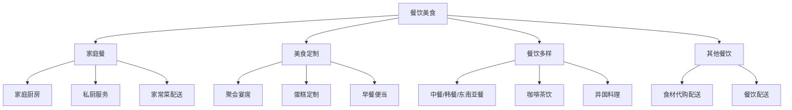
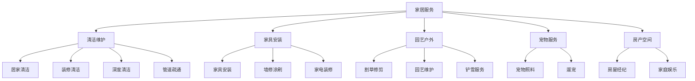
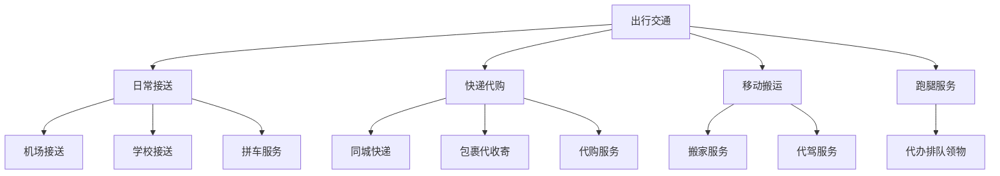
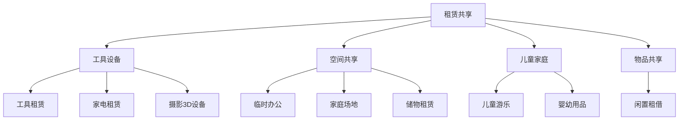
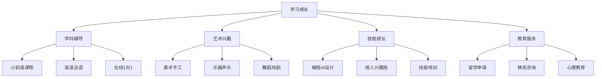
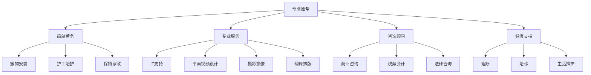
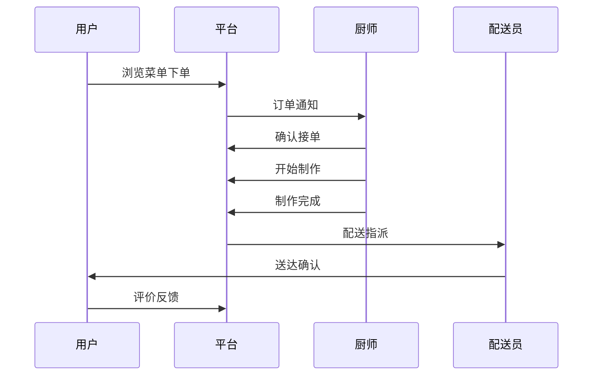
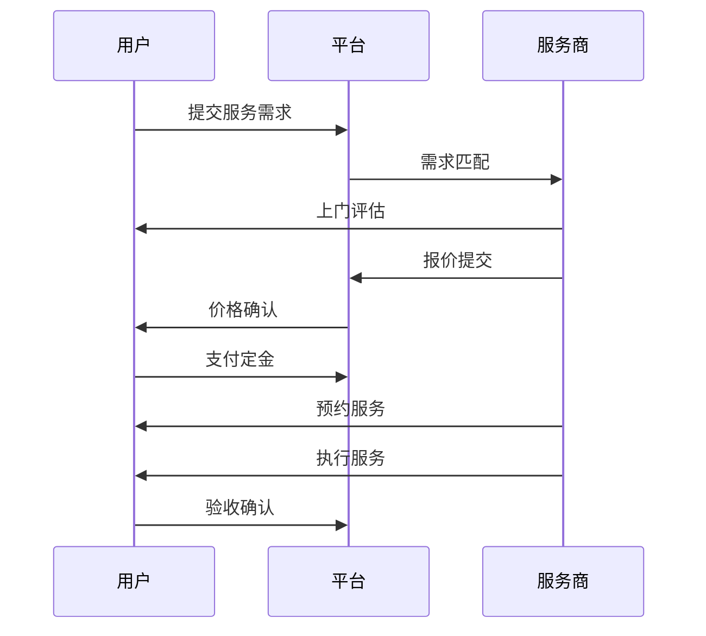
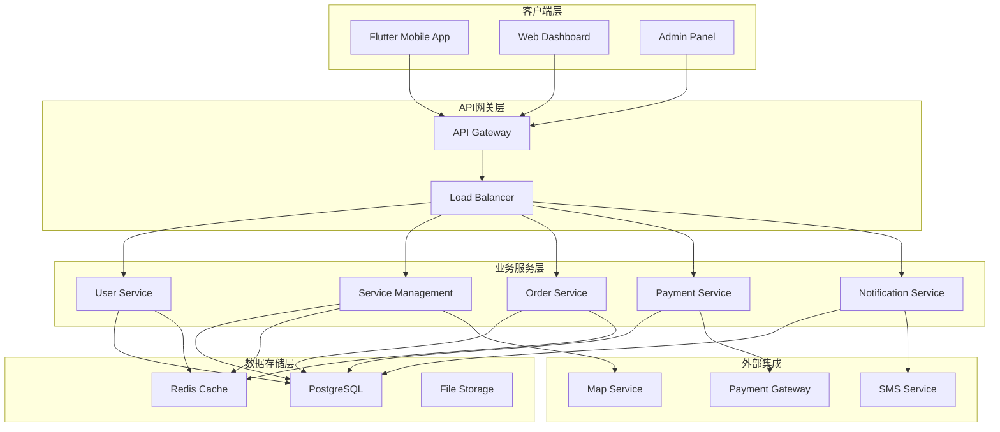

# 金豆平台六大行业统一深入分析

## 📋 目录
- [1. 概述](#1-概述)
- [2. 六大行业深度分析](#2-六大行业深度分析)
- [3. 跨行业通用功能需求](#3-跨行业通用功能需求)
- [4. 行业差异化设计](#4-行业差异化设计)
- [5. 技术架构统一设计](#5-技术架构统一设计)
- [6. 商业模式分析](#6-商业模式分析)
- [7. 实施策略](#7-实施策略)

---

## 1. 概述

### 1.1 金豆平台定位
金豆(JinBean)是一个基于地理位置的**本地化综合服务平台**，致力于连接加拿大华人社区的服务需求与供给，通过数字化手段促进社区经济发展和文化融合。

### 1.2 六大核心行业
```
1. 🍽️ 餐饮美食 (Dining)          - 本地化餐饮服务与美食文化
2. 🏠 家居服务 (Home Services)    - 家庭生活全方位支持
3. 🚗 出行交通 (Transportation)   - 便民出行与物流服务
4. 🤝 租赁共享 (Rental & Share)   - 资源共享与循环经济
5. 📚 学习成长 (Learning)         - 教育培训与技能提升
6. ⚡ 专业速帮 (Pro & Gigs)       - 专业服务与即时支援
```

### 1.3 平台核心价值
- **文化桥梁**：连接华人社区与本地资源
- **信任体系**：基于社区的可靠服务保障
- **便民服务**：一站式生活服务解决方案
- **经济赋能**：为服务提供者创造收入机会

---

## 2. 六大行业深度分析

### 2.1 🍽️ 餐饮美食 (Dining)

#### 行业特点分析
```
核心需求：解决华人饮食文化需求与本地化适应
用户画像：华人家庭、留学生、对中华料理感兴趣的本地人
服务频次：高频（日常3餐）
价格敏感度：中等
信任要求：高（食品安全）
即时性要求：强（用餐时间固定）
```

#### 细分服务类别


#### 业务模式特点
**定价模式**：
- 固定价格：标准餐品、套餐
- 按量计费：聚会宴席、定制服务
- 预估价格：私厨服务（需考虑人数、菜品复杂度）

**服务流程**：
```
下单 → 确认需求 → 备料制作 → 配送/自取 → 用餐 → 评价
```

**关键成功因素**：
- 食品安全认证
- 口味地道性
- 配送时效性
- 包装保温性

### 2.2 🏠 家居服务 (Home Services)

#### 行业特点分析
```
核心需求：家庭生活质量提升与维护
用户画像：有房家庭、租房群体、老年人群
服务频次：中低频（按需）
价格敏感度：高
信任要求：极高（家庭安全）
技能要求：高（专业性强）
```

#### 细分服务类别


#### 业务模式特点
**定价模式**：
- 价格区间：清洁服务（基于房屋大小）
- 现场评估：维修、装修服务
- 包时计费：保姆、宠物照料
- 项目报价：大型家具安装

**服务流程**：
```
需求描述 → 上门评估 → 价格确认 → 预约服务 → 执行服务 → 验收确认
```

**关键成功因素**：
- 专业资质认证
- 保险保障
- 工具设备齐全
- 背景调查完整

### 2.3 🚗 出行交通 (Transportation)

#### 行业特点分析
```
核心需求：便民出行与物流运输
用户画像：无车族、老年人、有特殊出行需求群体
服务频次：中频（定期需求）
价格敏感度：高
安全要求：极高
即时性要求：强
合规要求：严格（政府监管）
```

#### 细分服务类别


#### 业务模式特点
**定价模式**：
- 距离计费：机场接送、搬家
- 时间计费：代驾、包车
- 固定价格：定期接送
- 重量/体积计费：快递代购

**服务流程**：
```
预约 → 路线确认 → 车辆派遣 → 服务执行 → 安全送达 → 费用结算
```

**关键成功因素**：
- 合法运营资质
- 车辆保险齐全
- 司机背景清查
- GPS实时跟踪

### 2.4 🤝 租赁共享 (Rental & Share)

#### 行业特点分析
```
核心需求：资源优化配置与成本节约
用户画像：年轻群体、临时需求用户、环保意识强的人群
使用频次：低频（偶发性）
价格敏感度：高
物品损坏风险：中高
押金管理：重要
```

#### 细分服务类别


#### 业务模式特点
**定价模式**：
- 按天计费：工具、设备租赁
- 按小时计费：场地共享
- 押金制度：贵重物品租赁
- 会员制：长期用户优惠

**服务流程**：
```
搜索物品 → 预约租赁 → 押金支付 → 物品交接 → 使用期间 → 归还检查 → 押金退还
```

**关键成功因素**：
- 物品质量保证
- 清洁消毒程序
- 损坏评估标准
- 快速响应服务

### 2.5 📚 学习成长 (Learning)

#### 行业特点分析
```
核心需求：教育培训与技能提升
用户画像：学生群体、家长、职场人士、兴趣爱好者
服务频次：高频（周期性）
价格接受度：中高
效果期望：高
长期关系：强
```

#### 细分服务类别


#### 业务模式特点
**定价模式**：
- 课时计费：1对1辅导
- 套餐制：课程包
- 项目制：留学申请、移民咨询
- 会员制：长期学习计划

**服务流程**：
```
需求评估 → 课程规划 → 试听体验 → 正式报名 → 学习跟踪 → 效果评估
```

**关键成功因素**：
- 教师资质认证
- 教学效果跟踪
- 个性化定制
- 持续服务关系

### 2.6 ⚡ 专业速帮 (Pro & Gigs)

#### 行业特点分析
```
核心需求：专业技能服务与即时支援
用户画像：企业客户、有特殊需求的个人
服务频次：低频但紧急
专业性要求：极高
时效性要求：强
价格接受度：高
```

#### 细分服务类别


#### 业务模式特点
**定价模式**：
- 项目报价：设计、咨询服务
- 小时计费：IT支持、护理
- 定制报价：复杂专业服务
- 紧急加价：即时响应服务

**服务流程**：
```
紧急需求 → 快速匹配 → 专家评估 → 即时响应 → 问题解决 → 效果确认
```

**关键成功因素**：
- 专业资质认证
- 快速响应能力
- 问题解决效率
- 专业口碑建立

---

## 3. 跨行业通用功能需求

### 3.1 核心平台能力

#### 用户管理系统
```
✅ 多角色支持：消费者、服务提供者、管理员
✅ 身份认证：手机、邮箱、社交账号登录
✅ 个人资料：多语言、偏好设置、历史记录
✅ 信用体系：评分、认证、投诉处理
```

#### 服务发现与匹配
```
✅ 地理定位：基于LBS的服务推荐
✅ 智能搜索：关键词、分类、筛选
✅ 个性化推荐：基于历史和偏好
✅ 实时可用性：服务商在线状态
```

#### 订单管理系统
```
✅ 多种下单模式：即时、预约、议价
✅ 订单状态流转：完整生命周期管理
✅ 批量订单处理：购物车、组合服务
✅ 订单历史：查询、重复下单、退改
```

#### 支付结算系统
```
✅ 多种支付方式：信用卡、借记卡、数字钱包
✅ 灵活结算：预付、后付、分期、担保
✅ 自动税费计算：HST、服务费、配送费
✅ 退款处理：快速、安全、透明
```

### 3.2 通用技术架构

#### 数据层设计
```sql
-- 核心实体关系
users (用户) ← services (服务) ← orders (订单) ← payments (支付)
     ↓              ↓              ↓           ↓
reviews (评价) ← service_details ← order_items ← refunds (退款)
```

#### 业务逻辑层
```dart
// 统一服务接口
abstract class BaseService {
  Future<List<Service>> searchServices(SearchCriteria criteria);
  Future<Order> createOrder(OrderRequest request);
  Future<Payment> processPayment(PaymentRequest request);
}

// 行业特定实现
class DiningService extends BaseService { ... }
class HomeService extends BaseService { ... }
class TransportationService extends BaseService { ... }
```

#### 表现层组件
```dart
// 通用UI组件
ServiceCard, OrderCard, PaymentCard, ReviewCard
ServiceList, OrderList, PaymentHistory
SearchBar, FilterPanel, SortOptions
MapView, CalendarView, ChatView
```

---

## 4. 行业差异化设计

### 4.1 用户界面差异化

#### 餐饮美食界面特点
```
🎨 暖色调设计 (橙红色系)
📸 高质量食物图片展示
🕐 用餐时间选择器
🍽️ 菜单样式布局
⭐ 口味标签系统
```

#### 家居服务界面特点
```
🎨 清洁简约设计 (蓝绿色系)
🏠 房屋平面图集成
📋 服务清单展示
📅 预约日历视图
🛡️ 保险保障展示
```

#### 出行交通界面特点
```
🎨 动感设计 (蓝色系)
🗺️ 地图路线规划
🚗 实时位置跟踪
⏰ 预计到达时间
📱 司机信息展示
```

### 4.2 业务流程差异化

#### 餐饮服务流程


#### 家居服务流程


### 4.3 数据模型差异化

#### 餐饮特有属性
```dart
class DiningServiceDetail extends ServiceDetail {
  final List<String> allergens;      // 过敏原信息
  final int spicyLevel;             // 辣度等级
  final String cuisine;             // 菜系类型
  final bool isHalal;               // 清真认证
  final int preparationTime;        // 制作时长
  final bool supportsDelivery;      // 支持配送
}
```

#### 家居特有属性
```dart
class HomeServiceDetail extends ServiceDetail {
  final List<String> requiredTools;  // 所需工具
  final bool needsAssessment;        // 需要评估
  final List<String> certifications; // 资质认证
  final bool hasInsurance;           // 保险保障
  final int experienceYears;         // 从业年限
  final List<String> serviceAreas;   // 服务区域
}
```

#### 出行特有属性
```dart
class TransportationServiceDetail extends ServiceDetail {
  final String vehicleType;          // 车辆类型
  final int passengerCapacity;       // 载客量
  final bool hasChildSeat;           // 儿童座椅
  final String licenseNumber;        // 执照号码
  final bool isAccessible;           // 无障碍设施
  final double fuelSurcharge;        // 燃油附加费
}
```

---

## 5. 技术架构统一设计

### 5.1 微服务架构



### 5.2 数据库设计统一规范

#### 核心表结构
```sql
-- 用户表
CREATE TABLE users (
    id UUID PRIMARY KEY,
    role VARCHAR(20), -- 'customer', 'provider', 'admin'
    ...
);

-- 服务表
CREATE TABLE services (
    id UUID PRIMARY KEY,
    category_id BIGINT REFERENCES ref_codes(id),
    pricing_type VARCHAR(20), -- 'fixed', 'range', 'negotiable'
    ...
);

-- 订单表
CREATE TABLE orders (
    id UUID PRIMARY KEY,
    order_type VARCHAR(20), -- 'dining', 'home', 'transport', etc.
    industry_specific_data JSONB, -- 行业特定数据
    ...
);
```

#### 行业扩展设计
```sql
-- 行业特定配置表
CREATE TABLE industry_configs (
    id SERIAL PRIMARY KEY,
    industry_code VARCHAR(50),
    config_key VARCHAR(100),
    config_value JSONB,
    description TEXT
);

-- 行业特定字段扩展
ALTER TABLE services ADD COLUMN industry_attributes JSONB;
ALTER TABLE orders ADD COLUMN industry_metadata JSONB;
```

### 5.3 API设计规范

#### RESTful API标准
```
GET    /api/v1/{industry}/services          # 获取行业服务列表
POST   /api/v1/{industry}/services          # 创建服务
GET    /api/v1/{industry}/services/{id}     # 获取服务详情
PUT    /api/v1/{industry}/services/{id}     # 更新服务
DELETE /api/v1/{industry}/services/{id}     # 删除服务

POST   /api/v1/{industry}/orders            # 创建订单
GET    /api/v1/{industry}/orders/{id}       # 获取订单详情
PUT    /api/v1/{industry}/orders/{id}/status # 更新订单状态
```

#### 行业特定API
```
# 餐饮行业
GET /api/v1/dining/menus/{id}               # 获取菜单
POST /api/v1/dining/orders/{id}/delivery    # 安排配送

# 家居行业  
POST /api/v1/home/assessments               # 预约评估
GET /api/v1/home/certifications/{id}        # 获取资质

# 出行行业
POST /api/v1/transport/routes               # 路线规划
GET /api/v1/transport/vehicles/{id}/location # 实时位置
```

---

## 6. 商业模式分析

### 6.1 收入模式

#### 多元化收入结构
```
1. 交易佣金 (主要收入)
   - 餐饮：5-8%
   - 家居：8-12%
   - 出行：10-15%
   - 租赁：12-18%
   - 教育：8-15%
   - 专业：10-20%

2. 会员费用
   - 普通会员：免费
   - 高级会员：$9.99/月 (优先匹配、费率优惠)
   - 企业会员：$99/月 (批量采购、企业服务)

3. 增值服务
   - 置顶推广：$10-50/月
   - 专业认证：$50/年
   - 数据分析：$20/月
   - 保险服务：佣金分成

4. 广告收入
   - 横幅广告：按展示收费
   - 搜索广告：按点击收费
   - 品牌合作：年度合作费
```

### 6.2 成本结构分析

#### 主要成本项目
```
1. 技术开发 (35%)
   - 研发团队
   - 云服务费用
   - 第三方API费用

2. 运营成本 (25%)
   - 客服支持
   - 质量监控
   - 市场推广

3. 支付处理 (15%)
   - 支付网关费用
   - 金融合规成本
   - 风控系统

4. 基础设施 (15%)
   - 服务器
   - 带宽
   - 安全防护

5. 其他费用 (10%)
   - 法务
   - 财务
   - 保险
```

### 6.3 竞争优势分析

#### 核心竞争力
```
1. 文化定位优势
   ✅ 深度理解华人需求
   ✅ 双语服务支持
   ✅ 本地化适应能力

2. 技术平台优势
   ✅ 一站式服务整合
   ✅ 智能匹配算法
   ✅ 多行业统一架构

3. 信任体系优势
   ✅ 社区背景调查
   ✅ 多层级认证机制
   ✅ 完善的评价体系

4. 服务质量优势
   ✅ 严格的服务商筛选
   ✅ 持续的质量监控
   ✅ 快速的问题响应
```

---

## 7. 实施策略

### 7.1 分阶段实施计划

#### 第一阶段 (MVP - 3个月)
```
目标：核心功能验证
范围：餐饮美食 + 家居服务
用户：1000活跃用户
GMV：$50K/月

核心功能：
✅ 用户注册登录
✅ 服务浏览预订
✅ 基础支付功能
✅ 简单评价系统
```

#### 第二阶段 (扩展 - 6个月)
```
目标：行业覆盖完善
范围：全部6个行业
用户：5000活跃用户
GMV：$200K/月

新增功能：
✅ 复杂定价模式
✅ 高级搜索筛选
✅ 社区功能
✅ 商家工具
```

#### 第三阶段 (优化 - 12个月)
```
目标：平台生态成熟
范围：周边城市扩展
用户：20000活跃用户
GMV：$1M/月

高级功能：
✅ AI智能推荐
✅ 供应链整合
✅ 金融服务
✅ 数据分析
```

### 7.2 技术实施优先级

#### 核心系统开发
```
优先级1：用户管理、服务发现、订单处理
优先级2：支付系统、评价系统、通知系统
优先级3：数据分析、AI推荐、高级功能
```

#### 行业模块开发
```
Phase 1：餐饮美食 (高频刚需)
Phase 2：家居服务 (高价值)
Phase 3：出行交通 (强需求)
Phase 4：学习成长 (长期价值)
Phase 5：租赁共享 (差异化)
Phase 6：专业速帮 (高利润)
```

### 7.3 市场推广策略

#### 获客策略
```
1. 社区推广
   - 华人社区活动赞助
   - 微信群推广
   - 线下地推活动

2. 数字营销
   - 社交媒体广告
   - 搜索引擎优化
   - 内容营销

3. 合作伙伴
   - 现有服务商合作
   - 异业联盟
   - 口碑推荐计划

4. 用户激励
   - 新用户红包
   - 推荐奖励
   - 会员特权
```

---

## 总结

金豆平台六大行业的统一设计体现了**"统一架构、差异化实现"**的设计理念：

🎯 **统一的技术架构**：为所有行业提供稳定、可扩展的基础设施  
🎨 **差异化的用户体验**：针对各行业特点优化界面和流程  
💼 **灵活的商业模式**：支持多种定价和服务模式  
🔒 **完善的质量保障**：跨行业的信任和安全体系  

通过这种设计，金豆平台能够：
- 快速拓展到新的行业领域
- 为用户提供一致但个性化的体验
- 建立可持续的商业生态系统
- 成为加拿大华人社区的首选服务平台

这一统一而深入的行业分析为金豆平台的技术实现、产品设计和商业运营提供了全面的指导方案。
