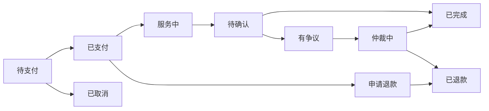
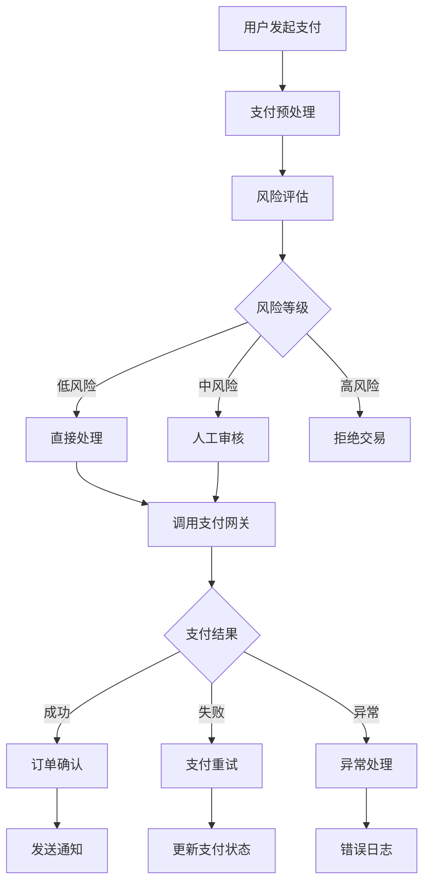

# 支付与订单生成模块 - 业务分析与架构设计

## 📋 目录
- [1. 业务场景分析](#1-业务场景分析)
- [2. 用户支付行为研究](#2-用户支付行为研究) 
- [3. 订单生成业务规则](#3-订单生成业务规则)
- [4. 支付方式与风控分析](#4-支付方式与风控分析)
- [5. 技术架构设计](#5-技术架构设计)
- [6. 数据库设计](#6-数据库设计)
- [7. API接口设计](#7-api接口设计)
- [8. 安全机制设计](#8-安全机制设计)
- [9. 实施计划](#9-实施计划)

---

## 1. 业务场景分析

### 1.1 金豆平台核心业务模式
金豆平台是一个本地化服务平台，连接服务提供商和消费者。主要特点：
- **服务多样化**：家政、美食、交通、教育、技术等
- **支付场景复杂**：预付费、后付费、分期付款、议价支付
- **服务特殊性**：部分服务需要线下确认，部分可在线完成

### 1.2 主要支付场景

#### 场景1：固定价格服务（如美食配送）
```
用户行为流程：
浏览服务 → 加入购物车 → 选择配送信息 → 支付 → 等待服务 → 完成评价
```

#### 场景2：议价服务（如家政清洁）
```
用户行为流程：
浏览服务 → 提交需求 → 服务商报价 → 议价沟通 → 确认价格 → 支付 → 服务执行 → 完成评价
```

#### 场景3：预约服务（如教育培训）
```
用户行为流程：
浏览服务 → 选择时间 → 预付定金 → 确认服务 → 支付尾款 → 服务完成 → 评价
```

### 1.3 加拿大本土化要求
- **税务合规**：GST/HST税收处理
- **支付方式**：支持加拿大主流支付方式
- **币种**：主要使用CAD（加元）
- **法规遵循**：符合加拿大消费者保护法

---

## 2. 用户支付行为研究

### 2.1 目标用户群体分析

#### 主要用户群体
1. **华人移民家庭**：25-45岁，注重性价比和服务质量
2. **本地加拿大居民**：各年龄段，重视便利性和安全性
3. **国际学生**：18-30岁，预算敏感，偏好移动支付
4. **老年用户**：50+岁，偏好传统支付方式

#### 支付偏好分析
- **信用卡**：最主流，安全性高，有消费保护
- **借记卡**：日常小额支付，即时扣款
- **数字钱包**：Apple Pay、Google Pay，便捷性高
- **银行转账**：大额支付，手续费低
- **现金支付**：线下服务，部分老年用户偏好

### 2.2 支付心理与行为模式

#### 信任建立机制
- 服务商认证展示
- 用户评价和信誉体系
- 平台担保机制
- 退款保障政策

#### 支付决策因素
1. **价格透明度**：明确的价格构成
2. **服务质量预期**：基于评价和描述
3. **支付安全感**：平台信誉和支付保护
4. **便利性**：支付流程简化程度

---

## 3. 订单生成业务规则

### 3.1 订单类型分类

#### 按服务特性分类
```
1. 即时订单（Instant Orders）
   - 特点：服务可立即提供
   - 例子：外卖配送、在线咨询
   - 支付：预付费为主

2. 预约订单（Scheduled Orders）
   - 特点：需要预约时间
   - 例子：家政服务、维修服务
   - 支付：定金+尾款模式

3. 议价订单（Negotiable Orders）
   - 特点：价格需要协商
   - 例子：装修服务、大型清洁
   - 支付：确认价格后支付

4. 长期订单（Subscription Orders）
   - 特点：周期性服务
   - 例子：月嫂服务、定期清洁
   - 支付：分期或周期支付
```

#### 按支付模式分类
```
1. 全额预付（Full Prepayment）
   - 适用：标准化服务，价格固定
   - 风险：服务方违约风险

2. 定金+尾款（Deposit + Final Payment）
   - 适用：需要确认的服务
   - 风险：双方违约风险

3. 服务完成后付款（Post-service Payment）
   - 适用：高信任度服务商
   - 风险：用户拒付风险

4. 分期付款（Installment Payment）
   - 适用：高价值长期服务
   - 风险：用户信用风险
```

### 3.2 订单状态流转

#### 核心状态定义


#### 详细状态说明
1. **PENDING_PAYMENT**（待支付）
   - 用户创建订单，等待支付
   - 超时自动取消机制

2. **PAID**（已支付）
   - 支付成功，等待服务开始
   - 可申请退款（根据退款政策）

3. **IN_SERVICE**（服务中）
   - 服务正在进行
   - 支持服务进度跟踪

4. **PENDING_CONFIRMATION**（待确认）
   - 服务完成，等待用户确认
   - 自动确认机制

5. **COMPLETED**（已完成）
   - 服务完成并确认
   - 资金释放给服务商

6. **CANCELLED**（已取消）
   - 订单取消，未产生费用
   - 记录取消原因

7. **REFUND_REQUESTED**（申请退款）
   - 用户申请退款
   - 等待审核处理

8. **REFUNDED**（已退款）
   - 退款完成
   - 记录退款详情

9. **DISPUTED**（有争议）
   - 服务质量争议
   - 进入仲裁流程

10. **IN_ARBITRATION**（仲裁中）
    - 平台介入处理
    - 最终裁决结果

---

## 4. 支付方式与风控分析

### 4.1 支付方式技术对接

#### 信用卡支付
```
接入方案：Stripe / Square / Moneris
- 优势：覆盖面广，用户接受度高
- 手续费：2.9% + $0.30 per transaction
- 安全：PCI DSS合规
- 争议处理：完善的Chargeback机制
```

#### 银行转账
```
接入方案：Interac e-Transfer
- 优势：手续费低，安全性高
- 劣势：处理时间较长
- 适用：大额支付
- 集成：通过银行API
```

#### 数字钱包
```
接入方案：Apple Pay / Google Pay / PayPal
- 优势：用户体验好，安全性高
- 手续费：与信用卡类似
- 集成：SDK集成
- 用户群：年轻用户偏好
```

### 4.2 风险控制机制

#### 支付风险识别
1. **异常交易检测**
   - 大额异常：超过用户历史平均金额
   - 频次异常：短时间内多次支付
   - 地理异常：异地登录支付
   - 设备异常：新设备支付行为

2. **用户信用评估**
   - 历史交易记录
   - 退款争议率
   - 身份验证状态
   - 第三方信用数据

3. **商户风险控制**
   - 服务商资质审核
   - 历史服务质量
   - 用户投诉率
   - 财务状况评估

#### 风控策略
```
低风险：自动处理
中风险：人工审核
高风险：暂停交易，要求额外验证
```

---

## 5. 技术架构设计

### 5.1 现有系统分析

#### 当前购物车系统
基于对现有代码的分析，当前系统已具备：

```dart
// 现有数据模型
- CartItem: 购物车项目，支持多语言、定制化、时间安排
- Cart: 购物车容器，支持分类型管理
- PricingResult: 价格计算结果，包含税费、服务费等
- Order: 订单模型，支持多种状态流转
- UnifiedCartController: 统一购物车控制器

// 已支持的功能
✅ 商品添加/删除/修改数量
✅ 购物车数据持久化（Supabase）
✅ 多服务商品分组管理
✅ 价格自动计算（含税费）
✅ 用户认证集成
✅ 实时数据同步
```

#### 现有订单系统
```dart
// 订单状态管理
- PendingAcceptance: 等待服务商接受
- Accepted: 已接受
- InProgress: 服务进行中  
- Completed: 已完成
- Canceled: 已取消

// 支付状态
- Pending: 待支付
- Completed: 已支付
- Refunded: 已退款
```

### 5.2 支付架构设计

#### 支付流程架构


#### 支付服务分层设计
```
┌─────────────────────────────────────┐
│           Presentation Layer        │  <- Flutter UI Components
├─────────────────────────────────────┤
│           Business Layer            │  <- Payment Controllers & Services
├─────────────────────────────────────┤
│           Data Layer                │  <- Payment Repositories
├─────────────────────────────────────┤
│           Integration Layer         │  <- Payment Gateway APIs
└─────────────────────────────────────┘
```

#### 核心支付组件设计

##### 1. 支付管理器（PaymentManager）
```dart
class PaymentManager {
  // 支付方式工厂
  PaymentMethodFactory _methodFactory;
  
  // 风险控制器
  RiskController _riskController;
  
  // 支付状态管理
  PaymentStateManager _stateManager;
  
  // 核心方法
  Future<PaymentResult> processPayment(PaymentRequest request);
  Future<RefundResult> processRefund(RefundRequest request);
  Future<PaymentStatus> getPaymentStatus(String paymentId);
}
```

##### 2. 支付方式抽象
```dart
abstract class PaymentMethod {
  String get name;
  String get displayName;
  List<String> get supportedCurrencies;
  
  Future<PaymentResult> charge(PaymentRequest request);
  Future<RefundResult> refund(RefundRequest request);
  Future<bool> validate(PaymentData data);
}

// 具体实现
class StripePaymentMethod extends PaymentMethod {...}
class InteracPaymentMethod extends PaymentMethod {...}
class PayPalPaymentMethod extends PaymentMethod {...}
```

##### 3. 订单生成器（OrderGenerator）
```dart
class OrderGenerator {
  // 从购物车生成订单
  Future<List<Order>> generateFromCart(
    Cart cart, 
    PaymentInfo paymentInfo,
    OrderPreferences preferences
  );
  
  // 直接服务预订生成订单
  Future<Order> generateDirectOrder(
    Service service,
    ServiceDetail serviceDetail,
    OrderOptions options
  );
  
  // 议价订单生成
  Future<Order> generateNegotiatedOrder(
    QuoteResult quote,
    PaymentInfo paymentInfo
  );
}
```

### 5.3 订单生成流程设计

#### 核心生成逻辑
```
购物车订单生成流程：
1. 验证购物车有效性
2. 按服务商分组商品
3. 计算每个订单的价格（含税费）
4. 生成订单号
5. 创建订单记录
6. 更新购物车状态
7. 发送通知

直接预订流程：
1. 验证服务可用性
2. 验证时间冲突
3. 计算价格
4. 创建订单
5. 立即处理支付

议价订单流程：
1. 基于报价单创建订单
2. 锁定价格
3. 设置支付期限
4. 等待用户确认支付
```

#### 订单拆分规则
```dart
class OrderSplitRule {
  // 按服务商拆分
  bool splitByProvider = true;
  
  // 按服务类型拆分  
  bool splitByServiceType = false;
  
  // 按配送时间拆分
  bool splitByDeliveryTime = true;
  
  // 最大订单商品数量
  int maxItemsPerOrder = 50;
  
  // 拆分策略
  List<Order> split(Cart cart, OrderContext context);
}
```

### 5.4 安全机制设计

#### 支付安全
```
1. 数据加密
   - 敏感信息AES-256加密存储
   - 传输过程TLS 1.3保护
   - PCI DSS合规

2. 身份验证
   - 多因素认证（MFA）
   - 设备指纹识别
   - 生物识别集成

3. 交易监控
   - 实时风险评分
   - 异常行为检测
   - 机器学习反欺诈

4. 审计日志
   - 完整操作记录
   - 不可篡改日志
   - 合规性报告
```

#### 订单安全
```
1. 防重复提交
   - 幂等性设计
   - Token验证
   - 时间窗口限制

2. 数据完整性
   - 订单签名验证
   - 状态变更追踪
   - 回滚机制

3. 权限控制
   - 基于角色的访问控制（RBAC）
   - 操作权限验证
   - 数据隔离
```

---

## 6. 数据库设计

### 6.1 支付相关表结构

#### payments 表
```sql
CREATE TABLE payments (
    id UUID PRIMARY KEY DEFAULT gen_random_uuid(),
    order_id UUID NOT NULL REFERENCES orders(id),
    payment_method VARCHAR(50) NOT NULL, -- 'stripe', 'interac', 'paypal'
    payment_provider VARCHAR(50) NOT NULL,
    payment_intent_id VARCHAR(255), -- 第三方支付ID
    amount DECIMAL(10,2) NOT NULL,
    currency VARCHAR(3) NOT NULL DEFAULT 'CAD',
    status VARCHAR(50) NOT NULL DEFAULT 'pending',
    failure_reason TEXT,
    provider_response JSONB,
    fees JSONB, -- 手续费详情
    created_at TIMESTAMP WITH TIME ZONE DEFAULT NOW(),
    updated_at TIMESTAMP WITH TIME ZONE DEFAULT NOW(),
    processed_at TIMESTAMP WITH TIME ZONE,
    expires_at TIMESTAMP WITH TIME ZONE
);
```

#### payment_methods 表（用户支付方式）
```sql
CREATE TABLE payment_methods (
    id UUID PRIMARY KEY DEFAULT gen_random_uuid(),
    user_id UUID NOT NULL REFERENCES users(id),
    type VARCHAR(50) NOT NULL, -- 'credit_card', 'debit_card', 'bank_account'
    provider VARCHAR(50) NOT NULL,
    provider_method_id VARCHAR(255), -- 第三方保存的方式ID
    display_name VARCHAR(100),
    last_four VARCHAR(4),
    expires_at DATE,
    is_default BOOLEAN DEFAULT false,
    is_active BOOLEAN DEFAULT true,
    created_at TIMESTAMP WITH TIME ZONE DEFAULT NOW(),
    updated_at TIMESTAMP WITH TIME ZONE DEFAULT NOW()
);
```

#### refunds 表
```sql
CREATE TABLE refunds (
    id UUID PRIMARY KEY DEFAULT gen_random_uuid(),
    payment_id UUID NOT NULL REFERENCES payments(id),
    order_id UUID NOT NULL REFERENCES orders(id),
    refund_reason VARCHAR(100) NOT NULL,
    refund_type VARCHAR(50) NOT NULL, -- 'full', 'partial'
    requested_amount DECIMAL(10,2) NOT NULL,
    approved_amount DECIMAL(10,2),
    status VARCHAR(50) NOT NULL DEFAULT 'pending',
    processed_by UUID REFERENCES users(id),
    provider_refund_id VARCHAR(255),
    created_at TIMESTAMP WITH TIME ZONE DEFAULT NOW(),
    processed_at TIMESTAMP WITH TIME ZONE
);
```

### 6.2 订单扩展表结构

#### 增强现有 orders 表
```sql
-- 添加新字段到现有orders表
ALTER TABLE orders ADD COLUMN IF NOT EXISTS batch_id UUID REFERENCES batch_orders(id);
ALTER TABLE orders ADD COLUMN IF NOT EXISTS cart_id UUID REFERENCES carts(id);
ALTER TABLE orders ADD COLUMN IF NOT EXISTS order_source VARCHAR(50) DEFAULT 'direct';
ALTER TABLE orders ADD COLUMN IF NOT EXISTS payment_method VARCHAR(50);
ALTER TABLE orders ADD COLUMN IF NOT EXISTS estimated_completion_time TIMESTAMP WITH TIME ZONE;
ALTER TABLE orders ADD COLUMN IF NOT EXISTS actual_completion_time TIMESTAMP WITH TIME ZONE;
ALTER TABLE orders ADD COLUMN IF NOT EXISTS cancellation_reason TEXT;
ALTER TABLE orders ADD COLUMN IF NOT EXISTS refund_policy JSONB;

-- 添加索引
CREATE INDEX IF NOT EXISTS idx_orders_batch_id ON orders(batch_id);
CREATE INDEX IF NOT EXISTS idx_orders_cart_id ON orders(cart_id);
CREATE INDEX IF NOT EXISTS idx_orders_payment_status ON orders(payment_status);
CREATE INDEX IF NOT EXISTS idx_orders_created_at ON orders(created_at);
```

#### batch_orders 表（批量订单）
```sql
CREATE TABLE batch_orders (
    id UUID PRIMARY KEY DEFAULT gen_random_uuid(),
    batch_number VARCHAR(50) NOT NULL UNIQUE,
    user_id UUID NOT NULL REFERENCES users(id),
    cart_id UUID REFERENCES carts(id),
    total_orders_count INTEGER NOT NULL DEFAULT 0,
    completed_orders_count INTEGER NOT NULL DEFAULT 0,
    total_amount DECIMAL(10,2) NOT NULL,
    currency VARCHAR(3) NOT NULL DEFAULT 'CAD',
    payment_status VARCHAR(50) NOT NULL DEFAULT 'pending',
    delivery_method VARCHAR(50),
    delivery_address JSONB,
    special_instructions TEXT,
    created_at TIMESTAMP WITH TIME ZONE DEFAULT NOW(),
    updated_at TIMESTAMP WITH TIME ZONE DEFAULT NOW(),
    paid_at TIMESTAMP WITH TIME ZONE,
    completed_at TIMESTAMP WITH TIME ZONE
);
```

#### order_status_history 表（订单状态历史）
```sql
CREATE TABLE order_status_history (
    id UUID PRIMARY KEY DEFAULT gen_random_uuid(),
    order_id UUID NOT NULL REFERENCES orders(id),
    old_status VARCHAR(50),
    new_status VARCHAR(50) NOT NULL,
    changed_by UUID REFERENCES users(id),
    change_reason TEXT,
    metadata JSONB,
    created_at TIMESTAMP WITH TIME ZONE DEFAULT NOW()
);
```

### 6.3 购物车表结构（现有基础上扩展）

#### carts 表（基于现有cart_models.dart设计）
```sql
CREATE TABLE IF NOT EXISTS carts (
    id UUID PRIMARY KEY DEFAULT gen_random_uuid(),
    user_id UUID NOT NULL REFERENCES users(id),
    cart_type VARCHAR(50) NOT NULL DEFAULT 'mixed', -- 'restaurant', 'appointment', 'mixed'
    status VARCHAR(50) NOT NULL DEFAULT 'active', -- 'active', 'converting', 'converted', 'expired'
    delivery_method VARCHAR(50), -- 'delivery', 'pickup', 'dine_in'
    delivery_address_id UUID REFERENCES user_addresses(id),
    estimated_delivery_time TIMESTAMP WITH TIME ZONE,
    special_instructions TEXT,
    expires_at TIMESTAMP WITH TIME ZONE,
    created_at TIMESTAMP WITH TIME ZONE DEFAULT NOW(),
    updated_at TIMESTAMP WITH TIME ZONE DEFAULT NOW()
);

-- 添加索引
CREATE INDEX IF NOT EXISTS idx_carts_user_id ON carts(user_id);
CREATE INDEX IF NOT EXISTS idx_carts_status ON carts(status);
CREATE INDEX IF NOT EXISTS idx_carts_expires_at ON carts(expires_at);
```

#### cart_items 表
```sql
CREATE TABLE IF NOT EXISTS cart_items (
    id UUID PRIMARY KEY DEFAULT gen_random_uuid(),
    cart_id UUID NOT NULL REFERENCES carts(id) ON DELETE CASCADE,
    service_id UUID NOT NULL REFERENCES services(id),
    service_detail_id UUID NOT NULL REFERENCES service_details(id),
    item_type VARCHAR(50) NOT NULL DEFAULT 'menu_item',
    quantity INTEGER NOT NULL DEFAULT 1,
    unit_price DECIMAL(10,2) NOT NULL,
    scheduled_start_time TIMESTAMP WITH TIME ZONE,
    scheduled_end_time TIMESTAMP WITH TIME ZONE,
    customizations JSONB DEFAULT '{}',
    special_instructions TEXT,
    
    -- 快照数据（防止源数据变更影响）
    item_name_snapshot JSONB NOT NULL, -- 多语言名称
    item_description_snapshot TEXT,
    item_image_snapshot TEXT,
    provider_name_snapshot VARCHAR(255),
    
    added_at TIMESTAMP WITH TIME ZONE DEFAULT NOW(),
    updated_at TIMESTAMP WITH TIME ZONE DEFAULT NOW(),
    
    UNIQUE(cart_id, service_detail_id, customizations)
);
```

---

## 7. API接口设计

### 7.1 支付相关API

#### 创建支付
```http
POST /api/v1/payments
Content-Type: application/json
Authorization: Bearer {token}

{
  "order_id": "uuid",
  "payment_method_id": "uuid", 
  "payment_method": "stripe",
  "amount": 25.50,
  "currency": "CAD",
  "return_url": "app://payment-success",
  "metadata": {
    "order_type": "restaurant",
    "delivery_method": "delivery"
  }
}

Response:
{
  "payment_id": "uuid",
  "status": "pending",
  "client_secret": "pi_xxx_secret_xxx",
  "expires_at": "2024-01-01T12:00:00Z"
}
```

#### 确认支付
```http
POST /api/v1/payments/{payment_id}/confirm
Content-Type: application/json

{
  "payment_intent_id": "pi_xxx"
}

Response:
{
  "status": "completed",
  "order_status": "confirmed",
  "receipt_url": "https://..."
}
```

#### 申请退款
```http
POST /api/v1/refunds
Content-Type: application/json

{
  "payment_id": "uuid",
  "amount": 25.50,
  "reason": "customer_request",
  "description": "Customer changed mind"
}

Response:
{
  "refund_id": "uuid",
  "status": "pending",
  "estimated_arrival": "2024-01-01T12:00:00Z"
}
```

### 7.2 订单生成API

#### 从购物车生成订单
```http
POST /api/v1/orders/from-cart
Content-Type: application/json

{
  "cart_id": "uuid",
  "delivery_info": {
    "method": "delivery",
    "address_id": "uuid",
    "requested_time": "2024-01-01T18:00:00Z",
    "instructions": "Ring doorbell"
  },
  "payment_method_id": "uuid",
  "split_preferences": {
    "by_provider": true,
    "by_delivery_time": false
  }
}

Response:
{
  "batch_id": "uuid",
  "orders": [
    {
      "order_id": "uuid",
      "order_number": "ORD-20240101-001",
      "provider_id": "uuid",
      "items_count": 3,
      "total_amount": 45.50,
      "estimated_completion": "2024-01-01T19:30:00Z"
    }
  ],
  "total_amount": 45.50,
  "payment_required": true
}
```

#### 直接预订服务
```http
POST /api/v1/orders/direct-booking
Content-Type: application/json

{
  "service_id": "uuid",
  "service_detail_id": "uuid",
  "quantity": 1,
  "scheduled_time": "2024-01-01T14:00:00Z",
  "service_address": {
    "address": "123 Main St",
    "city": "Toronto",
    "postal_code": "M5V 1A1"
  },
  "customizations": {},
  "payment_method_id": "uuid"
}

Response:
{
  "order_id": "uuid",
  "order_number": "ORD-20240101-002", 
  "total_amount": 75.00,
  "payment_status": "pending",
  "estimated_start": "2024-01-01T14:00:00Z"
}
```

### 7.3 购物车API扩展

#### 价格计算API
```http
POST /api/v1/carts/{cart_id}/calculate-pricing
Content-Type: application/json

{
  "delivery_info": {
    "method": "delivery",
    "address_id": "uuid"
  },
  "service_time": "2024-01-01T18:00:00Z"
}

Response:
{
  "items_total": 35.00,
  "delivery_fee": 5.00,
  "service_fee": 2.50,
  "tax_amount": 5.53,
  "total": 48.03,
  "currency": "CAD",
  "breakdown": {
    "gst": 1.75,
    "pst": 3.78,
    "delivery_distance_km": 5.2
  }
}
```

---

## 8. 实施计划

### 8.1 开发阶段划分

#### 阶段一：支付基础设施（2周）
```
Week 1:
- 支付数据模型设计和实现
- 支付方式抽象层
- Stripe集成基础

Week 2:
- 支付流程核心逻辑
- 风险控制基础框架
- 单元测试覆盖
```

#### 阶段二：订单生成核心（2周）
```
Week 3:
- 订单生成器实现
- 购物车到订单转换
- 订单拆分逻辑

Week 4:  
- 直接预订流程
- 订单状态管理
- 价格计算完善
```

#### 阶段三：UI集成和测试（2周）
```
Week 5:
- 支付UI组件开发
- 订单确认页面
- 支付结果处理

Week 6:
- 端到端测试
- 支付流程测试
- 性能优化
```

#### 阶段四：高级功能（2周）
```
Week 7:
- 退款流程实现
- 批量订单处理
- 议价订单支持

Week 8:
- 监控和日志
- 错误处理完善
- 上线准备
```

### 8.2 技术风险评估

#### 高风险项
1. **第三方支付集成**
   - 风险：API变更、合规要求
   - 缓解：多支付方式备选、详细文档

2. **数据一致性**
   - 风险：支付和订单状态不同步
   - 缓解：事务处理、补偿机制

#### 中风险项
1. **性能优化**
   - 风险：高并发下响应慢
   - 缓解：缓存策略、异步处理

2. **用户体验**
   - 风险：支付流程复杂
   - 缓解：用户测试、流程简化

### 8.3 测试策略

#### 单元测试
- 支付逻辑测试覆盖率 > 90%
- 订单生成逻辑测试
- 价格计算准确性测试

#### 集成测试  
- 支付网关集成测试
- 数据库事务测试
- API端到端测试

#### 性能测试
- 并发支付处理能力
- 大量订单生成性能
- 数据库查询优化

#### 安全测试
- 支付数据加密验证
- 权限控制测试
- 渗透测试

---

## 9. 监控和运维

### 9.1 关键指标监控

#### 业务指标
```
- 支付成功率 (Target: >99%)
- 平均支付处理时间 (Target: <3s)
- 订单生成成功率 (Target: >99.5%)
- 退款处理时间 (Target: <24h)
```

#### 技术指标
```
- API响应时间 (Target: <500ms)
- 数据库连接池使用率
- 错误率 (Target: <0.1%)
- 系统可用性 (Target: 99.9%)
```

### 9.2 告警机制
```
Level 1 (Critical): 支付失败率 >5%
Level 2 (Warning): 响应时间 >1s  
Level 3 (Info): 异常交易检测
```

### 9.3 灾难恢复
```
数据备份：每日全量 + 实时增量
故障切换：多可用区部署
回滚策略：版本化部署
```

---

## 总结

通过对金豆平台支付与订单生成模块的深入分析，我们设计了一个:

✅ **安全可靠**的支付处理框架  
✅ **灵活高效**的订单生成系统  
✅ **合规完善**的加拿大本土化方案  
✅ **可扩展**的微服务架构设计  

下一步将根据此分析开始具体的代码实现工作。
