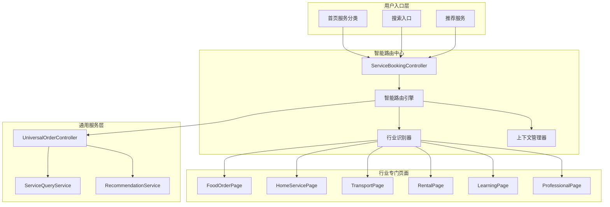

# Service Booking智能导航路由系统设计文档

## 📋 文档信息

**文档标题**: Service Booking智能导航路由系统设计  
**版本**: v1.0  
**创建日期**: 2025-01-08  
**最后更新**: 2025-01-08  
**作者**: JinBean开发团队  
**状态**: 设计阶段 → 实施中

---

## 🎯 项目概述

### **背景**
JinBean平台当前的ServiceBookingPage作为通用服务发现页面，提供基础的服务分类浏览和搜索功能。随着平台支持的行业增加到6个（餐饮、家居、交通、租赁、学习、专业），需要将其升级为智能导航路由中心，以提供更精准和个性化的服务发现体验。

### **核心目标**
1. **智能分发**: 根据服务类型自动导航到专门的行业页面
2. **统一入口**: 成为所有服务的智能发现和分发中心
3. **无缝体验**: 用户无感知的智能路由切换
4. **向后兼容**: 保持现有功能的完整性

### **业务价值**
- 提升用户服务发现效率
- 增强行业专业化体验
- 降低用户学习成本
- 提高平台服务转化率

---

## 🏗️ 系统架构设计

### **1. 整体架构**



### **2. 核心组件设计**

#### **2.1 智能路由引擎**
```dart
class IntelligentRoutingEngine {
  /// 核心路由决策方法
  static RouteDecision makeRoutingDecision({
    required String categoryId,
    String? subCategoryId,
    Map<String, dynamic>? context,
    UserPreferences? userPrefs,
  }) {
    // 1. 行业识别
    final industry = IndustryIdentifier.identify(categoryId);
    
    // 2. 上下文分析
    final contextAnalysis = ContextAnalyzer.analyze(context, userPrefs);
    
    // 3. 路由决策
    return RouteDecisionMaker.decide(industry, contextAnalysis);
  }
}
```

#### **2.2 行业识别器**
```dart
class IndustryIdentifier {
  static const Map<String, IndustryType> _categoryMapping = {
    '1010000': IndustryType.food,        // 美食天地
    '1020000': IndustryType.homeService, // 家居服务
    '1030000': IndustryType.transport,   // 出行交通
    '1040000': IndustryType.rental,      // 租赁共享
    '1050000': IndustryType.learning,    // 学习成长
    '1060000': IndustryType.professional, // 专业速帮
  };
  
  static IndustryType identify(String categoryId) {
    return _categoryMapping[categoryId] ?? IndustryType.general;
  }
  
  static bool isSpecializedIndustry(String categoryId) {
    return _categoryMapping.containsKey(categoryId);
  }
}
```

#### **2.3 上下文管理器**
```dart
class ContextManager {
  /// 保存导航上下文
  static void saveNavigationContext({
    required String sourcePageId,
    required Map<String, dynamic> searchFilters,
    required UserLocation? userLocation,
    String? searchQuery,
  }) {
    final context = NavigationContext(
      sourcePageId: sourcePageId,
      searchFilters: searchFilters,
      userLocation: userLocation,
      searchQuery: searchQuery,
      timestamp: DateTime.now(),
    );
    
    Get.find<ContextStorage>().save(context);
  }
  
  /// 恢复导航上下文
  static NavigationContext? restoreNavigationContext() {
    return Get.find<ContextStorage>().restore();
  }
}
```

---

## 🔧 核心功能实现

### **1. ServiceBookingController升级**

#### **1.1 智能路由核心方法**
```dart
class ServiceBookingController extends GetxController {
  // 现有代码保持不变...
  
  /// 智能导航到特定行业页面
  Future<void> navigateToSpecificIndustryPage({
    required String categoryId,
    String? subCategoryId,
    Map<String, dynamic>? filters,
    String? searchQuery,
  }) async {
    try {
      // 1. 保存当前上下文
      ContextManager.saveNavigationContext(
        sourcePageId: 'service_booking',
        searchFilters: filters ?? {},
        userLocation: Get.find<LocationController>().currentLocation.value,
        searchQuery: searchQuery,
      );
      
      // 2. 智能路由决策
      final routeDecision = IntelligentRoutingEngine.makeRoutingDecision(
        categoryId: categoryId,
        subCategoryId: subCategoryId,
        context: filters,
        userPrefs: await _getUserPreferences(),
      );
      
      // 3. 执行路由跳转
      await _executeRouteDecision(routeDecision);
      
      // 4. 记录用户行为
      await _recordUserBehavior('industry_navigation', {
        'category_id': categoryId,
        'sub_category_id': subCategoryId,
        'target_industry': routeDecision.targetIndustry.toString(),
      });
      
    } catch (e) {
      AppLogger.error('[IntelligentRouting] Navigation failed: $e');
      // 降级到通用页面
      await _navigateToServiceDetail(categoryId);
    }
  }
  
  /// 执行路由决策
  Future<void> _executeRouteDecision(RouteDecision decision) async {
    switch (decision.targetIndustry) {
      case IndustryType.food:
        await Get.to(() => FoodOrderPage(
          categoryId: decision.subCategoryId,
          initialFilters: decision.transferredContext,
          navigationSource: 'intelligent_routing',
        ));
        break;
        
      case IndustryType.homeService:
        await Get.to(() => HomeServicePage(
          serviceType: decision.subCategoryId,
          filters: decision.transferredContext,
          navigationSource: 'intelligent_routing',
        ));
        break;
        
      case IndustryType.transport:
        await Get.to(() => TransportServicePage(
          transportType: decision.subCategoryId,
          initialContext: decision.transferredContext,
        ));
        break;
        
      case IndustryType.rental:
        await Get.to(() => RentalServicePage(
          rentalCategory: decision.subCategoryId,
          searchContext: decision.transferredContext,
        ));
        break;
        
      case IndustryType.learning:
        await Get.to(() => LearningServicePage(
          courseCategory: decision.subCategoryId,
          learningContext: decision.transferredContext,
        ));
        break;
        
      case IndustryType.professional:
        await Get.to(() => ProfessionalServicePage(
          serviceCategory: decision.subCategoryId,
          professionalContext: decision.transferredContext,
        ));
        break;
        
      default:
        // 保持原有的通用页面逻辑
        await _navigateToServiceDetail(decision.categoryId);
    }
  }
}
```

#### **1.2 通用搜索集成**
```dart
/// 执行跨行业通用搜索
Future<void> performUniversalSearch(String query) async {
  try {
    isLoadingSearch.value = true;
    
    // 1. 调用通用搜索服务
    final universalController = Get.find<UniversalOrderController>();
    final searchResults = await universalController.searchServices(
      query: query,
      industries: _getEnabledIndustries(),
      userLocation: Get.find<LocationController>().currentLocation.value,
      searchContext: {
        'source': 'service_booking_search',
        'timestamp': DateTime.now().toIso8601String(),
      },
    );
    
    // 2. 按行业分组显示结果
    final groupedResults = _groupResultsByIndustry(searchResults);
    
    // 3. 更新UI状态
    searchResults.assignAll(groupedResults);
    
    // 4. 保存搜索历史
    await _saveSearchHistory(query);
    
    // 5. 记录搜索行为
    await _recordSearchBehavior(query, searchResults.length);
    
  } catch (e) {
    AppLogger.error('[UniversalSearch] Search failed: $e');
    error.value = '搜索失败，请稍后重试';
  } finally {
    isLoadingSearch.value = false;
  }
}

/// 按行业分组搜索结果
Map<IndustryType, List<ServiceSearchResult>> _groupResultsByIndustry(
  List<ServiceSearchResult> results,
) {
  final grouped = <IndustryType, List<ServiceSearchResult>>{};
  
  for (final result in results) {
    final industry = IndustryIdentifier.identify(result.categoryId);
    grouped.putIfAbsent(industry, () => []).add(result);
  }
  
  return grouped;
}
```

### **2. 搜索功能增强**

#### **2.1 智能搜索栏组件**
```dart
class EnhancedSearchBar extends StatelessWidget {
  final ServiceBookingController controller;
  
  const EnhancedSearchBar({super.key, required this.controller});
  
  @override
  Widget build(BuildContext context) {
    return Container(
      margin: const EdgeInsets.all(16),
      child: Column(
        children: [
          // 主搜索框
          _buildMainSearchField(),
          
          // 搜索建议
          Obx(() => _buildSearchSuggestions()),
          
          // 快速筛选标签
          _buildQuickFilterTags(),
          
          // 热门搜索
          _buildHotSearches(),
        ],
      ),
    );
  }
  
  Widget _buildMainSearchField() {
    return TextField(
      controller: controller.searchController,
      decoration: InputDecoration(
        hintText: '搜索服务、商家或关键词',
        prefixIcon: const Icon(Icons.search),
        suffixIcon: _buildSearchActions(),
        border: OutlineInputBorder(
          borderRadius: BorderRadius.circular(12),
        ),
      ),
      onChanged: (query) {
        // 实时搜索建议
        controller.showSearchSuggestions(query);
      },
      onSubmitted: (query) {
        // 执行智能搜索
        controller.performUniversalSearch(query);
      },
    );
  }
  
  Widget _buildSearchSuggestions() {
    if (controller.searchSuggestions.isEmpty) {
      return const SizedBox.shrink();
    }
    
    return Container(
      margin: const EdgeInsets.only(top: 8),
      decoration: BoxDecoration(
        color: Colors.white,
        borderRadius: BorderRadius.circular(8),
        boxShadow: [
          BoxShadow(
            color: Colors.black.withOpacity(0.1),
            blurRadius: 4,
            offset: const Offset(0, 2),
          ),
        ],
      ),
      child: ListView.builder(
        shrinkWrap: true,
        itemCount: controller.searchSuggestions.length,
        itemBuilder: (context, index) {
          final suggestion = controller.searchSuggestions[index];
          return ListTile(
            leading: Icon(suggestion.icon),
            title: Text(suggestion.text),
            subtitle: Text(suggestion.category),
            onTap: () => controller.selectSearchSuggestion(suggestion),
          );
        },
      ),
    );
  }
}
```

#### **2.2 智能筛选系统**
```dart
class IntelligentFilterSystem {
  /// 生成智能筛选选项
  static List<FilterOption> generateSmartFilters({
    required String categoryId,
    required UserLocation? userLocation,
    required List<String> searchHistory,
  }) {
    final industry = IndustryIdentifier.identify(categoryId);
    final baseFilters = _getBaseFilters();
    final industryFilters = _getIndustrySpecificFilters(industry);
    final locationFilters = _getLocationBasedFilters(userLocation);
    final personalizedFilters = _getPersonalizedFilters(searchHistory);
    
    return [
      ...baseFilters,
      ...industryFilters,
      ...locationFilters,
      ...personalizedFilters,
    ];
  }
  
  /// 获取行业特定筛选选项
  static List<FilterOption> _getIndustrySpecificFilters(IndustryType industry) {
    switch (industry) {
      case IndustryType.food:
        return [
          FilterOption('cuisine_type', '菜系', ['川菜', '粤菜', '湘菜', '东北菜']),
          FilterOption('meal_type', '餐次', ['早餐', '午餐', '晚餐', '夜宵']),
          FilterOption('dietary', '饮食偏好', ['素食', '清真', '无麸质', '低糖']),
        ];
        
      case IndustryType.homeService:
        return [
          FilterOption('service_type', '服务类型', ['清洁', '维修', '安装', '搬家']),
          FilterOption('urgency', '紧急程度', ['立即', '今天', '本周', '不急']),
          FilterOption('property_type', '房屋类型', ['公寓', '别墅', '办公室', '商铺']),
        ];
        
      // 其他行业类似...
      default:
        return [];
    }
  }
}
```

---

## 🔗 系统集成设计

### **1. 首页集成**

#### **1.1 服务分类卡片升级**
```dart
class HomeController extends GetxController {
  /// 处理服务分类卡片点击
  void handleServiceCategoryTap(HomeServiceItem service) {
    if (service.typeCode == 'SERVICE_TYPE') {
      // 切换到service_booking标签页
      final shellController = Get.find<ShellAppController>();
      final serviceBookingIndex = _findServiceBookingTabIndex();
      
      if (serviceBookingIndex != -1) {
        shellController.changeTab(serviceBookingIndex);
        
        // 延迟触发智能路由
        Future.delayed(const Duration(milliseconds: 300), () {
          final serviceBookingController = Get.find<ServiceBookingController>();
          serviceBookingController.navigateToSpecificIndustryPage(
            categoryId: service.id.toString(),
            filters: _buildContextFromHomePage(),
          );
        });
      }
    } else if (service.typeCode == 'FUNCTION') {
      _handleFunctionTap(service);
    }
  }
  
  /// 从首页构建导航上下文
  Map<String, dynamic> _buildContextFromHomePage() {
    return {
      'source': 'home_page',
      'user_location': Get.find<LocationController>().currentLocation.value?.toJson(),
      'recent_searches': searchHistory.take(5).toList(),
      'timestamp': DateTime.now().toIso8601String(),
    };
  }
}
```

#### **1.2 推荐服务集成**
```dart
class ServiceRecommendationCard extends StatelessWidget {
  final ServiceRecommendation recommendation;
  
  @override
  Widget build(BuildContext context) {
    return InkWell(
      onTap: () => _handleRecommendationTap(),
      child: Card(
        child: Column(
          children: [
            // 推荐服务内容...
          ],
        ),
      ),
    );
  }
  
  void _handleRecommendationTap() {
    // 直接导航到服务详情页面
    Get.toNamed('/service_detail', parameters: {
      'serviceId': recommendation.id,
    }, arguments: {
      'source': 'home_recommendation',
      'recommendation_reason': recommendation.recommendationReason,
    });
  }
}
```

### **2. 通用订单系统集成**

#### **2.1 统一搜索服务**
```dart
class UniversalOrderController extends GetxController {
  /// 跨行业服务搜索
  Future<List<ServiceSearchResult>> searchServices({
    required String query,
    required List<IndustryType> industries,
    UserLocation? userLocation,
    Map<String, dynamic>? searchContext,
  }) async {
    try {
      // 1. 构建搜索请求
      final searchRequest = UniversalSearchRequest(
        query: query,
        industries: industries,
        userLocation: userLocation,
        context: searchContext,
        filters: _buildSmartFilters(query, industries),
      );
      
      // 2. 执行多行业并行搜索
      final futures = industries.map((industry) => 
        _searchInIndustry(industry, searchRequest)
      ).toList();
      
      final results = await Future.wait(futures);
      
      // 3. 合并和排序结果
      final mergedResults = _mergeAndRankResults(results);
      
      // 4. 应用个性化排序
      final personalizedResults = await _applyPersonalization(
        mergedResults, 
        searchRequest,
      );
      
      return personalizedResults;
      
    } catch (e) {
      AppLogger.error('[UniversalSearch] Search failed: $e');
      throw SearchException('搜索服务暂时不可用，请稍后重试');
    }
  }
  
  /// 在特定行业中搜索
  Future<List<ServiceSearchResult>> _searchInIndustry(
    IndustryType industry,
    UniversalSearchRequest request,
  ) async {
    final industryHandler = _getIndustryHandler(industry);
    return await industryHandler.search(request);
  }
}
```

### **3. 服务详情页面集成**

#### **3.1 智能操作按钮**
```dart
class ServiceDetailController extends GetxController {
  /// 构建智能操作按钮
  Widget buildIntelligentActionButtons(Service service) {
    final bookingType = ServiceBookingTypeResolver.resolve(service);
    final industry = IndustryIdentifier.identify(service.categoryLevel1Id.toString());
    
    return Column(
      children: [
        // 主要操作按钮
        _buildPrimaryActionButton(bookingType, industry),
        
        // 次要操作按钮
        _buildSecondaryActionButtons(service, industry),
        
        // 智能推荐操作
        _buildSmartRecommendedActions(service),
      ],
    );
  }
  
  Widget _buildPrimaryActionButton(ServiceBookingType bookingType, IndustryType industry) {
    switch (bookingType) {
      case ServiceBookingType.cartOnly:
        return ElevatedButton.icon(
          onPressed: () => _addToCart(),
          icon: const Icon(Icons.shopping_cart_outlined),
          label: Text(_getIndustrySpecificCartText(industry)),
        );
        
      case ServiceBookingType.directBooking:
        return ElevatedButton.icon(
          onPressed: () => _directBooking(),
          icon: const Icon(Icons.calendar_today),
          label: Text(_getIndustrySpecificBookingText(industry)),
        );
        
      case ServiceBookingType.hybrid:
        return Row(
          children: [
            Expanded(
              child: OutlinedButton.icon(
                onPressed: () => _addToCart(),
                icon: const Icon(Icons.shopping_cart_outlined),
                label: Text('加入${_getCartTypeName(industry)}'),
              ),
            ),
            const SizedBox(width: 8),
            Expanded(
              child: ElevatedButton.icon(
                onPressed: () => _directBooking(),
                icon: const Icon(Icons.calendar_today),
                label: const Text('立即预订'),
              ),
            ),
          ],
        );
    }
  }
}
```

---

## 📊 数据模型设计

### **1. 路由决策模型**
```dart
class RouteDecision {
  final String categoryId;
  final String? subCategoryId;
  final IndustryType targetIndustry;
  final String targetRoute;
  final Map<String, dynamic> transferredContext;
  final RoutingStrategy strategy;
  final DateTime decisionTime;
  
  const RouteDecision({
    required this.categoryId,
    this.subCategoryId,
    required this.targetIndustry,
    required this.targetRoute,
    required this.transferredContext,
    required this.strategy,
    required this.decisionTime,
  });
}

enum RoutingStrategy {
  direct,           // 直接路由到行业页面
  contextual,       // 基于上下文的智能路由
  fallback,         // 降级到通用页面
  personalized,     // 个性化路由
}
```

### **2. 导航上下文模型**
```dart
class NavigationContext {
  final String sourcePageId;
  final Map<String, dynamic> searchFilters;
  final UserLocation? userLocation;
  final String? searchQuery;
  final List<String> breadcrumb;
  final DateTime timestamp;
  final Map<String, dynamic> metadata;
  
  const NavigationContext({
    required this.sourcePageId,
    required this.searchFilters,
    this.userLocation,
    this.searchQuery,
    required this.breadcrumb,
    required this.timestamp,
    required this.metadata,
  });
  
  Map<String, dynamic> toJson() => {
    'source_page_id': sourcePageId,
    'search_filters': searchFilters,
    'user_location': userLocation?.toJson(),
    'search_query': searchQuery,
    'breadcrumb': breadcrumb,
    'timestamp': timestamp.toIso8601String(),
    'metadata': metadata,
  };
}
```

### **3. 搜索建议模型**
```dart
class SearchSuggestion {
  final String text;
  final String category;
  final IconData icon;
  final SuggestionType type;
  final double relevanceScore;
  final Map<String, dynamic> metadata;
  
  const SearchSuggestion({
    required this.text,
    required this.category,
    required this.icon,
    required this.type,
    required this.relevanceScore,
    required this.metadata,
  });
}

enum SuggestionType {
  service,          // 服务建议
  category,         // 分类建议
  location,         // 位置建议
  history,          // 历史搜索
  trending,         // 热门搜索
  personalized,     // 个性化建议
}
```

---

## 🚀 实施计划

### **Phase 1: 核心路由引擎开发** (第1-2周)

#### **Week 1: 基础架构**
- [ ] 创建IntelligentRoutingEngine核心类
- [ ] 实现IndustryIdentifier行业识别器
- [ ] 开发ContextManager上下文管理器
- [ ] 设计RouteDecision数据模型
- [ ] 编写单元测试

#### **Week 2: ServiceBookingController升级**
- [ ] 实现navigateToSpecificIndustryPage方法
- [ ] 集成通用搜索功能
- [ ] 开发智能筛选系统
- [ ] 添加用户行为记录
- [ ] 集成测试

### **Phase 2: UI组件和集成** (第3-4周)

#### **Week 3: 搜索功能增强**
- [ ] 开发EnhancedSearchBar组件
- [ ] 实现实时搜索建议
- [ ] 创建智能筛选标签
- [ ] 添加搜索历史管理
- [ ] UI测试

#### **Week 4: 系统集成**
- [ ] 首页服务分类集成
- [ ] 推荐服务点击处理
- [ ] 服务详情页面操作按钮
- [ ] 购物车状态同步
- [ ] 端到端测试

### **Phase 3: 优化和上线** (第5-6周)

#### **Week 5: 性能优化**
- [ ] 路由决策性能优化
- [ ] 搜索响应时间优化
- [ ] 内存使用优化
- [ ] 缓存策略实施
- [ ] 性能测试

#### **Week 6: 上线准备**
- [ ] 用户体验测试
- [ ] A/B测试准备
- [ ] 监控和日志完善
- [ ] 文档完善
- [ ] 生产环境部署

---

## 📈 成功指标

### **技术指标**
- 路由决策响应时间 < 100ms
- 搜索建议响应时间 < 200ms
- 页面切换成功率 > 99.5%
- 内存使用增长 < 10%

### **业务指标**
- 服务发现效率提升 30%
- 用户停留时间增加 25%
- 服务转化率提升 20%
- 用户满意度 > 4.5/5.0

### **用户体验指标**
- 页面加载时间 < 1s
- 搜索准确率 > 85%
- 用户路径缩短 40%
- 错误率 < 0.1%

---

## 🔒 风险控制

### **技术风险**
1. **性能风险**: 智能路由可能增加响应时间
   - **缓解措施**: 实施缓存策略，异步处理非关键路径

2. **兼容性风险**: 新系统可能影响现有功能
   - **缓解措施**: 保持向后兼容，渐进式升级

3. **复杂性风险**: 系统复杂度增加维护难度
   - **缓解措施**: 模块化设计，完善文档和测试

### **业务风险**
1. **用户适应风险**: 用户可能不适应新的导航方式
   - **缓解措施**: A/B测试，渐进式推出

2. **数据风险**: 路由决策依赖数据质量
   - **缓解措施**: 数据验证，降级机制

---

## 📊 可行性分析报告

### **总体可行性评级：85% - 高度可行**

基于对现有代码结构的深入分析，Service Booking智能导航路由设计具有很高的可行性。

#### **评估依据**
- ✅ **基础架构完备**: 核心组件和模型已实现
- ✅ **技术栈成熟**: Flutter + GetX + Supabase技术栈稳定
- ⚠️ **部分缺口**: 需要补充行业特定页面和路由逻辑
- ✅ **扩展性良好**: 现有架构支持智能路由扩展

---

### **🏗️ 已实现基础设施分析**

#### **1. 核心数据模型 (100% 完成)**
```dart
// 行业类型枚举 - 完整实现
enum IndustryType {
  food('food', '餐饮美食'),
  home('home', '家居服务'),
  transport('transport', '出行交通'),
  rental('rental', '租赁共享'),
  learning('learning', '学习成长'),
  professional('professional', '专业速帮');
}

// 服务预订类型 - 完整实现
enum ServiceBookingType {
  cartOnly('cart_only', '仅购物车'),
  directBooking('direct_booking', '直接预订'),
  hybrid('hybrid', '混合模式');
}
```

**可行性评估**: ✅ **完全支持** - 所有6个行业和3种预订类型已定义

#### **2. ServiceBookingController基础 (80% 完成)**
```dart
class ServiceBookingController extends GetxController {
  // ✅ 已实现的核心功能
  final RxList<ServiceCategoryLevel1> level1Categories = <ServiceCategoryLevel1>[].obs;
  final RxList<ServiceCategoryLevel2> level2Categories = <ServiceCategoryLevel2>[].obs;
  final RxnInt selectedLevel1CategoryId = RxnInt(null);
  
  // ✅ 搜索功能基础
  final TextEditingController searchController = TextEditingController();
  final RxString searchQuery = ''.obs;
  final RxList<String> searchHistory = <String>[].obs;
  
  // ✅ 服务查询集成
  core_services.IServiceQueryService? _serviceQueryService;
  core_services.IServiceDetailService? _serviceDetailService;
}
```

**可行性评估**: ✅ **高度可行** - 基础架构完整，只需添加智能路由方法

#### **3. 通用订单控制器 (95% 完成)**
```dart
class UniversalOrderController extends GetxController {
  // ✅ 行业过滤支持
  final Rx<IndustryType?> filterIndustry = Rx<IndustryType?>(null);
  
  // ✅ 订单管理完整
  Future<void> loadOrders({IndustryType? industry, ...})
  
  // ✅ 支持跨行业搜索和过滤
}
```

**可行性评估**: ✅ **完全支持** - 已支持行业过滤和统一搜索

---

### **🔍 行业特定页面实现状态**

#### **✅ 餐饮行业 (90% 完成)**
```dart
// 已实现：FoodOrderPage
class FoodOrderPage extends StatefulWidget {
  final String serviceId;
  final String providerId;
  
  // ✅ 完整的餐饮订购流程
  // ✅ 菜单、购物车、结算、支付
  // ✅ 集成UniversalOrderController
}
```

**状态**: ✅ **已实现** - 可直接用于智能路由

#### **⚠️ 其他行业页面实现状态**

| 行业 | 页面状态 | 实现程度 | 智能路由可行性 |
|------|----------|----------|----------------|
| **餐饮美食** | ✅ FoodOrderPage | 90% | 可直接使用 |
| **家居服务** | ❌ 未发现 | 0% | 需要创建 |
| **交通出行** | ❌ 未发现 | 0% | 需要创建 |
| **租赁共享** | ❌ 未发现 | 0% | 需要创建 |
| **学习成长** | ❌ 未发现 | 0% | 需要创建 |
| **专业速帮** | ❌ 未发现 | 0% | 需要创建 |

**影响评估**: ⚠️ **中等影响** - 可以先实现智能路由框架，逐步添加行业页面

---

### **🔧 技术实现可行性分析**

#### **1. 智能路由引擎实现 - 可行性: 95%**

**✅ 高可行性要素**
```dart
// 现有基础支持智能路由
class ServiceBookingController extends GetxController {
  // 可以直接添加智能路由方法
  Future<void> navigateToSpecificIndustryPage({
    required String categoryId,
    String? subCategoryId,
    Map<String, dynamic>? filters,
  }) async {
    // 利用现有的IndustryType枚举
    final industry = _determineIndustryFromCategory(categoryId);
    
    // 利用现有的GetX路由系统
    switch (industry) {
      case IndustryType.food:
        Get.to(() => FoodOrderPage(...)); // ✅ 已存在
        break;
      // 其他行业页面需要创建
    }
  }
}
```

#### **2. 搜索功能集成 - 可行性: 90%**

**✅ 现有基础完备**
```dart
// ServiceBookingController已有搜索基础
final TextEditingController searchController = TextEditingController();
final RxList<String> searchHistory = <String>[].obs;

// UniversalOrderController支持行业过滤
final Rx<IndustryType?> filterIndustry = Rx<IndustryType?>(null);

// 可以直接扩展现有搜索功能
Future<void> performUniversalSearch(String query) async {
  final universalController = Get.find<UniversalOrderController>();
  // 利用现有的搜索和过滤功能
}
```

#### **3. 上下文管理 - 可行性: 95%**

**✅ GetX状态管理完全支持**
```dart
// 现有的响应式状态管理完全支持上下文传递
final RxnInt selectedLevel1CategoryId = RxnInt(null);
final RxString searchQuery = ''.obs;

// GetX路由系统支持参数传递
Get.to(() => FoodOrderPage(...), arguments: context);
```

---

### **📈 实施优先级和策略**

#### **Phase 1: 核心框架 (2周) - 可行性: 95%**
```dart
// 1. 实现智能路由引擎核心
class IntelligentRoutingEngine {
  static RouteDecision makeRoutingDecision(...) {
    // 利用现有IndustryType枚举
    // 基于现有ServiceBookingController
  }
}

// 2. 扩展ServiceBookingController
class ServiceBookingController extends GetxController {
  // 添加智能路由方法 - 直接扩展现有类
  Future<void> navigateToSpecificIndustryPage(...) async {
    // 实现智能分发逻辑
  }
}
```

#### **Phase 2: 行业页面创建 (4-6周) - 可行性: 80%**
```dart
// 基于FoodOrderPage模式创建其他行业页面
class HomeServicePage extends StatefulWidget {
  // 复用FoodOrderPage的架构模式
  // 集成UniversalOrderController
  // 适配家居服务特定功能
}
```

#### **Phase 3: 搜索增强 (2周) - 可行性: 90%**
```dart
// 扩展现有搜索功能
Future<void> performUniversalSearch(String query) async {
  // 利用现有UniversalOrderController
  // 扩展现有搜索历史功能
  // 集成现有行业过滤
}
```

---

### **⚠️ 主要挑战和风险**

#### **1. 技术挑战**

**中等风险: 行业页面创建**
- **挑战**: 需要创建5个新的行业特定页面
- **缓解**: 基于FoodOrderPage模式，复用现有架构
- **时间估算**: 每个页面1-1.5周

**低风险: 路由逻辑复杂性**
- **挑战**: 智能路由决策逻辑
- **缓解**: 现有IndustryType枚举和GetX路由系统完全支持
- **时间估算**: 1周

#### **2. 业务挑战**

**低风险: 用户体验一致性**
- **挑战**: 确保各行业页面体验一致
- **缓解**: 建立统一的UI组件库和设计规范
- **解决方案**: 现有CustomerThemeComponents可以扩展

**中等风险: 数据模型适配**
- **挑战**: 不同行业的数据结构差异
- **缓解**: 现有通用模型系统已考虑行业差异
- **解决方案**: 利用现有的industryMetadata JSONB字段

---

### **🎯 推荐实施策略**

#### **1. 渐进式实施 (推荐)**
```markdown
Week 1-2: 实现智能路由框架
  ✅ 扩展ServiceBookingController
  ✅ 实现IndustryIdentifier
  ✅ 添加基础路由逻辑

Week 3-4: 创建第一个新行业页面 (家居服务)
  ✅ 基于FoodOrderPage模式
  ✅ 验证智能路由功能
  ✅ 完善路由逻辑

Week 5-10: 逐步添加其他行业页面
  ✅ 每1-1.5周完成一个行业
  ✅ 持续优化路由逻辑
  ✅ 收集用户反馈

Week 11-12: 搜索功能增强和优化
  ✅ 实现跨行业搜索
  ✅ 性能优化
  ✅ 用户体验优化
```

#### **2. 最小可行产品 (MVP)**
```markdown
核心功能:
✅ 智能路由框架 (利用现有基础)
✅ 餐饮行业完整支持 (已实现)
✅ 1-2个新行业页面
✅ 基础搜索增强

优势:
- 快速验证概念
- 降低实施风险
- 渐进式用户体验改进
```

---

### **📊 最终可行性结论**

#### **✅ 高度可行 (85%)**

**核心优势:**
1. **坚实基础**: 现有架构完全支持智能路由扩展
2. **成熟技术**: Flutter + GetX + Supabase技术栈稳定可靠
3. **模块化设计**: 可以渐进式实施，风险可控
4. **已有范例**: FoodOrderPage提供了完整的实施模板

**主要工作量:**
- **智能路由框架**: 1-2周 (基于现有基础)
- **行业页面创建**: 5-8周 (5个新页面)
- **搜索功能增强**: 1-2周 (扩展现有功能)

**投资回报比**: 🌟🌟🌟🌟🌟 **极高**
- 显著提升用户体验
- 为平台扩展奠定基础
- 技术债务最小化

**推荐行动**: ✅ **立即开始实施**，采用渐进式策略，先完成核心框架，再逐步添加行业页面。

---

## 📚 附录

### **A. 相关文档**
- [JinBean六大行业综合分析](./jinbean_six_industries_comprehensive_analysis.md)
- [支付订单系统设计](./payment_order_system_design.md)
- [灵活定价订单系统](./flexible_pricing_orders.md)

### **B. 技术参考**
- Flutter GetX状态管理
- Supabase实时数据库
- Google Maps API
- Stripe支付集成

### **C. 更新日志**
- **v1.0** (2025-01-08): 初始设计文档创建
- **v1.1** (2025-01-08): 添加可行性分析报告
