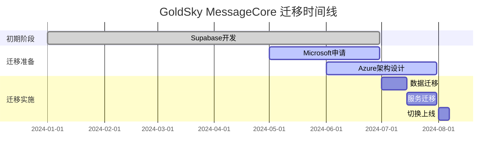
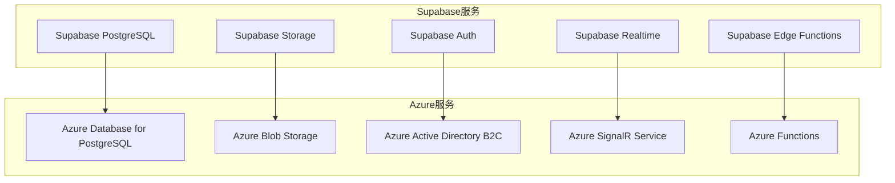

# GoldSky MessageCore Azure迁移策略

## 📋 目录
1. [迁移背景](#1-迁移背景)
2. [Microsoft Startup项目申请](#2-microsoft-startup项目申请)
3. [Azure架构设计](#3-azure架构设计)
4. [迁移实施计划](#4-迁移实施计划)
5. [技术迁移方案](#5-技术迁移方案)
6. [成本对比分析](#6-成本对比分析)
7. [风险控制](#7-风险控制)

## 1. 迁移背景

### 1.1 迁行动因

```yaml
业务驱动:
  - 申请Microsoft Startup项目
  - 获得$150,000 Azure免费额度
  - 企业级服务支持
  - 全球化部署能力

技术驱动:
  - 更强大的企业级服务
  - 更好的性能和可扩展性
  - 更完善的监控和运维
  - 更丰富的AI/ML集成
```

### 1.2 迁移时机



## 2. Microsoft Startup项目申请

### 2.1 申请条件

```yaml
基本要求:
  - 成立时间: 不超过5年
  - 融资阶段: 种子轮到B轮
  - 技术产品: 基于云服务
  - 团队规模: 2-50人

申请材料:
  - 公司注册信息
  - 产品介绍和演示
  - 技术架构说明
  - 商业计划书
  - 团队介绍
```

### 2.2 申请流程

```bash
# 1. 注册Microsoft for Startups
访问: https://startups.microsoft.com/
注册: 创建账户并填写基本信息

# 2. 提交申请
- 上传公司资料
- 填写产品信息
- 说明技术架构
- 描述Azure使用计划

# 3. 审核流程
- 初步审核 (1-2周)
- 技术评审 (2-3周)
- 最终批准 (1周)

# 4. 获得福利
- $150,000 Azure免费额度
- 技术专家支持
- 企业级服务
- 市场推广支持
```

### 2.3 申请策略

```yaml
申请重点:
  - 强调GoldSky MessageCore的创新性
  - 展示多租户SaaS架构
  - 说明Azure服务的使用计划
  - 突出企业级应用场景

技术亮点:
  - 实时通信技术
  - 多租户隔离
  - 企业级安全
  - 全球化部署
```

## 3. Azure架构设计

### 3.1 服务映射



### 3.2 Azure架构图

```yaml
前端层:
  - Azure CDN: 静态资源分发
  - Azure Front Door: 全球负载均衡
  - Azure Application Gateway: API网关

应用层:
  - Azure Container Instances: 微服务容器
  - Azure Functions: 无服务器函数
  - Azure SignalR Service: 实时通信

数据层:
  - Azure Database for PostgreSQL: 主数据库
  - Azure Cache for Redis: 缓存服务
  - Azure Blob Storage: 文件存储
  - Azure Cosmos DB: 会话数据

安全层:
  - Azure Active Directory B2C: 用户认证
  - Azure Key Vault: 密钥管理
  - Azure Security Center: 安全监控

监控层:
  - Azure Application Insights: 应用监控
  - Azure Monitor: 基础设施监控
  - Azure Log Analytics: 日志分析
```

### 3.3 成本优化策略

```yaml
免费额度使用:
  - Azure Database for PostgreSQL: 750小时/月
  - Azure Blob Storage: 5GB/月
  - Azure Functions: 1M次执行/月
  - Azure SignalR Service: 20K连接/月

成本控制:
  - 使用预留实例
  - 自动扩缩容
  - 数据生命周期管理
  - 多区域部署优化
```

## 4. 迁移实施计划

### 4.1 迁移阶段

```yaml
Phase 1: 准备阶段 (1个月)
  任务:
    - 申请Microsoft Startup项目
    - 设计Azure架构
    - 准备迁移脚本
    - 搭建测试环境
    - 制定回滚计划

  交付物:
    - Azure架构设计文档
    - 迁移脚本和工具
    - 测试环境配置
    - 风险评估报告

Phase 2: 数据迁移 (2周)
  任务:
    - 数据库迁移 (PostgreSQL)
    - 文件存储迁移 (Blob Storage)
    - 用户数据迁移 (AAD B2C)
    - 数据验证和测试

  交付物:
    - 数据迁移报告
    - 数据完整性验证
    - 性能基准测试

Phase 3: 服务迁移 (2周)
  任务:
    - API服务迁移到Azure
    - 实时通信迁移 (SignalR)
    - 认证系统迁移 (AAD B2C)
    - 集成测试

  交付物:
    - 服务迁移报告
    - API性能测试
    - 功能验证报告

Phase 4: 切换上线 (1周)
  任务:
    - 灰度发布
    - 监控验证
    - 全量切换
    - 旧服务清理

  交付物:
    - 上线成功报告
    - 性能监控报告
    - 用户反馈收集
```

### 4.2 迁移工具

```bash
# 数据库迁移工具
pg_dump -h supabase-host -U postgres -d messagecore > backup.sql
psql -h azure-host -U postgres -d messagecore < backup.sql

# 文件存储迁移工具
az storage blob copy start-batch \
  --source-container supabase-storage \
  --destination-container azure-storage \
  --source-account-name supabase \
  --destination-account-name azure

# 用户数据迁移工具
# 使用Azure AD Graph API迁移用户数据
```

## 5. 技术迁移方案

### 5.1 数据库迁移

```sql
-- 1. 创建Azure PostgreSQL数据库
CREATE DATABASE messagecore;

-- 2. 迁移表结构
-- 使用Prisma迁移工具
npx prisma migrate deploy

-- 3. 数据迁移脚本
-- 使用pg_dump和psql进行数据迁移
pg_dump -h supabase-host -U postgres -d messagecore \
  --data-only --disable-triggers > data.sql

psql -h azure-host -U postgres -d messagecore < data.sql

-- 4. 验证数据完整性
SELECT COUNT(*) FROM tenants;
SELECT COUNT(*) FROM messages;
SELECT COUNT(*) FROM conversations;
```

### 5.2 文件存储迁移

```javascript
// Azure Blob Storage迁移脚本
const { BlobServiceClient } = require('@azure/storage-blob');

async function migrateFiles() {
  // 从Supabase下载文件
  const supabaseFiles = await supabase.storage
    .from('messagecore')
    .list();

  // 上传到Azure Blob Storage
  const blobServiceClient = BlobServiceClient.fromConnectionString(
    process.env.AZURE_STORAGE_CONNECTION_STRING
  );

  for (const file of supabaseFiles) {
    const blobClient = blobServiceClient
      .getContainerClient('messagecore')
      .getBlobClient(file.name);

    await blobClient.upload(file.data, file.data.length);
  }
}
```

### 5.3 认证系统迁移

```javascript
// Azure AD B2C迁移配置
const msalConfig = {
  auth: {
    clientId: process.env.AZURE_CLIENT_ID,
    authority: `https://${process.env.AZURE_TENANT}.b2clogin.com/${process.env.AZURE_TENANT}.onmicrosoft.com/${process.env.AZURE_POLICY}`,
    knownAuthorities: [`${process.env.AZURE_TENANT}.b2clogin.com`]
  },
  cache: {
    cacheLocation: 'localStorage',
    storeAuthStateInCookie: false
  }
};

// 用户数据迁移
async function migrateUsers() {
  const users = await supabase.auth.admin.listUsers();
  
  for (const user of users.data) {
    await createAzureADUser({
      displayName: user.user_metadata.full_name,
      email: user.email,
      password: generateTemporaryPassword()
    });
  }
}
```

### 5.4 实时通信迁移

```javascript
// Azure SignalR Service配置
const { HubConnectionBuilder } = require('@microsoft/signalr');

const connection = new HubConnectionBuilder()
  .withUrl(process.env.AZURE_SIGNALR_URL)
  .withAutomaticReconnect()
  .build();

// 迁移WebSocket连接
async function migrateRealtimeConnections() {
  // 通知客户端重新连接到Azure SignalR
  await supabase.channel('migration')
    .send({
      type: 'broadcast',
      event: 'migrate_to_azure',
      payload: {
        newUrl: process.env.AZURE_SIGNALR_URL,
        migrationTime: new Date().toISOString()
      }
    });
}
```

## 6. 成本对比分析

### 6.1 初期成本对比 (1万用户)

```yaml
Supabase成本:
  数据库: $25/月 (基础计划)
  存储: $5/月 (1GB)
  带宽: $10/月
  总计: $40/月

Azure成本 (使用免费额度):
  数据库: $0/月 (免费额度内)
  存储: $0/月 (5GB免费)
  带宽: $0/月 (免费额度内)
  总计: $0/月

节省成本: $40/月 (100%节省)
```

### 6.2 成长期成本对比 (10万用户)

```yaml
Supabase成本:
  数据库: $100/月 (专业计划)
  存储: $50/月 (10GB)
  带宽: $100/月
  总计: $250/月

Azure成本 (使用Startup额度):
  数据库: $0/月 (免费额度内)
  存储: $0/月 (免费额度内)
  带宽: $0/月 (免费额度内)
  总计: $0/月

节省成本: $250/月 (100%节省)
```

### 6.3 长期成本优势

```yaml
Microsoft Startup福利:
  - $150,000免费额度 (约2年免费使用)
  - 技术专家支持 (价值$50,000/年)
  - 企业级服务 (价值$100,000/年)
  - 市场推广支持 (价值$200,000/年)

总价值: $500,000+ (2年)
```

## 7. 风险控制

### 7.1 技术风险

```yaml
数据丢失风险:
  缓解措施:
    - 多重备份策略
    - 数据完整性验证
    - 回滚计划准备
    - 分阶段迁移

服务中断风险:
  缓解措施:
    - 灰度发布策略
    - 双活部署
    - 监控告警
    - 快速回滚机制

性能下降风险:
  缓解措施:
    - 性能基准测试
    - 负载测试
    - 性能监控
    - 优化调整
```

### 7.2 业务风险

```yaml
用户影响风险:
  缓解措施:
    - 用户通知计划
    - 维护窗口安排
    - 客服支持准备
    - 补偿方案

合规风险:
  缓解措施:
    - 数据保护合规
    - 隐私政策更新
    - 法律审查
    - 用户同意获取
```

### 7.3 应急预案

```bash
# 快速回滚脚本
#!/bin/bash
echo "开始回滚到Supabase..."

# 1. 切换DNS
az network dns record-set a update \
  --resource-group messagecore-rg \
  --zone-name messagecore.com \
  --name api \
  --target-resource supabase-endpoint

# 2. 通知用户
curl -X POST https://api.messagecore.com/notifications \
  -H "Content-Type: application/json" \
  -d '{"type": "maintenance", "message": "系统维护中，请稍后再试"}'

# 3. 监控服务状态
echo "回滚完成，监控服务状态..."
```

## 总结

GoldSky MessageCore的Azure迁移策略将带来以下优势：

1. **成本优势**: 获得$150,000免费额度，大幅降低运营成本
2. **技术优势**: 企业级服务，更好的性能和可扩展性
3. **商业优势**: Microsoft Startup项目支持，市场推广机会
4. **战略优势**: 为GoldSky生态的全球化部署奠定基础

通过分阶段迁移和风险控制措施，确保迁移过程平稳，业务连续性不受影响。 