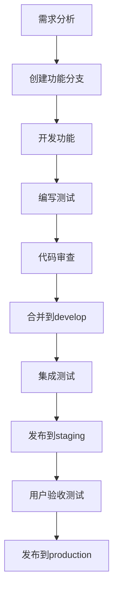

# JinBean 开发规范

> 本文档定义了JinBean项目的开发规范，确保代码质量、团队协作和项目可维护性。

## 📋 目录

- [代码规范](#代码规范)
- [分支管理](#分支管理)
- [提交规范](#提交规范)
- [文档规范](#文档规范)
- [测试规范](#测试规范)
- [部署规范](#部署规范)
- [协作流程](#协作流程)

## 🎯 代码规范

### Flutter/Dart 代码规范

#### 1. 命名规范

```dart
// 类名：PascalCase
class ProviderService {}
class CustomerController {}

// 变量和方法名：camelCase
String userName;
int orderCount;
void getUserInfo() {}

// 常量：SCREAMING_SNAKE_CASE
const String API_BASE_URL = 'https://api.jinbean.com';
const int MAX_RETRY_COUNT = 3;

// 私有成员：下划线前缀
class _PrivateClass {}
String _privateVariable;
void _privateMethod() {}
```

#### 2. 文件组织

```
lib/
├── core/                    # 核心功能
│   ├── constants/          # 常量定义
│   ├── utils/             # 工具类
│   ├── services/          # 基础服务
│   └── models/            # 基础模型
├── features/              # 功能模块
│   ├── provider/          # Provider端功能
│   │   ├── orders/        # 订单管理
│   │   ├── clients/       # 客户管理
│   │   ├── services/      # 服务管理
│   │   └── income/        # 收入管理
│   └── customer/          # Customer端功能
│       ├── booking/       # 预约功能
│       ├── profile/       # 个人资料
│       └── reviews/       # 评价功能
├── shared/                # 共享组件
│   ├── widgets/           # 共享UI组件
│   ├── models/            # 共享数据模型
│   └── services/          # 共享服务
└── main.dart              # 应用入口
```

#### 3. 代码风格

```dart
// 使用有意义的变量名
// ❌ 错误
var a = 1;
var b = "test";

// ✅ 正确
int orderCount = 1;
String userName = "test";

// 使用const构造函数
// ❌ 错误
Widget build(BuildContext context) {
  return Container(
    child: Text("Hello"),
  );
}

// ✅ 正确
Widget build(BuildContext context) {
  return const Container(
    child: Text("Hello"),
  );
}

// 使用late关键字
// ❌ 错误
String? _apiService;

// ✅ 正确
late final String _apiService;

// 使用扩展方法
extension StringExtension on String {
  bool get isValidEmail {
    return RegExp(r'^[\w-\.]+@([\w-]+\.)+[\w-]{2,4}$').hasMatch(this);
  }
}
```

### 数据库代码规范

#### 1. SQL命名规范

```sql
-- 表名：snake_case，使用前缀区分模块
users                    -- 用户表
provider_profiles        -- Provider配置表
customer_preferences     -- Customer偏好表
orders                   -- 订单表
order_status_history     -- 订单状态历史表

-- 字段名：snake_case
user_id                 -- 用户ID
created_at              -- 创建时间
updated_at              -- 更新时间
is_active               -- 是否激活

-- 索引名：idx_表名_字段名
CREATE INDEX idx_orders_provider_id ON orders(provider_id);
CREATE INDEX idx_orders_status_date ON orders(status, created_at);

-- 约束名：fk_表名_字段名
CONSTRAINT fk_orders_provider_id FOREIGN KEY (provider_id) REFERENCES users(id)
```

#### 2. 数据库设计规范

```sql
-- 所有表必须包含审计字段
CREATE TABLE example_table (
    id uuid PRIMARY KEY DEFAULT uuid_generate_v4(),
    created_at timestamptz NOT NULL DEFAULT now(),
    updated_at timestamptz NOT NULL DEFAULT now(),
    created_by uuid REFERENCES users(id),
    updated_by uuid REFERENCES users(id)
);

-- 使用触发器自动更新updated_at
CREATE OR REPLACE FUNCTION update_updated_at_column()
RETURNS TRIGGER AS $$
BEGIN
    NEW.updated_at = now();
    RETURN NEW;
END;
$$ language 'plpgsql';

CREATE TRIGGER update_example_table_updated_at 
    BEFORE UPDATE ON example_table 
    FOR EACH ROW EXECUTE FUNCTION update_updated_at_column();
```

## 🌿 分支管理

### 分支策略

```
main                    # 主分支，生产环境代码
├── develop            # 开发分支，集成所有功能
├── feature/           # 功能分支
│   ├── feature/provider-orders
│   ├── feature/customer-booking
│   └── feature/shared-components
├── bugfix/            # 修复分支
│   ├── bugfix/order-status-bug
│   └── bugfix/login-issue
├── hotfix/            # 热修复分支
│   └── hotfix/critical-security-fix
└── release/           # 发布分支
    └── release/v1.0.0
```

### 分支命名规范

```bash
# 功能分支
feature/provider-orders
feature/customer-booking
feature/shared-auth-service

# 修复分支
bugfix/order-status-update
bugfix/login-validation

# 热修复分支
hotfix/critical-database-issue
hotfix/security-vulnerability

# 发布分支
release/v1.0.0
release/v1.1.0
```

### 分支操作流程

#### 1. 创建功能分支

```bash
# 从develop分支创建功能分支
git checkout develop
git pull origin develop
git checkout -b feature/provider-orders

# 推送分支到远程
git push -u origin feature/provider-orders
```

#### 2. 开发过程中的提交

```bash
# 定期提交代码
git add .
git commit -m "feat: 实现订单列表页面基础UI"

# 推送到远程分支
git push origin feature/provider-orders
```

#### 3. 合并到develop分支

```bash
# 切换到develop分支
git checkout develop
git pull origin develop

# 合并功能分支
git merge feature/provider-orders

# 推送develop分支
git push origin develop

# 删除本地功能分支
git branch -d feature/provider-orders

# 删除远程功能分支
git push origin --delete feature/provider-orders
```

#### 4. 发布到main分支

```bash
# 从develop创建发布分支
git checkout develop
git checkout -b release/v1.0.0

# 修复发布问题
git commit -m "fix: 修复发布相关问题"

# 合并到main分支
git checkout main
git merge release/v1.0.0

# 打标签
git tag -a v1.0.0 -m "Release version 1.0.0"
git push origin v1.0.0

# 合并到develop分支
git checkout develop
git merge release/v1.0.0

# 删除发布分支
git branch -d release/v1.0.0
```

## 📝 提交规范

### 提交消息格式

```
<type>(<scope>): <subject>

<body>

<footer>
```

### 提交类型

- **feat**: 新功能
- **fix**: 修复bug
- **docs**: 文档更新
- **style**: 代码格式调整
- **refactor**: 代码重构
- **test**: 测试相关
- **chore**: 构建过程或辅助工具的变动

### 提交示例

```bash
# 新功能
git commit -m "feat(provider): 实现订单管理列表页面

- 添加订单列表UI组件
- 实现订单数据获取和展示
- 添加订单状态筛选功能
- 实现分页加载

Closes #123"

# 修复bug
git commit -m "fix(shared): 修复用户认证token过期问题

- 添加token自动刷新机制
- 修复token过期后的重定向逻辑
- 优化错误处理流程

Fixes #456"

# 文档更新
git commit -m "docs(api): 更新Provider端API文档

- 添加订单管理API接口文档
- 更新认证接口说明
- 补充错误码说明

Related to #789"
```

### 提交检查清单

- [ ] 代码符合项目规范
- [ ] 通过所有测试
- [ ] 更新相关文档
- [ ] 提交消息格式正确
- [ ] 没有敏感信息泄露

## 📚 文档规范

### 文档结构

```
docs/
├── README.md                    # 项目总览
├── development/                 # 开发文档
│   ├── development_standards.md # 开发规范
│   ├── api_documentation.md     # API文档
│   └── deployment_guide.md      # 部署指南
├── provider/                    # Provider端文档
│   ├── README.md               # Provider端总览
│   ├── architecture/           # 架构文档
│   ├── features/               # 功能文档
│   ├── database/               # 数据库文档
│   └── progress/               # 进展文档
├── customer/                    # Customer端文档
│   ├── README.md               # Customer端总览
│   ├── architecture/           # 架构文档
│   ├── features/               # 功能文档
│   └── progress/               # 进展文档
└── shared/                     # 共享文档
    ├── database_schema.md      # 数据库架构
    ├── api_standards.md        # API标准
    └── ui_components.md        # UI组件库
```

### 文档编写规范

#### 1. Markdown格式

```markdown
# 一级标题

## 二级标题

### 三级标题

#### 四级标题

**粗体文本**
*斜体文本*
`代码片段`

> 引用文本

- 无序列表项
- 无序列表项

1. 有序列表项
2. 有序列表项

[链接文本](URL)


```代码块
代码内容
```
```

#### 2. 文档模板

```markdown
# 文档标题

> 文档描述和用途

## 📋 目录

- [概述](#概述)
- [功能特性](#功能特性)
- [技术实现](#技术实现)
- [使用示例](#使用示例)
- [注意事项](#注意事项)

## 🎯 概述

文档概述内容...

## ✨ 功能特性

- 特性1
- 特性2
- 特性3

## 🔧 技术实现

技术实现细节...

## 📝 使用示例

```dart
// 使用示例代码
```

## ⚠️ 注意事项

注意事项和限制...

---

**最后更新**: YYYY-MM-DD
**维护者**: 开发者姓名
```

## 🧪 测试规范

### 测试类型

#### 1. 单元测试

```dart
// 测试文件命名：test_文件名_test.dart
import 'package:flutter_test/flutter_test.dart';
import 'package:jinbean/services/order_service.dart';

void main() {
  group('OrderService Tests', () {
    late OrderService orderService;

    setUp(() {
      orderService = OrderService();
    });

    test('should create order successfully', () async {
      // Arrange
      final orderData = OrderData(
        customerId: 'customer123',
        providerId: 'provider456',
        serviceId: 'service789',
        amount: 100.0,
      );

      // Act
      final result = await orderService.createOrder(orderData);

      // Assert
      expect(result.isSuccess, true);
      expect(result.data?.id, isNotNull);
    });

    test('should fail when required fields are missing', () async {
      // Arrange
      final orderData = OrderData(
        customerId: '',
        providerId: 'provider456',
        serviceId: 'service789',
        amount: 100.0,
      );

      // Act
      final result = await orderService.createOrder(orderData);

      // Assert
      expect(result.isSuccess, false);
      expect(result.error, contains('customerId is required'));
    });
  });
}
```

#### 2. 集成测试

```dart
import 'package:flutter_test/flutter_test.dart';
import 'package:jinbean/main.dart' as app;

void main() {
  group('Order Management Integration Tests', () {
    testWidgets('should display order list and create new order', (tester) async {
      // Arrange
      app.main();
      await tester.pumpAndSettle();

      // Act - 导航到订单页面
      await tester.tap(find.byKey(Key('orders_tab')));
      await tester.pumpAndSettle();

      // Assert - 验证订单列表显示
      expect(find.text('订单列表'), findsOneWidget);

      // Act - 点击创建订单按钮
      await tester.tap(find.byKey(Key('create_order_button')));
      await tester.pumpAndSettle();

      // Assert - 验证创建订单页面显示
      expect(find.text('创建订单'), findsOneWidget);
    });
  });
}
```

#### 3. 数据库测试

```dart
import 'package:flutter_test/flutter_test.dart';
import 'package:jinbean/services/database_service.dart';

void main() {
  group('Database Service Tests', () {
    late DatabaseService databaseService;

    setUp(() async {
      databaseService = DatabaseService();
      await databaseService.initialize();
    });

    tearDown(() async {
      await databaseService.close();
    });

    test('should insert and retrieve order', () async {
      // Arrange
      final order = Order(
        id: 'test_order_123',
        customerId: 'customer123',
        providerId: 'provider456',
        amount: 100.0,
        status: 'pending',
      );

      // Act
      await databaseService.insertOrder(order);
      final retrievedOrder = await databaseService.getOrder('test_order_123');

      // Assert
      expect(retrievedOrder, isNotNull);
      expect(retrievedOrder!.id, equals('test_order_123'));
      expect(retrievedOrder.amount, equals(100.0));
    });
  });
}
```

### 测试覆盖率要求

- **单元测试覆盖率**: > 80%
- **集成测试覆盖率**: > 60%
- **关键业务逻辑覆盖率**: > 90%

## 🚀 部署规范

### 环境管理

#### 1. 环境配置

```dart
// lib/core/config/environment.dart
enum Environment {
  development,
  staging,
  production,
}

class EnvironmentConfig {
  static const Environment _environment = Environment.development;
  
  static String get apiBaseUrl {
    switch (_environment) {
      case Environment.development:
        return 'http://localhost:3000';
      case Environment.staging:
        return 'https://staging-api.jinbean.com';
      case Environment.production:
        return 'https://api.jinbean.com';
    }
  }
  
  static bool get isDevelopment => _environment == Environment.development;
  static bool get isStaging => _environment == Environment.staging;
  static bool get isProduction => _environment == Environment.production;
}
```

#### 2. 构建配置

```yaml
# pubspec.yaml
name: jinbean
description: JinBean Provider Application

environment:
  sdk: ">=3.0.0 <4.0.0"
  flutter: ">=3.10.0"

dependencies:
  flutter:
    sdk: flutter
  get: ^4.6.5
  supabase_flutter: ^1.10.0
  http: ^1.1.0

dev_dependencies:
  flutter_test:
    sdk: flutter
  flutter_lints: ^3.0.0
  build_runner: ^2.4.6
  json_annotation: ^4.8.1
```

### 部署流程

#### 1. 开发环境部署

```bash
# 构建开发版本
flutter build apk --debug
flutter build ios --debug

# 运行测试
flutter test

# 代码检查
flutter analyze
```

#### 2. 生产环境部署

```bash
# 构建生产版本
flutter build apk --release
flutter build ios --release

# 运行完整测试套件
flutter test --coverage

# 代码质量检查
flutter analyze
dart format .
```

## 🤝 协作流程

### 开发流程

#### 1. 功能开发流程



#### 2. 代码审查流程

- **审查者**: 至少1名团队成员
- **审查内容**: 代码质量、功能正确性、性能影响
- **审查工具**: GitHub Pull Request
- **审查时间**: 24小时内完成

#### 3. 发布流程

- **开发环境**: 每日自动部署
- **测试环境**: 功能完成后部署
- **生产环境**: 每周发布，紧急修复可随时发布

### 沟通协作

#### 1. 日常沟通

- **每日站会**: 9:00 AM，同步开发进展
- **周会**: 每周五，回顾和计划
- **技术讨论**: 随时进行，记录在文档中

#### 2. 问题反馈

- **Bug报告**: 使用GitHub Issues
- **功能请求**: 使用GitHub Issues
- **技术讨论**: 使用GitHub Discussions

#### 3. 文档更新

- **API变更**: 立即更新API文档
- **架构变更**: 更新架构文档
- **部署变更**: 更新部署文档

### 质量保证

#### 1. 代码质量

- **静态分析**: 使用flutter analyze
- **代码格式化**: 使用dart format
- **测试覆盖率**: 保持80%以上
- **性能监控**: 监控应用性能指标

#### 2. 安全要求

- **代码安全**: 定期安全审查
- **数据安全**: 敏感数据加密
- **访问控制**: 严格的权限管理
- **安全测试**: 定期安全测试

#### 3. 性能要求

- **启动时间**: < 3秒
- **页面加载**: < 2秒
- **内存使用**: < 200MB
- **电池消耗**: 优化电池使用

---

**最后更新**: 2024年12月
**维护者**: JinBean开发团队 