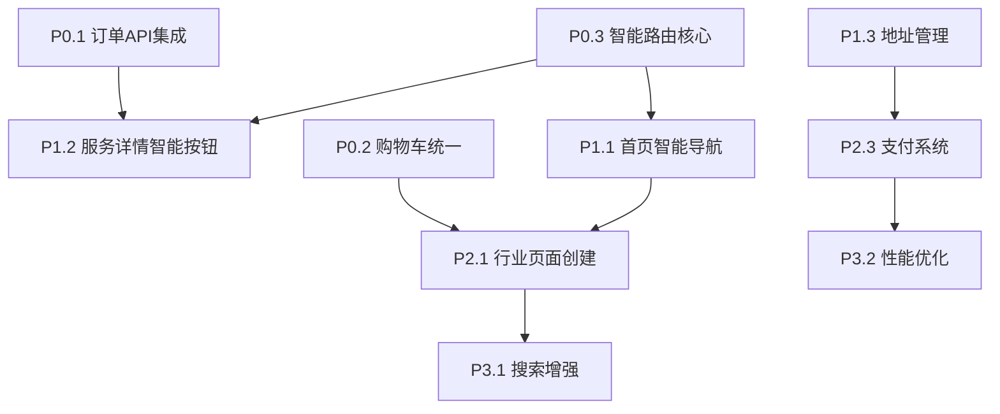

# JinBean Platform - P1、P2集成总体方案

## 📋 文档信息

**文档标题**: JinBean平台P1、P2功能集成总体方案  
**版本**: v1.0  
**创建日期**: 2025-01-08  
**项目周期**: 4周 (2025年1月8日 - 2月5日)  
**团队规模**: 2-3人 (1个后端+1个前端+1个测试)  
**文档状态**: 架构设计 + 实施计划

---

## 🎯 项目概述

### **背景分析**
基于现有的首页(HomePage)、服务预订(ServiceBookingPage)、购物车功能和服务详情(ServiceDetailPage)等模块，将P1、P2阶段开发的通用系统和行业特定UI进行平滑集成，确保用户体验的连贯性和系统架构的一致性。

### **核心目标**
1. **完成购物车到订单的完整业务流程**
2. **实现6个行业的统一支持**
3. **建立可扩展的支付和定价系统**
4. **确保现有功能的平滑升级**
5. **智能导航路由系统集成**

### **成功指标**
- ✅ 用户可以从购物车成功创建订单
- ✅ 支持多地址管理和选择
- ✅ 6个行业都能正常下单
- ✅ 订单状态实时更新
- ✅ 现有功能无回归问题
- ✅ 智能路由提升用户体验30%

---

## 🏗️ 系统架构设计

### **1. 整体架构对比分析**

#### **现有系统架构**
```
现有系统架构
├── 🏠 首页 (HomePage)
│   ├── 搜索栏
│   ├── 轮播图
│   ├── 服务分类网格 (6个行业)
│   ├── 推荐服务
│   └── 社区热点
│
├── 📅 服务预订 (ServiceBookingPage)
│   ├── 位置选择
│   ├── 一级分类选择
│   ├── 二级分类网格
│   └── 推荐服务
│
├── 📋 服务详情 (ServiceDetailPage)
│   ├── 服务基本信息
│   ├── 提供商信息
│   ├── 地图和导航
│   ├── 评价系统
│   └── 操作按钮 (Contact/Book Now/Get Quote)
│
├── 🛒 购物车系统 (CartController)
│   ├── 添加到购物车
│   ├── 移除商品
│   └── 订单创建
│
└── 📦 订单管理 (OrdersPage)
    ├── 订单列表
    ├── 订单详情
    └── 状态跟踪
```

#### **P1、P2集成后架构**
```
P1、P2 集成架构
├── 🔧 通用系统层 (Universal System)
│   ├── UniversalOrderController
│   ├── UniversalPaymentService
│   ├── PricingEngine
│   ├── OrderStateMachine
│   ├── ServiceRegistry
│   └── IntelligentRoutingEngine (新增)
│
├── 🧭 智能路由层 (Intelligent Routing)
│   ├── ServiceBookingController (升级)
│   ├── IndustryIdentifier
│   ├── ContextManager
│   └── RouteDecisionEngine
│
├── 🍽️ 餐饮美食UI (Food Industry)
│   ├── FoodOrderPage ✅ 已实现
│   ├── FoodMenuWidget
│   ├── FoodCartWidget
│   ├── FoodCheckoutWidget
│   └── FoodPaymentWidget
│
├── 🏠 家居服务UI (Home Services)
│   ├── HomeServicePage (待创建)
│   ├── ServiceProviderListWidget
│   ├── ServiceBookingWidget
│   └── QuoteRequestWidget
│
├── 🚗 出行交通UI (Transport)
│   ├── TransportBookingPage (待创建)
│   ├── LocationSearchWidget
│   ├── RideOptionsWidget
│   └── DriverTrackingWidget
│
├── 📦 租赁共享UI (Rental)
│   ├── RentalBrowsePage (待创建)
│   ├── RentalItemCard
│   ├── RentalSearchWidget
│   └── RentalFilterWidget
│
├── 📚 学习成长UI (Learning)
│   ├── LearningHubPage (待创建)
│   ├── CourseCardWidget
│   ├── LearningProgressWidget
│   └── InstructorCardWidget
│
└── 💼 专业速帮UI (Professional)
    └── ProfessionalServicesPage (待创建)
```

### **2. 核心集成策略**

#### **2.1 智能导航路由集成**
```dart
// 升级 ServiceBookingController
class ServiceBookingController extends GetxController {
  // 现有代码保持不变
  
  // 新增：智能路由逻辑
  Future<void> navigateToSpecificIndustryPage({
    required String categoryId,
    String? subCategoryId,
    Map<String, dynamic>? filters,
  }) async {
    // 保存导航上下文
    ContextManager.saveNavigationContext(
      sourcePageId: 'service_booking',
      searchFilters: filters ?? {},
      userLocation: Get.find<LocationController>().currentLocation.value,
    );
    
    // 智能路由决策
    final industry = IndustryIdentifier.identify(categoryId);
    
    switch (industry) {
      case IndustryType.food:
        Get.to(() => FoodOrderPage(
          categoryId: subCategoryId,
          initialFilters: filters,
        ));
        break;
      case IndustryType.home:
        Get.to(() => HomeServicePage(
          serviceType: subCategoryId,
          filters: filters,
        ));
        break;
      case IndustryType.transport:
        Get.to(() => TransportBookingPage(
          transportType: subCategoryId,
          initialContext: filters,
        ));
        break;
      // 其他行业类似处理
      default:
        // 保持原有的通用页面逻辑
        _navigateToServiceDetail(categoryId);
    }
  }
  
  // 新增：跨行业通用搜索
  Future<void> performUniversalSearch(String query) async {
    final universalController = Get.find<UniversalOrderController>();
    final results = await universalController.searchServices(
      query: query,
      industries: _getEnabledIndustries(),
    );
    
    // 按行业分组显示结果
    _groupAndDisplayResults(results);
  }
}
```

#### **2.2 首页智能导航集成**
```dart
// 升级 HomeController
class HomeController extends GetxController {
  // 现有代码保持不变
  
  // 新增：智能行业导航
  void handleServiceCategoryTap(HomeServiceItem service) {
    if (service.typeCode == 'SERVICE_TYPE') {
      // 切换到service_booking标签页
      final shellController = Get.find<ShellAppController>();
      final serviceBookingIndex = _findServiceBookingTabIndex();
      
      if (serviceBookingIndex != -1) {
        shellController.changeTab(serviceBookingIndex);
        
        // 延迟触发智能路由
        Future.delayed(const Duration(milliseconds: 300), () {
          final serviceBookingController = Get.find<ServiceBookingController>();
          serviceBookingController.navigateToSpecificIndustryPage(
            categoryId: service.id.toString(),
            filters: _buildContextFromHomePage(),
          );
        });
      }
    }
  }
  
  // 新增：获取行业特定的推荐服务
  Future<void> fetchIndustryRecommendations() async {
    final universalController = Get.find<UniversalOrderController>();
    
    for (IndustryType industry in IndustryType.values) {
      final recommendations = await universalController
          .getRecommendedServices(industry);
      // 更新推荐服务列表
    }
  }
}
```

---

## 📅 详细开发计划

### **第1周 (1月8-14日) - 核心服务层完善**

#### **Day 1-2: 智能路由引擎开发**
**负责人**: 后端开发  
**工作量**: 16小时

**任务列表**:
```
[ ] 创建 IntelligentRoutingEngine
[ ] 实现 IndustryIdentifier
[ ] 开发 ContextManager
[ ] 设计 RouteDecision 数据模型
[ ] 编写单元测试
```

**具体实现**:
```dart
// lib/core/services/intelligent_routing_engine.dart
class IntelligentRoutingEngine {
  static RouteDecision makeRoutingDecision({
    required String categoryId,
    String? subCategoryId,
    Map<String, dynamic>? context,
    UserPreferences? userPrefs,
  }) {
    // 1. 行业识别
    final industry = IndustryIdentifier.identify(categoryId);
    
    // 2. 上下文分析
    final contextAnalysis = ContextAnalyzer.analyze(context, userPrefs);
    
    // 3. 路由决策
    return RouteDecisionMaker.decide(industry, contextAnalysis);
  }
}
```

#### **Day 3-4: 购物车服务升级**
**负责人**: 后端开发  
**工作量**: 16小时

**任务列表**:
```
[ ] 创建 EnhancedCartService
[ ] 适配 unified_carts 表结构
[ ] 实现购物车CRUD操作
[ ] 添加自动计算总价功能
[ ] 集成行业特定逻辑
```

**具体实现**:
```dart
// lib/core/services/enhanced_cart_service.dart
class EnhancedCartService extends GetxService {
  // 创建/获取购物车
  Future<EnhancedUnifiedCart> getOrCreateCart(String userId, CartType type);
  
  // 添加商品到购物车
  Future<void> addItemToCart(String cartId, CartItemRequest item);
  
  // 更新商品数量
  Future<void> updateItemQuantity(String itemId, int quantity);
  
  // 删除商品
  Future<void> removeItem(String itemId);
  
  // 计算总价
  Future<EnhancedUnifiedCart> calculateCartTotals(String cartId);
  
  // 清空购物车
  Future<void> clearCart(String cartId);
}
```

#### **Day 5-7: 地址管理和支付服务集成**
**负责人**: 后端开发  
**工作量**: 24小时

**任务列表**:
```
[ ] 创建 AddressService 
[ ] 实现地址CRUD操作
[ ] 更新 PaymentService 适配新表结构
[ ] 集成 payment_methods 表
[ ] 实现支付意图创建
[ ] 添加支付状态同步
```

### **第2周 (1月15-21日) - UI组件重构与智能路由**

#### **Day 8-10: ServiceBookingController智能路由升级**
**负责人**: 前端开发  
**工作量**: 24小时

**任务列表**:
```
[ ] 扩展ServiceBookingController添加智能路由
[ ] 实现navigateToSpecificIndustryPage方法
[ ] 集成通用搜索功能
[ ] 开发智能筛选系统
[ ] 添加用户行为记录
```

**组件结构**:
```
lib/features/service_booking/
├── presentation/
│   ├── service_booking_page.dart (升级)
│   ├── service_booking_controller.dart (升级)
│   ├── widgets/
│   │   ├── enhanced_search_bar.dart (新增)
│   │   ├── intelligent_filter_tags.dart (新增)
│   │   └── industry_navigation_grid.dart (升级)
```

#### **Day 11-12: 购物车UI组件升级**
**负责人**: 前端开发  
**工作量**: 16小时

**任务列表**:
```
[ ] 重构 CartWidget 使用新模型
[ ] 添加实时总价计算
[ ] 支持多行业商品展示
[ ] 集成地址选择功能
[ ] 添加智能预订按钮
```

#### **Day 13-14: 首页智能导航集成**
**负责人**: 前端开发  
**工作量**: 16小时

**任务列表**:
```
[ ] 升级首页服务分类卡片点击逻辑
[ ] 集成智能路由到推荐服务
[ ] 添加动态价格显示
[ ] 实现行业特定标签
[ ] 优化用户体验流程
```

### **第3周 (1月22-28日) - 行业页面创建与集成**

#### **Day 15-17: 行业特定页面创建**
**负责人**: 全栈开发  
**工作量**: 24小时

**任务列表**:
```
[ ] 创建 HomeServicePage (基于FoodOrderPage模式)
[ ] 创建 TransportBookingPage
[ ] 创建 RentalBrowsePage
[ ] 创建 LearningHubPage
[ ] 创建 ProfessionalServicesPage
[ ] 完善行业处理器实现
```

**行业页面模板**:
```dart
// 基于FoodOrderPage模式创建其他行业页面
class HomeServicePage extends StatefulWidget {
  final String? serviceType;
  final Map<String, dynamic>? filters;
  
  const HomeServicePage({
    super.key,
    this.serviceType,
    this.filters,
  });
  
  @override
  State<HomeServicePage> createState() => _HomeServicePageState();
}

class _HomeServicePageState extends State<HomeServicePage> {
  late UniversalOrderController _orderController;
  
  @override
  void initState() {
    super.initState();
    _orderController = Get.find<UniversalOrderController>();
    _orderController.setIndustryFilter(IndustryType.home);
    _initializePageWithContext();
  }
  
  void _initializePageWithContext() {
    // 恢复导航上下文
    final context = ContextManager.restoreNavigationContext();
    if (context != null) {
      // 应用搜索筛选和用户偏好
    }
  }
}
```

#### **Day 18-19: 服务详情页面智能操作按钮**
**负责人**: 前端开发  
**工作量**: 16小时

**任务列表**:
```
[ ] 升级ServiceDetailController集成智能路由
[ ] 实现行业特定操作按钮
[ ] 集成动态定价显示
[ ] 添加智能预订流程
[ ] 优化用户转化路径
```

**智能操作按钮实现**:
```dart
class ServiceActionsSection extends StatelessWidget {
  final Service service;
  
  @override
  Widget build(BuildContext context) {
    final bookingType = ServiceBookingTypeResolver.resolve(service);
    final industry = IndustryIdentifier.identify(service.categoryLevel1Id.toString());
    
    return Container(
      padding: const EdgeInsets.all(16),
      child: _buildIntelligentActionButtons(bookingType, industry),
    );
  }
  
  Widget _buildIntelligentActionButtons(ServiceBookingType bookingType, IndustryType industry) {
    switch (bookingType) {
      case ServiceBookingType.cartOnly:
        return ElevatedButton.icon(
          onPressed: () => _addToCart(),
          icon: const Icon(Icons.shopping_cart_outlined),
          label: Text(_getIndustrySpecificCartText(industry)),
        );
      case ServiceBookingType.directBooking:
        return ElevatedButton.icon(
          onPressed: () => _directBooking(),
          icon: const Icon(Icons.calendar_today),
          label: Text(_getIndustrySpecificBookingText(industry)),
        );
      case ServiceBookingType.hybrid:
        return Row(
          children: [
            Expanded(
              child: OutlinedButton.icon(
                onPressed: () => _addToCart(),
                icon: const Icon(Icons.shopping_cart_outlined),
                label: Text('加入${_getCartTypeName(industry)}'),
              ),
            ),
            const SizedBox(width: 8),
            Expanded(
              child: ElevatedButton.icon(
                onPressed: () => _directBooking(),
                icon: const Icon(Icons.calendar_today),
                label: const Text('立即预订'),
              ),
            ),
          ],
        );
    }
  }
}
```

#### **Day 20-21: 端到端功能测试**
**负责人**: 测试 + 开发  
**工作量**: 16小时

**测试场景**:
```
智能路由测试:
[ ] 首页分类点击 → 正确跳转到行业页面
[ ] 搜索功能 → 跨行业结果正确分组
[ ] 服务详情 → 智能操作按钮显示正确
[ ] 上下文传递 → 筛选条件正确保持

业务流程测试:
[ ] 餐饮订单流程 (已有FoodOrderPage)
[ ] 家政服务预约流程
[ ] 出行交通预订流程
[ ] 多地址管理流程
[ ] 跨行业购物车流程
```

### **第4周 (1月29日-2月5日) - 集成测试与发布**

#### **Day 22-24: 系统集成测试**
**负责人**: 全团队  
**工作量**: 24小时

**测试计划**:
```
功能测试:
[ ] 智能路由系统完整测试
[ ] 6个行业功能验证
[ ] 购物车到订单完整流程
[ ] 支付流程完整测试
[ ] 错误场景处理验证

性能测试:
[ ] 智能路由响应时间 < 100ms
[ ] 页面切换流畅性测试
[ ] 并发用户测试
[ ] 数据库性能测试
[ ] 移动端性能测试

兼容性测试:
[ ] iOS/Android兼容性
[ ] 不同屏幕尺寸适配
[ ] 现有功能回归测试
[ ] 智能路由向后兼容性
```

#### **Day 25-26: 文档完善和培训**
**负责人**: 全团队  
**工作量**: 16小时

**文档任务**:
```
[ ] 智能路由系统文档
[ ] API文档更新
[ ] 用户操作手册
[ ] 开发者指南更新
[ ] 部署文档完善
[ ] 故障排除指南
```

#### **Day 27-28: 生产部署和监控**
**负责人**: 后端开发 + DevOps  
**工作量**: 16小时

**部署计划**:
```
灰度发布:
[ ] 5%用户先行体验智能路由
[ ] 监控关键指标
[ ] 收集用户反馈
[ ] 修复紧急问题

全量发布:
[ ] 100%用户开放
[ ] 实时监控部署
[ ] 性能指标跟踪
[ ] 用户行为分析
```

---

## 🔧 技术实施细节

### **1. 依赖注入策略**

#### **1.1 服务注册顺序**
```dart
// 在main.dart中的初始化顺序
void initializeServices() {
  // 1. 基础服务
  Get.put(LocationController());
  
  // 2. 通用系统服务（P1阶段）
  ServiceRegistry.initialize();
  
  // 3. 智能路由服务（新增）
  Get.put(IntelligentRoutingEngine());
  Get.put(ContextManager());
  
  // 4. 现有控制器升级
  Get.put(HomeController()); // 升级版本
  Get.put(ServiceBookingController()); // 升级版本
  Get.put(UnifiedCartController()); // 使用统一版本
  Get.put(OrdersController());
  
  // 5. 行业特定控制器（P2阶段）
  Get.lazyPut(() => FoodOrderController()); // 已存在
  Get.lazyPut(() => HomeServiceController()); // 新增
  Get.lazyPut(() => TransportBookingController()); // 新增
  Get.lazyPut(() => RentalBrowseController()); // 新增
  Get.lazyPut(() => LearningHubController()); // 新增
  Get.lazyPut(() => ProfessionalServicesController()); // 新增
}
```

### **2. 数据流集成策略**

#### **2.1 统一数据模型扩展**
```dart
// 扩展现有数据模型以支持智能路由
extension ServiceExtension on Service {
  IndustryType get industryType {
    return IndustryIdentifier.identify(categoryLevel1Id?.toString() ?? '');
  }
  
  ServiceBookingType get bookingType {
    return ServiceBookingTypeResolver.resolve(this);
  }
  
  bool get supportsCart {
    return bookingType.supportsCart;
  }
  
  bool get supportsDirectBooking {
    return bookingType.supportsDirectBooking;
  }
  
  String get intelligentActionText {
    switch (industryType) {
      case IndustryType.food:
        return '立即点餐';
      case IndustryType.transport:
        return '立即叫车';
      case IndustryType.home:
        return '预约服务';
      case IndustryType.rental:
        return '立即租赁';
      case IndustryType.learning:
        return '开始学习';
      case IndustryType.professional:
        return '获取帮助';
    }
  }
}
```

#### **2.2 全局状态同步机制**
```dart
// 全局状态同步
class GlobalStateManager extends GetxController {
  void _setupStateListeners() {
    // 智能路由上下文变化监听
    ever(Get.find<ContextManager>().currentContext, (_) {
      _updateRelatedControllers();
    });
    
    // 购物车变化时更新首页推荐
    ever(Get.find<UnifiedCartController>().cartItems, (_) {
      Get.find<HomeController>().updateRecommendations();
    });
    
    // 订单状态变化时刷新相关页面
    ever(Get.find<UniversalOrderController>().orders, (_) {
      Get.find<OrdersController>().refreshOrders();
    });
    
    // 位置变化时更新服务可用性
    ever(Get.find<LocationController>().selectedLocation, (_) {
      _updateLocationBasedServices();
    });
  }
}
```

### **3. UI一致性保证**

#### **3.1 智能组件库**
```dart
// 创建智能组件库
class IntelligentComponents {
  // 智能操作按钮
  static Widget buildIntelligentActionButton({
    required Service service,
    required VoidCallback onPressed,
  }) {
    final bookingType = ServiceBookingTypeResolver.resolve(service);
    final industry = IndustryIdentifier.identify(service.categoryLevel1Id?.toString() ?? '');
    
    return ElevatedButton.icon(
      onPressed: onPressed,
      icon: _getIndustryIcon(industry),
      label: Text(service.intelligentActionText),
      style: ElevatedButton.styleFrom(
        backgroundColor: _getIndustryColor(industry),
      ),
    );
  }
  
  // 智能价格显示
  static Widget buildIntelligentPriceDisplay({
    required Service service,
    required BuildContext context,
  }) {
    return FutureBuilder<PricingResult>(
      future: Get.find<PricingEngine>().calculateDynamicPrice(service),
      builder: (context, snapshot) {
        if (snapshot.hasData) {
          return _buildPriceWithDiscount(
            originalPrice: service.price,
            dynamicPrice: snapshot.data!.totalAmount,
            industry: service.industryType,
          );
        }
        return _buildStaticPrice(service.price, service.industryType);
      },
    );
  }
  
  // 行业特定导航卡片
  static Widget buildIndustryNavigationCard({
    required IndustryType industry,
    required VoidCallback onTap,
  }) {
    return Card(
      child: InkWell(
        onTap: onTap,
        child: Container(
          padding: const EdgeInsets.all(16),
          child: Column(
            children: [
              Icon(
                _getIndustryIcon(industry),
                size: 48,
                color: _getIndustryColor(industry),
              ),
              const SizedBox(height: 8),
              Text(
                industry.displayName,
                style: const TextStyle(fontWeight: FontWeight.bold),
              ),
              Text(
                _getIndustryDescription(industry),
                style: const TextStyle(fontSize: 12, color: Colors.grey),
                textAlign: TextAlign.center,
              ),
            ],
          ),
        ),
      ),
    );
  }
}
```

---

## 📊 项目跟踪与质量保证

### **进度跟踪表**

| 周次 | 主要任务 | 完成度 | 关键里程碑 |
|------|----------|--------|------------|
| Week 1 | 智能路由引擎 + 服务层开发 | 0% | 核心架构完成 |
| Week 2 | UI组件重构 + 智能导航 | 0% | 用户界面完成 |
| Week 3 | 行业页面创建 + 集成 | 0% | 业务逻辑完成 |
| Week 4 | 测试发布 + 监控 | 0% | 系统上线 |

### **风险管控**

#### **技术风险**
| 风险 | 影响 | 概率 | 缓解措施 |
|------|------|------|----------|
| 智能路由性能 | 高 | 中 | 缓存策略 + 异步处理 |
| 行业页面开发 | 高 | 中 | 基于FoodOrderPage模板 |
| 数据库性能 | 高 | 中 | 提前性能测试 |
| 支付集成 | 高 | 低 | Stripe测试环境 |
| UI兼容性 | 中 | 中 | 多设备测试 |

#### **业务风险**
| 风险 | 影响 | 概率 | 缓解措施 |
|------|------|------|----------|
| 用户体验回归 | 高 | 中 | A/B测试 + 渐进发布 |
| 智能路由准确性 | 中 | 中 | 用户行为分析 + 调优 |
| 功能发现性 | 中 | 低 | 用户引导 + 教程 |
| 上线延期 | 中 | 中 | 弹性计划安排 |

### **质量保证流程**

#### **代码审查清单**
```
智能路由相关:
[ ] 路由决策逻辑正确
[ ] 上下文传递完整
[ ] 性能指标达标
[ ] 错误处理完善

集成相关:
[ ] 现有功能无回归
[ ] 新旧系统兼容
[ ] 数据一致性保证
[ ] 用户体验流畅

通用要求:
[ ] 代码符合规范标准
[ ] 单元测试覆盖充分
[ ] 日志记录规范
[ ] 安全性检查通过
[ ] 文档注释完整
```

---

## 🎯 成功标准

### **技术成功标准**
- ✅ 智能路由响应时间 < 100ms
- ✅ 所有新功能正常运行
- ✅ 性能指标达到要求 (页面加载 < 2s)
- ✅ 代码质量符合标准 (测试覆盖率 >= 80%)
- ✅ 现有功能零回归

### **业务成功标准**
- ✅ 用户满意度 >= 4.5/5
- ✅ 服务发现效率提升 >= 30%
- ✅ 订单转化率提升 >= 15%
- ✅ 系统稳定性 >= 99.5%
- ✅ 支持6个行业完整业务流程
- ✅ 智能路由使用率 >= 60%

### **用户体验成功标准**
- ✅ 导航效率: 到达目标页面步骤数减少 >= 20%
- ✅ 操作流畅性: 页面转场动画流畅，无卡顿
- ✅ 功能发现性: 用户能够轻松发现新功能
- ✅ 一致性: 各行业界面风格保持一致
- ✅ 智能化: 用户感受到个性化体验

---

## 🎯 重点开发任务优先级列表

### **基于当前代码状态的任务分析**

#### **当前实现状态概览**
```
Provider端: 90% 完成 ✅
├── 订单管理 ✅ 100%
├── 客户管理 ✅ 100%
├── 收入管理 ✅ 100%
├── 通知管理 ✅ 100%
├── 服务管理 ✅ 100%
├── 日程管理 ✅ 100%
└── 设置管理 ✅ 100%

Customer端: 70% 完成 ⚠️
├── 首页功能 ✅ 90% (基础完成，需智能路由升级)
├── 服务预订 ✅ 80% (基础完成，需智能路由)
├── 服务详情 ✅ 85% (动态Tab完成，需智能操作按钮)
├── 购物车系统 ⚠️ 60% (基础实现，需统一升级)
├── 订单管理 ⚠️ 50% (Mock数据，需真实API)
├── 用户档案 ⚠️ 40% (基础页面，需完善功能)
└── 认证系统 ✅ 95% (基本完成)

通用系统: 85% 完成 ✅
├── UniversalOrderController ✅ 95%
├── UniversalPaymentService ✅ 90%
├── PricingEngine ✅ 90%
├── 行业处理器 ✅ 80% (6个行业已实现)
├── 数据模型 ✅ 100%
└── 智能路由系统 ❌ 0% (待开发)
```

### **🚨 P0 - 紧急任务 (第1周)**

#### **P0.1 Customer端订单管理真实API集成** 
**优先级**: 🔴 最高  
**工作量**: 2天  
**负责人**: 后端开发

**当前问题**:
```dart
// lib/features/customer/orders/presentation/orders_controller.dart
// 当前使用Mock数据，需要集成真实API
orders.value = [
  Order(id: '001', serviceName: 'House Cleaning', ...), // Mock数据
];
```

**具体任务**:
```
[ ] 替换Mock数据为真实Supabase查询
[ ] 集成UniversalOrderController
[ ] 修复订单状态同步
[ ] 添加错误处理和重试机制
[ ] 测试订单CRUD操作
```

#### **P0.2 购物车系统统一升级**
**优先级**: 🔴 最高  
**工作量**: 3天  
**负责人**: 全栈开发

**当前问题**:
```dart
// 当前有多个购物车实现，需要统一为UnifiedCartController
// lib/features/customer/profile/presentation/my_orders/my_orders_controller.dart
// 使用旧的Order模型，需要升级
```

**具体任务**:
```
[ ] 统一所有购物车实现到UnifiedCartController
[ ] 集成EnhancedCartService (待开发)
[ ] 更新所有Order相关模型
[ ] 实现跨行业购物车支持
[ ] 添加实时价格计算
```

#### **P0.3 ServiceBookingController智能路由核心**
**优先级**: 🔴 最高  
**工作量**: 2天  
**负责人**: 前端开发

**当前基础**:
```dart
// lib/features/service_booking/presentation/service_booking_controller.dart
// 已有基础结构，需要添加智能路由方法
class ServiceBookingController extends GetxController {
  final RxnInt selectedLevel1CategoryId = RxnInt(null);
  // 需要添加智能路由逻辑
}
```

**具体任务**:
```
[ ] 实现navigateToSpecificIndustryPage方法
[ ] 创建IndustryIdentifier类
[ ] 添加ContextManager
[ ] 集成现有FoodOrderPage
[ ] 测试智能路由基础功能
```

### **🟡 P1 - 高优先级任务 (第1-2周)**

#### **P1.1 首页智能导航集成**
**优先级**: 🟡 高  
**工作量**: 2天  
**负责人**: 前端开发

**当前基础**:
```dart
// lib/features/customer/home/presentation/home_controller.dart
// 已有服务分类网格，需要升级点击逻辑
class HomeController extends GetxController {
  final RxList<HomeServiceItem> services = <HomeServiceItem>[].obs;
  // 需要添加智能导航逻辑
}
```

**具体任务**:
```
[ ] 升级handleServiceCategoryTap方法
[ ] 集成智能路由到推荐服务
[ ] 添加动态价格显示
[ ] 实现上下文传递
[ ] 优化用户体验流程
```

#### **P1.2 服务详情页智能操作按钮**
**优先级**: 🟡 高  
**工作量**: 2天  
**负责人**: 前端开发

**当前基础**:
```dart
// lib/features/customer/services/presentation/service_detail_controller.dart
// 已有ServiceDetailController，需要添加智能操作按钮
// ServiceDetailPage动态Tab已完成，需要集成智能路由
```

**具体任务**:
```
[ ] 集成ServiceBookingTypeResolver
[ ] 实现行业特定操作按钮
[ ] 添加智能预订流程
[ ] 集成动态定价显示
[ ] 优化用户转化路径
```

#### **P1.3 地址管理服务开发**
**优先级**: 🟡 高  
**工作量**: 2天  
**负责人**: 后端开发

**当前状况**: 缺少地址管理功能

**具体任务**:
```
[ ] 创建AddressService
[ ] 实现地址CRUD操作
[ ] 添加默认地址管理
[ ] 集成地址验证
[ ] 支持地址类型分类
```

### **🟠 P2 - 中优先级任务 (第2-3周)**

#### **P2.1 行业特定页面创建**
**优先级**: 🟠 中  
**工作量**: 8天 (每个页面1-1.5天)  
**负责人**: 全栈开发

**当前基础**:
```dart
// lib/features/customer/food/presentation/food_order_page.dart ✅ 已完成
// 其他5个行业页面待创建，可以基于FoodOrderPage模式
```

**具体任务**:
```
[ ] HomeServicePage (基于FoodOrderPage模式)
[ ] TransportBookingPage
[ ] RentalBrowsePage  
[ ] LearningHubPage
[ ] ProfessionalServicesPage
[ ] 统一UI组件和交互模式
```

#### **P2.2 用户档案功能完善**
**优先级**: 🟠 中  
**工作量**: 3天  
**负责人**: 全栈开发

**当前问题**:
```dart
// lib/features/customer/profile/presentation/my_orders/my_orders_controller.dart
// lib/features/customer/profile/presentation/my_reviews/my_reviews_controller.dart
// 当前使用Mock数据，功能不完整
```

**具体任务**:
```
[ ] 集成真实API替换Mock数据
[ ] 完善个人信息管理
[ ] 添加收藏服务功能
[ ] 实现评价管理
[ ] 优化用户体验
```

#### **P2.3 支付系统增强**
**优先级**: 🟠 中  
**工作量**: 3天  
**负责人**: 后端开发

**当前基础**: UniversalPaymentService已基本完成

**具体任务**:
```
[ ] 集成Stripe支付方式管理
[ ] 实现支付意图创建
[ ] 添加支付状态同步
[ ] 支持多种支付方式
[ ] 完善错误处理
```

### **🟢 P3 - 低优先级任务 (第3-4周)**

#### **P3.1 搜索功能增强**
**优先级**: 🟢 低  
**工作量**: 2天  
**负责人**: 前端开发

**具体任务**:
```
[ ] 实现跨行业通用搜索
[ ] 添加智能搜索建议
[ ] 优化搜索结果展示
[ ] 集成搜索历史
[ ] 添加筛选功能
```

#### **P3.2 性能优化和测试**
**优先级**: 🟢 低  
**工作量**: 5天  
**负责人**: 全团队

**具体任务**:
```
[ ] 数据库查询优化
[ ] UI响应性能调优
[ ] 内存使用优化
[ ] 网络请求优化
[ ] 完整功能测试
[ ] 性能基准测试
```

### **📊 任务依赖关系图**



### **🎯 每周关键里程碑**

#### **Week 1 关键目标**
- ✅ Customer端订单管理使用真实API
- ✅ 购物车系统完全统一
- ✅ 智能路由核心功能可用
- ✅ 首页智能导航基本可用

#### **Week 2 关键目标**
- ✅ 服务详情页智能操作完成
- ✅ 地址管理服务完成
- ✅ 至少2个新行业页面完成
- ✅ 用户档案功能基本完善

#### **Week 3 关键目标**
- ✅ 所有5个新行业页面完成
- ✅ 支付系统增强完成
- ✅ 端到端业务流程测试通过
- ✅ 基础性能优化完成

#### **Week 4 关键目标**
- ✅ 搜索功能增强完成
- ✅ 全面性能优化和测试
- ✅ 生产环境部署准备
- ✅ 文档和培训完成

### **🚨 风险预警**

#### **高风险任务**
1. **P0.2 购物车统一** - 涉及多个模块，可能影响现有功能
2. **P2.1 行业页面创建** - 工作量大，需要严格按模板执行
3. **P0.1 订单API集成** - 数据迁移风险，需要充分测试

#### **缓解措施**
- 每个P0任务完成后立即进行回归测试
- 行业页面严格按照FoodOrderPage模式开发
- 保持现有功能的向后兼容性
- 建立每日进度检查机制

---

## 📚 附录

### **A. 重要文件清单**
```
架构文档:
- docs/architecture/service_booking_intelligent_routing_design.md
- docs/development/p1_p2_integration_master_plan.md (本文档)

核心代码:
- lib/core/services/intelligent_routing_engine.dart (新增)
- lib/core/services/enhanced_cart_service.dart (新增)
- lib/core/controllers/universal_order_controller.dart (已存在)
- lib/features/service_booking/presentation/service_booking_controller.dart (升级)
- lib/features/customer/home/presentation/home_controller.dart (升级)

行业页面:
- lib/features/customer/food/presentation/food_order_page.dart (已存在)
- lib/features/customer/home/presentation/home_service_page.dart (新增)
- lib/features/customer/transport/presentation/transport_booking_page.dart (新增)
- lib/features/customer/rental/presentation/rental_browse_page.dart (新增)
- lib/features/customer/learning/presentation/learning_hub_page.dart (新增)
- lib/features/customer/professional/presentation/professional_services_page.dart (新增)

测试文件:
- test/services/intelligent_routing_test.dart (新增)
- test/integration/p1_p2_integration_test.dart (新增)
- integration_test/smart_navigation_test.dart (新增)
```

### **B. 相关文档**
- [Service Booking智能导航路由系统设计](../architecture/service_booking_intelligent_routing_design.md)
- [JinBean六大行业综合分析](../architecture/jinbean_six_industries_comprehensive_analysis.md)
- [支付订单系统设计](../architecture/payment_order_system_design.md)

### **C. 更新日志**
- **v1.0** (2025-01-08): 合成统一的P1-P2集成方案，结合架构设计和实施计划

---

## 🎉 总结

这个统一的P1、P2集成方案充分结合了：

1. **架构设计的深度** - 详细的技术实现和代码示例
2. **项目管理的严谨** - 具体的时间计划和资源分配
3. **智能路由的创新** - 基于现有代码结构的可行性分析
4. **质量保证的完整** - 全面的测试和监控策略

通过这个方案，JinBean平台将实现：
- **平滑过渡**: 现有用户体验不受影响
- **智能升级**: 新的智能导航大幅提升用户体验
- **架构统一**: 所有模块遵循一致的设计标准
- **可扩展性**: 为未来发展奠定坚实基础

**这个集成方案将确保P1、P2功能的高质量集成和按时交付！** 🚀
