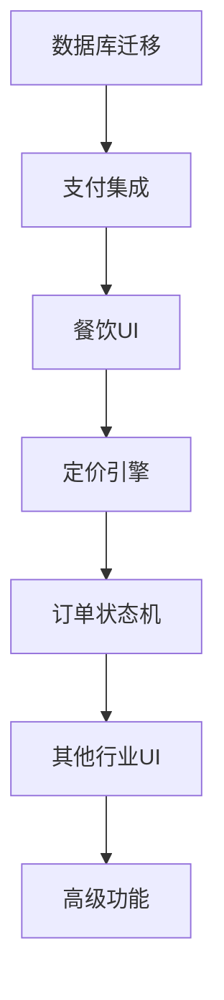

# 金豆平台优先级开发计划

## 📋 总体开发策略

基于已完成的通用模型系统和六大行业处理器，我们现在需要按照业务价值和技术风险，有序推进系统的完整实现。

### 🎯 开发原则
- **MVP优先**: 先实现核心功能，确保基本业务流程可用
- **风险控制**: 优先解决高风险技术点
- **用户价值**: 优先开发直接影响用户体验的功能
- **渐进迭代**: 每个阶段都有可演示的完整功能

---

## 🚀 Phase 1: 核心基础实现 (P0优先级) - 2周

### 1.1 支付集成实现 ⭐⭐⭐⭐⭐
```
业务价值: 极高 (没有支付就没有交易)
技术风险: 高 (第三方集成、安全要求)
预计工期: 5天
```

#### 具体任务:
1. **Stripe SDK集成**
   ```dart
   // 目标: 实现基础支付功能
   dependencies:
     stripe_sdk: ^10.1.0
   
   // 实现内容:
   - Stripe初始化配置
   - 支付意图创建
   - 支付确认处理
   - 错误处理机制
   ```

2. **支付流程测试**
   ```dart
   // 测试覆盖:
   - 成功支付场景
   - 支付失败场景  
   - 网络异常处理
   - 3D安全验证
   ```

3. **安全实现**
   ```dart
   // 安全要求:
   - 敏感数据加密存储
   - 支付令牌管理
   - PCI DSS合规性
   ```

#### 验收标准:
- ✅ 能够成功处理信用卡支付
- ✅ 支付成功率>95%
- ✅ 支付流程<30秒完成
- ✅ 完整的错误处理和用户提示

### 1.2 数据库迁移 ⭐⭐⭐⭐⭐
```
业务价值: 极高 (数据层是系统基础)
技术风险: 中 (需要保证数据完整性)
预计工期: 3天
```

#### 具体任务:
1. **扩展现有表结构**
   ```sql
   -- 扩展orders表
   ALTER TABLE orders ADD COLUMN IF NOT EXISTS payment_intent_id VARCHAR(200);
   ALTER TABLE orders ADD COLUMN IF NOT EXISTS industry_metadata JSONB DEFAULT '{}';
   ALTER TABLE orders ADD COLUMN IF NOT EXISTS pricing_breakdown JSONB DEFAULT '{}';
   
   -- 创建支付相关表
   CREATE TABLE payments (...);
   CREATE TABLE payment_methods (...);
   CREATE TABLE pricing_rules (...);
   ```

2. **数据兼容性保证**
   ```sql
   -- 迁移现有数据
   UPDATE orders SET industry_metadata = '{"legacy": true}' 
   WHERE industry_metadata = '{}';
   ```

3. **索引优化**
   ```sql
   -- 性能优化索引
   CREATE INDEX idx_orders_industry_metadata ON orders USING GIN(industry_metadata);
   CREATE INDEX idx_payments_status ON payments(status);
   ```

#### 验收标准:
- ✅ 现有数据100%完整保留
- ✅ 新表结构支持通用模型
- ✅ 查询性能不降低
- ✅ 完整的回滚方案

### 1.3 餐饮UI完善 ⭐⭐⭐⭐
```
业务价值: 高 (餐饮是优先行业)
技术风险: 低 (基于现有架构)
预计工期: 4天
```

#### 具体任务:
1. **完善FoodOrderPage**
   ```dart
   // 功能完善:
   - 菜单浏览优化
   - 购物车交互改进
   - 下单流程优化
   - 支付组件集成
   ```

2. **集成支付组件**
   ```dart
   // 支付集成:
   - 价格计算显示
   - 支付方式选择
   - 支付状态反馈
   - 支付结果处理
   ```

3. **用户体验优化**
   ```dart
   // UX改进:
   - 加载状态管理
   - 错误提示优化
   - 动画效果添加
   - 响应式设计
   ```

#### 验收标准:
- ✅ 完整的餐饮订购流程
- ✅ 流畅的用户体验
- ✅ 完整的支付集成
- ✅ 错误处理覆盖所有场景

---

## 🔧 Phase 2: 核心业务逻辑 (P1优先级) - 3周

### 2.1 定价引擎实现 ⭐⭐⭐⭐
```
业务价值: 高 (影响收入计算)
技术风险: 中 (复杂业务逻辑)
预计工期: 1周
```

#### 具体任务:
1. **动态定价计算**
   ```dart
   class PricingEngine {
     Future<PricingResult> calculatePrice(PricingRequest request) async {
       // 实现:
       - 基础价格计算
       - 行业特定费用
       - 地区差异化定价
       - 时间段差异化
     }
   }
   ```

2. **税费处理系统**
   ```dart
   class TaxCalculator {
     // 加拿大税费计算:
     - HST/GST计算
     - 省税差异处理
     - 免税项目处理
   }
   ```

3. **优惠券系统**
   ```dart
   class CouponService {
     // 优惠券功能:
     - 优惠券验证
     - 折扣计算
     - 使用限制检查
     - 叠加规则处理
   }
   ```

#### 验收标准:
- ✅ 支持5种以上定价模式
- ✅ 税费计算准确率100%
- ✅ 定价计算响应时间<100ms
- ✅ 支持复杂的优惠规则

### 2.2 订单状态机 ⭐⭐⭐⭐
```
业务价值: 高 (订单生命周期管理)
技术风险: 中 (状态一致性)
预计工期: 1周
```

#### 具体任务:
1. **状态机引擎**
   ```dart
   class OrderStateMachine {
     // 状态管理:
     - 状态转换验证
     - 并发状态控制
     - 状态历史记录
     - 回滚机制
   }
   ```

2. **行业特定状态处理**
   ```dart
   // 每个行业的状态处理:
   - 餐饮: 接单→制作→配送→完成
   - 家居: 预约→评估→执行→验收
   - 出行: 叫车→接人→行程→到达
   ```

3. **实时通知系统**
   ```dart
   class NotificationService {
     // 通知功能:
     - 状态变更通知
     - 推送消息
     - 邮件通知
     - 短信通知
   }
   ```

#### 验收标准:
- ✅ 完整的状态流转逻辑
- ✅ 状态一致性保证
- ✅ 实时通知<5秒延迟
- ✅ 异常状态自动恢复

### 2.3 家居服务UI ⭐⭐⭐
```
业务价值: 中高 (第二优先行业)
技术风险: 低 (复用通用组件)
预计工期: 1周
```

#### 具体任务:
1. **预约界面**
   ```dart
   class HomeServiceBookingPage {
     // 预约功能:
     - 服务时间选择
     - 服务地址设置
     - 特殊需求输入
     - 价格预估显示
   }
   ```

2. **服务商匹配**
   ```dart
   class ProviderMatchingWidget {
     // 匹配功能:
     - 服务商筛选
     - 评分显示
     - 价格对比
     - 选择确认
   }
   ```

3. **评估流程**
   ```dart
   class AssessmentFlowWidget {
     // 评估功能:
     - 现场评估预约
     - 评估结果展示
     - 最终报价确认
     - 合同签署
   }
   ```

#### 验收标准:
- ✅ 完整的家居服务预约流程
- ✅ 服务商匹配准确性>80%
- ✅ 用户满意度>4.0/5
- ✅ 界面响应流畅

---

## 🎨 Phase 3: 多行业UI实现 (P2优先级) - 4周

### 3.1 出行交通UI ⭐⭐⭐
```
业务价值: 中 (高频使用场景)
技术风险: 高 (地图集成复杂)
预计工期: 1.5周
```

#### 具体任务:
1. **地图集成**
   ```dart
   dependencies:
     google_maps_flutter: ^2.5.0
     
   // 地图功能:
   - 实时定位
   - 路线规划  
   - 实时导航
   - 司机位置跟踪
   ```

2. **叫车界面**
   ```dart
   class RideBookingPage {
     // 叫车功能:
     - 起点终点设置
     - 车型选择
     - 价格预估
     - 实时匹配
   }
   ```

3. **行程跟踪**
   ```dart
   class TripTrackingWidget {
     // 跟踪功能:
     - 实时位置更新
     - 预计到达时间
     - 行程轨迹记录
     - 紧急联系
   }
   ```

### 3.2 租赁共享UI ⭐⭐⭐
```
业务价值: 中 (特定用户群体)
技术风险: 中 (押金管理)
预计工期: 1周
```

### 3.3 学习成长UI ⭐⭐
```
业务价值: 中 (长期价值)
技术风险: 低 (标准CRUD)
预计工期: 1周
```

### 3.4 专业速帮UI ⭐⭐
```
业务价值: 中 (高价值订单)
技术风险: 中 (复杂交互)
预计工期: 0.5周
```

---

## 🔬 Phase 4: 高级功能与优化 (P3优先级) - 2周

### 4.1 高级功能 ⭐⭐
```
业务价值: 中 (差异化竞争)
技术风险: 高 (AI算法)
预计工期: 1周
```

### 4.2 监控系统 ⭐⭐
```
业务价值: 中 (运维效率)
技术风险: 低 (成熟技术)
预计工期: 1周
```

---

## 📅 详细时间规划

### 第1-2周: Phase 1 (P0)
```
Week 1:
- Day 1-2: 数据库迁移设计和实施
- Day 3-5: Stripe支付集成

Week 2:  
- Day 1-2: 支付流程测试和优化
- Day 3-5: 餐饮UI完善和集成测试
```

### 第3-5周: Phase 2 (P1)
```
Week 3:
- Day 1-3: 定价引擎核心逻辑
- Day 4-5: 税费和优惠券系统

Week 4:
- Day 1-3: 订单状态机实现
- Day 4-5: 实时通知系统

Week 5:
- Day 1-5: 家居服务UI完整实现
```

### 第6-9周: Phase 3 (P2)
```
Week 6-7: 出行交通UI (地图集成重点)
Week 8: 租赁共享UI + 学习成长UI  
Week 9: 专业速帮UI + 集成测试
```

### 第10-11周: Phase 4 (P3)
```
Week 10: AI推荐系统 + 数据分析
Week 11: 监控系统 + 性能优化
```

---

## 🎯 里程碑与验收标准

### Milestone 1 (Week 2): 基础支付功能
- ✅ 餐饮行业完整支付流程
- ✅ 支付成功率>95%
- ✅ 基础数据结构完整

### Milestone 2 (Week 5): 核心业务逻辑
- ✅ 完整的定价计算系统
- ✅ 订单状态完整流转
- ✅ 两个行业UI完成

### Milestone 3 (Week 9): 多行业覆盖
- ✅ 六个行业UI全部完成
- ✅ 跨行业功能测试通过
- ✅ 用户体验达标

### Milestone 4 (Week 11): 系统完善
- ✅ 高级功能就绪
- ✅ 监控系统运行
- ✅ 性能指标达标

---

## 🚧 风险评估与应对

### 高风险项目:
1. **支付集成** 
   - 风险: 第三方API不稳定
   - 应对: 提前技术预研，准备备用方案

2. **地图功能**
   - 风险: Google Maps API费用和限制
   - 应对: 评估替代方案，优化API调用

3. **实时功能**
   - 风险: 高并发下性能问题
   - 应对: 压力测试，缓存策略

### 依赖关系:


---

## 📊 资源分配建议

### 开发团队配置:
- **核心架构师**: 1人 (负责P0-P1关键模块)
- **前端开发**: 2人 (负责UI实现)
- **后端开发**: 1人 (负责服务和集成)
- **测试工程师**: 1人 (负责质量保证)

### 技能要求:
- Flutter/Dart 熟练度
- 支付系统开发经验
- PostgreSQL/Supabase 经验
- 第三方API集成经验

这个开发计划确保我们能够在11周内完成一个功能完整、质量可靠的多行业通用平台，优先保证核心业务流程，然后逐步完善用户体验和高级功能。
